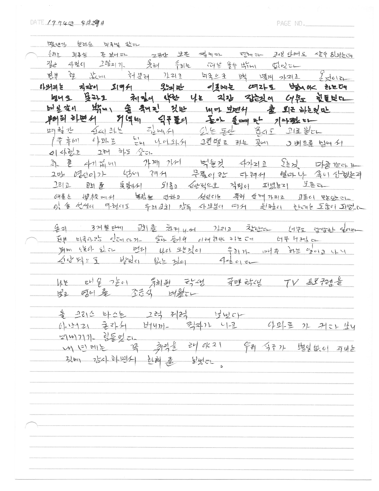
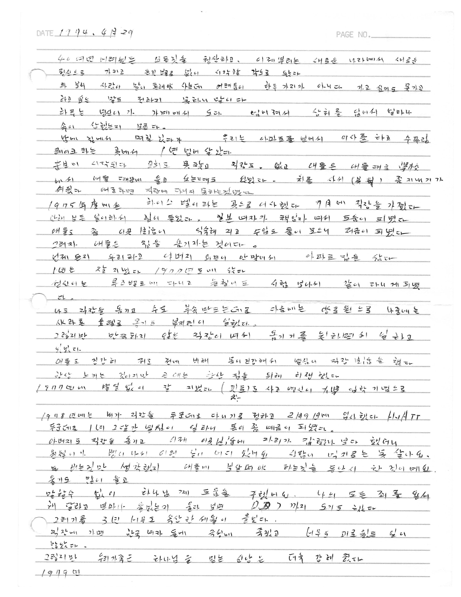

Mother kept several books where she kept record.

This one is dated 29 April 1974.

The day we arrived in the United States of America as a family.

She relates why we had to leave Korea.

With brevity and oblique references, typical of that generation she opens the journal with this entry.

------------------------------------------------------------------------

몇 년간 원하던 미국에 왔다.

우리는 **피란**([避](https://namu.wiki/w/%E9%81%BF "避")[亂](https://namu.wiki/w/%E4%BA%82 "亂"))을 온것이다.

그동안 모은 집에다, 땅에다, 고생 안 해도 살 수 있었는데,

집안 사정이 그렇지가 못해 우리는 떠나올 수밖에 없었다.

We came to America, a place we'd longed for for years.

We were refugees.

We had a house. We had land. We could have lived without hardship (in Korea).

But our family circumstances weren't so favorable, so we had no choice but to leave.

By the time our father concluded his 4 year stay in Vietnam, our family finances were secure.

Dad made about 10x the salary of persons in Korea.

Per capita GDP in 1970 was \$260

With that money, mom had purchased a home near 주안국민학교 and some land near 주안역 (200 평). She visited city hall to determine where the growth will occur in 인천 area.

In addition, dad had opened an account with the Bank of America and had saved about \$6,000.

This is about \$50,000 in today's money.

This allowed him to immigrate without the financial proof or backing.

All this supports Mom's statement that things were well, financially.

However, Dad had 3 younger brothers and a sister.

```{r}
library(leaflet)

leaflet() %>% addTiles() %>% addMarkers(lng = 126.67990723585388, lat = 37.464588765570085, popup = "주안역입구")
```




