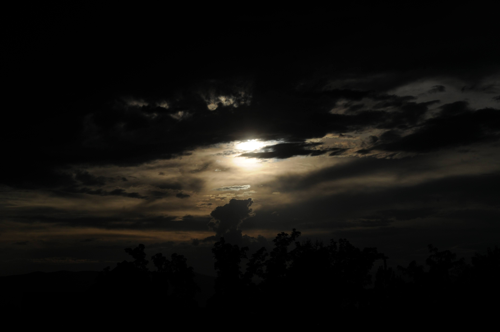

The YouTube algorithm chose this piece for me.

<https://www.youtube.com/watch?v=hSG1FKGVuD8>

I was not surprised by the selection for I am familiar with this number.

However, I was surprised to see a group of Korean musicians (KBS 교향악단) perform under the direction of the conductor 정명훈.

Playing the composition of an Austro-Bohemian Romantic composer, born to a Jewish parents.

Watching the Korean translation gave an additional insight I hadn't experienced before

If one didn't watch the video, it would be like any other Western ensemble.
Especially when mezzo soprano 이단비 sang Urlicht or Primeval Light.

But this group resembled people I knew, our extended family, playing familiar instruments that they played in 밴드부.

Korea, as a nation, and Koreans as people have overcome and accomplished much.

Quickly shared the link with the family. Making sure it is not too late in Korea/Japan.

Short time later, a question was asked, what is the context of this piece.

This is my response.

.jpg)

The Mahler's 2nd Symphony was one of the first classical symphonies I attended.[^1] \\

[^1]: Performed by Francesca Forsyth, alto; Jennie Litster, soprano; BYU Philharmonic; BYU Combined Choirs on April 09, 2004 <https://news.byu.edu/news/byu-philharmonic-choirs-perform-mahlers-resurrection>

I was not ready for the scope and the breadth of the work.\\

A grand, heroic anthem, lasting 80 minutes.

I am still trying to learn the musical aspect of it.

But I am beginning to understand the life's lesson in it

Wrote this, shortly after my mother passed away [January, 2023, LINK to a Blog](https://oakhi.github.io/Life-Begins-When/posts/20230127%20resurrection/)

For all of my life, up to that point, I thought my parents would live forever.

The message of this symphony, especially the passage,

> I am from God and to God I will return, Dear God will give me a light, Will light my way to eternal blessed life

That reality, as expressed through poem and the music was powerful and gave solace at that time.

I have regrets as a son and a person. That I could have done more for them and with them.

But in some ways, I tried to be that son and that person that my parents would be proud of.

------------------------------------------------------------------------

## AI Summary

Gustav Mahler’s **Symphony No. 2 in C minor ("Resurrection")** (premiered 1895) is over a century old, yet it continues to resonate with audiences and performers worldwide. Its relevance today comes from a mix of **musical innovation, emotional depth, and timeless themes**.

------------------------------------------------------------------------

## Why Mahler’s 2nd Still Matters Today

### 1. **Universal Themes**

-   The symphony wrestles with **life, death, despair, hope, and transcendence**.
-   Mahler takes the listener from funeral rites (first movement) through struggles, irony, and grief, to an overwhelming vision of renewal and resurrection.
-   These are **existential questions** that remain as urgent in the 21st century as they were in Mahler’s time.

### 2. **Scale and Power**

-   One of the first truly **monumental symphonies**: massive orchestra, organ, vocal soloists, and chorus.
-   Modern audiences still find the sheer **sonic impact** overwhelming — it fills concert halls in ways few works can.
-   The finale’s choral eruption of *“Aufersteh’n, ja aufersteh’n wirst du”* (“You will rise again”) is often described as a **life-changing moment** in live performance.

### 3. **Bridge Between Eras**

-   Combines **Romantic tradition** (Beethoven, Brahms) with innovations pointing toward **20th-century modernism**.
-   Its use of folk-like melodies, irony, collage of styles, and spiritual searching prefigures Shostakovich, Stravinsky, and even film music.

### 4. **Resonance with Crisis and Renewal**

-   After wars, pandemics, and social upheavals, audiences connect with its narrative of **struggle → collapse → renewal**.
-   It’s often programmed in times of mourning or remembrance (e.g., after 9/11, orchestras turned to it for healing).

### 5. **Personal Connection**

-   Mahler wrote the work while grappling with mortality and meaning. His deeply personal struggle gives the symphony an **authentic voice** that transcends its era.
-   Today, listeners facing their own uncertainties hear their emotions mirrored in the music.

------------------------------------------------------------------------

## In short

Mahler’s **Resurrection Symphony** endures because it is **more than music** — it’s an experience of grief, hope, and transcendence. Its emotional honesty, monumental sound, and universal questions keep it fresh, urgent, and profoundly moving for modern audiences.
