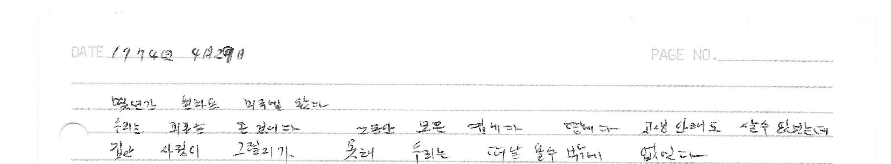
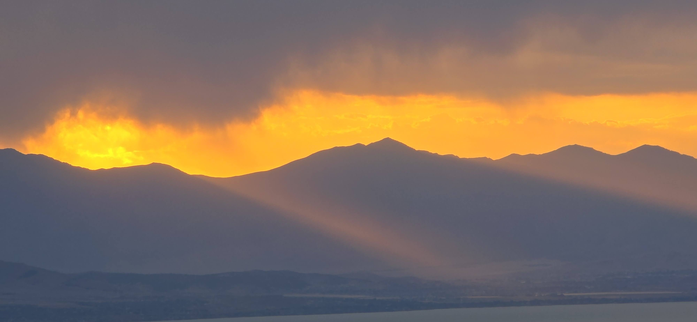

During a dozen year period, we received 16 independent accounts from multiple locations.

The correspondence began as physical letters and electronic mails.

Slowly transitioning to all eMails.

These weekly communications were engaging, enlightening, as well as entertaining.

Some letters were like snapshots or a postcard, whereas some were written like a short story.

In fact, we received some printed photographs that gave way to a digital image file transmitted electronically.

We were living vicariously.

Visiting places through minds, eyes and hearts of dedicated, young individuals.

------------------------------------------------------------------------

My siblings and I received letters and emails from 8 missionaries.

Through Sister K, received 8 additional eyewitness accounts.

From islands of sea: Micronesia, Kyushu/Okinawa, Taiwan, Hong Kong, Madagascar, and Scotland/Ireland to mainlands of North America; Massachusetts, Long Island, Washington, and California and Asia; Korea.

Eagerly waiting for that appointed time when they would send us their weekly events, happenings and experiences.

Heard highlights but sometimes understanding things they could not share.

Thoughtful way of minimizing our worries.

Seeing and feeling their growth.

------------------------------------------------------------------------

To observers, the 18 or 24 months seem to be a relatively short duration.

Not to the families of those missionaries.

Recipients of the words and images from the field.

Experiencing, savouring and growing with each missionary.

------------------------------------------------------------------------

Welcomed home these heroes at the old Salt Lake City Airport.

Multiple families would gather at the bottom of the escalator.

Inquiry began with the pilots and flight attendants

> Which flight is this?

Then the balance of the passengers would pass by.

Triumphantly a group of missionaries appear.

Some maintain their composure, others ran.

Reserving their biggest hugs for their mothers.

While fathers are relegated to taking photographic or videographic images.

Siblings are biggest supporters.

Meanwhile grandparents are in the background and remember their younger days.

------------------------------------------------------------------------

My mother kept a number of journals.

Writing about her experiences and sharing some of her recipes.

Some were bound notebooks and some were the loosely bound, ones with 3 rings and removable pages. Making them ideal for digital scanning.

With brevity and oblique references, typical of that generation, she opens the journal with this entry.

> 몇 년간 원하던 미국에 왔다. 우리는 **피란**(避亂)을 온것이다. 그동안 모은 집에다, 땅에다, 고생 안 해도 살 수 있었는데, 집안 사정이 그렇지가 못해 우리는 떠나올 수밖에 없었다.

We came to America, a place we'd longed for for years.  We were refugees.\
We had a house. We had land. We could have lived without hardship (in Korea).\
But our family circumstances weren't so favorable, so we had no choice but to leave.

------------------------------------------------------------------------

Captured in those few words were the summary, 42 years of her life in Korea and the reason for our departure to a new land.

Mom lived 50 more years in her new land.

Seeing this entry was like receiving a letter from the Home.

The Home without an address, no earthly means of navigating to it.

But as they have done in this life, our parents have not only demonstrated how to live in this life but they are also supporting our journey and preparing that place we call Home.

That someday, I will find and understand the intended messages, written or otherwise.

I will then shed tears when I realize anew that those unfavorable conditions and circumstances were the very core and meaning of life.

Thank you Mother and Father.\
Thank you those 16 missionaries for your services and messages you shared.

Life is a set of challenges or hardships,   God is merciful,\
All is well.

-   Late 夏, Early 秋 2025

