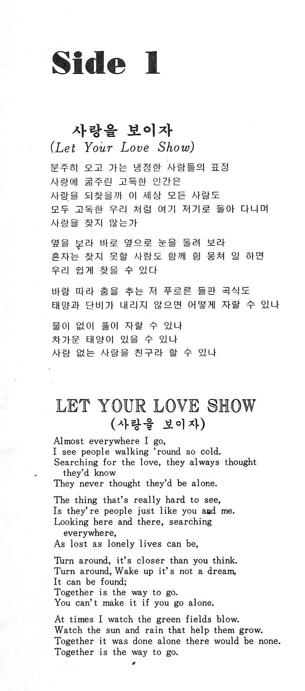
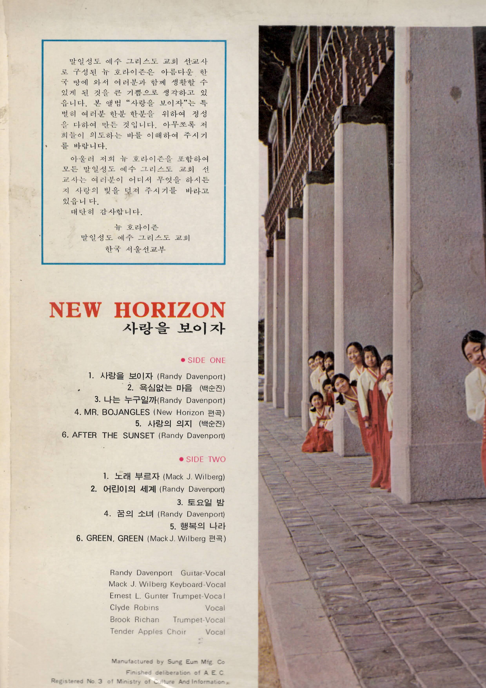

## New Era of K-Pop

Would a new group be formed in this era?

What would new group of missionaries sing?

------------------------------------------------------------------------

Koreans love music. They adore their favorite singers

National singing competition like Mr. Trot would rival any sporting event in US.

Super Bowl has numericals afterwards, so does Mr. and Ms. Trot.

# [**미스터트롯3**](https://namu.wiki/w/%EB%AF%B8%EC%8A%A4%ED%84%B0%ED%8A%B8%EB%A1%AF3)

<https://namu.wiki/w/%EB%AF%B8%EC%8A%A4%ED%84%B0%ED%8A%B8%EB%A1%AF3>

# [**미스트롯3**](https://namu.wiki/w/%EB%AF%B8%EC%8A%A4%ED%8A%B8%EB%A1%AF3)

<https://namu.wiki/w/%EB%AF%B8%EC%8A%A4%ED%8A%B8%EB%A1%AF3>

All kinds of music

Especially when foreigners sing in Korea, that is another level.

However, if a foreigner is singing a Korean song, that is another matter

<https://www.thechurchnews.com/2008/11/29/23230973/singing-elders-took-korea-by-storm/>

> "The intent from the very beginning was not to call in the most musically talented elders," he said. "I interviewed for the spirit. . . . Those who were the most tender hearted and loving and kind and humble and had the spirit of Heavenly Father with them were the ones who were called."

<https://www.youtube.com/watch?v=nZw7AixtC6U>

Here’s an image of the original *New Horizons* (also referred to as *New Horizon*), the LDS missionary musical group that brought music to the people of Korea in the 1970s.

The original members of the group included **Elder Randy Davenport**, a guitar-playing composer, and **Elder Mack Wilberg**, a talented composer and arranger. They were joined by **Elders Lonnie Gunter**, **Brook Richan**, and **Clyde Robins** [[Church News]{.underline}](https://www.thechurchnews.com/2008/11/29/23230973/singing-elders-took-korea-by-storm/?utm_source=chatgpt.com){alt="https://www.thechurchnews.com/2008/11/29/23230973/singing-elders-took-korea-by-storm/?utm_source=chatgpt.com"}[[Scribd]{.underline}](https://www.scribd.com/document/844460376/Saints-Volume-4?utm_source=chatgpt.com){alt="https://www.scribd.com/document/844460376/Saints-Volume-4?utm_source=chatgpt.com"}.

These missionaries, called by the Korea Seoul Mission President Eugene P. Till, were selected not merely for musical skill but for having "tender-hearted" and humble spirits [[Church News]{.underline}](https://www.thechurchnews.com/2008/11/29/23230973/singing-elders-took-korea-by-storm/?utm_source=chatgpt.com){alt="https://www.thechurchnews.com/2008/11/29/23230973/singing-elders-took-korea-by-storm/?utm_source=chatgpt.com"}.

So, to summarize:

**Original members of New Horizons in Korea:**

-   Elder Randy Davenport

<!-- -->

-   Elder Mack Wilberg

-   Elder Lonnie Gunter

-   Elder Brook Richan

-   Elder Clyde Robins

------------------------------------------------------------------------

## Their First Albums

YouTuber `Forgotten LPs` has curated 2 of their albums

[New Horizon - Debut LP (Full Album)](https://www.youtube.com/watch?v=nZw7AixtC6U&list=RDnZw7AixtC6U)

which includes this note,

> ...Quite frankly, kids...I'm just some random old dude archiving super old music from a really long time ago and I highly doubt that it is going to interest you.

[New Horizon & Tender Apples - Merry Christmas (Full Album)](https://www.youtube.com/watch?v=MzQn9FNpp6E&list=RDMzQn9FNpp6E)

The eponymous album has this entry

------------------------------------------------------------------------

<https://www.churchofjesuschrist.org/study/history/saints-v4/part-2/10-time-is-crucial?lang=eng>

Part 2, Chapter 10, page 159

> One day, he reached out to Keun Ok for help. A few elders in the mission were incorporating music into their teaching. The group’s leader, Elder Randy Davenport, wrote most of the group’s original songs, and Elder Mack Wilberg arranged the music. They called themselves New Horizon.

<https://www.churchofjesuschrist.org/study/history/saints-stories-hwang-keun-ok-south-korea/hwang-keun-ok-south-korea?lang=eng>

YouTuber `Jeannie` has these 2 entries, same albums

<https://www.youtube.com/watch?v=yur8pjRD2Po>

<https://www.youtube.com/watch?v=vHL9_SLaCi0&list=RDvHL9_SLaCi0&start_radio=1>

[Jeannie's Version](https://www.youtube.com/watch?v=ccbu9y4F7_M)
