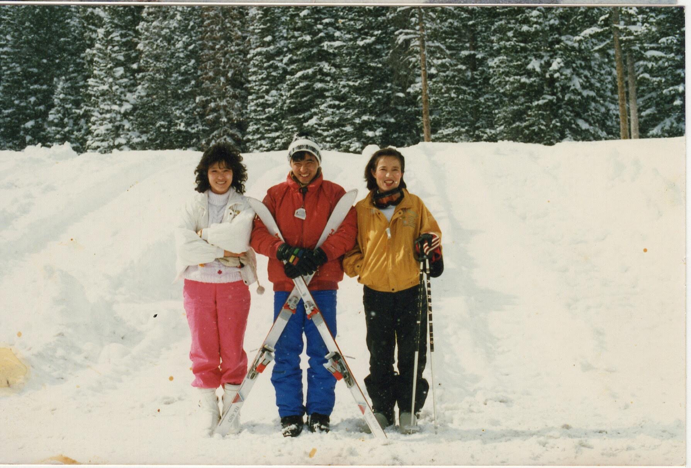
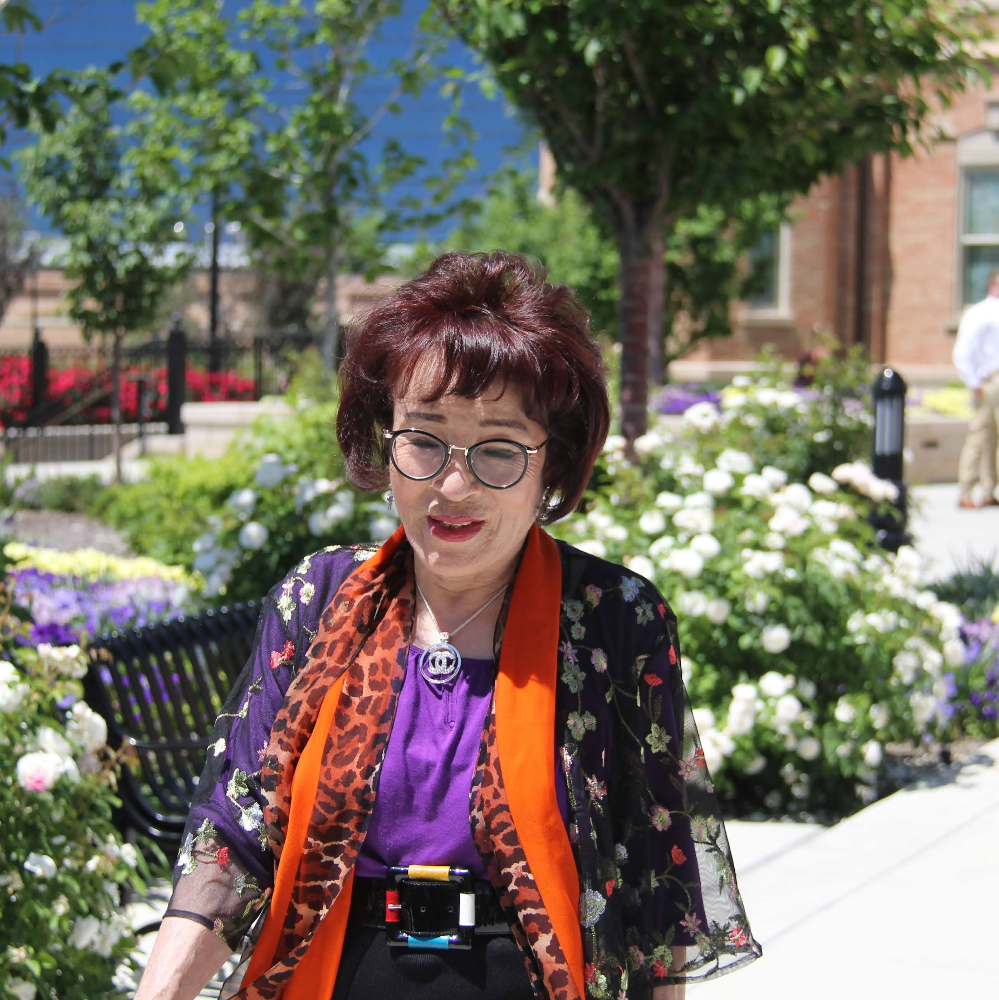

Sister K's aunt passed away last month.

She was 2 years younger than my 장모님 (mother-in-law) but years apart in thinking.

It was almost as if, she was from a different family.

---

{#fig-1}

{#fig-2}

She was always kind to me.

After my mission, I remember visiting her restaurants in Provo and Salt Lake.

Saw June working there.

Then as I was dating June, she took me aside and said.

"She may seem an average person, helping at a restaurant now, but she is from a good family"

Reminding us that what we are now and doing is not as important as what we may become and will be doing in the near future.

That was nearly 40 years ago.

Thankful for her thoughtful and wise counsels.
