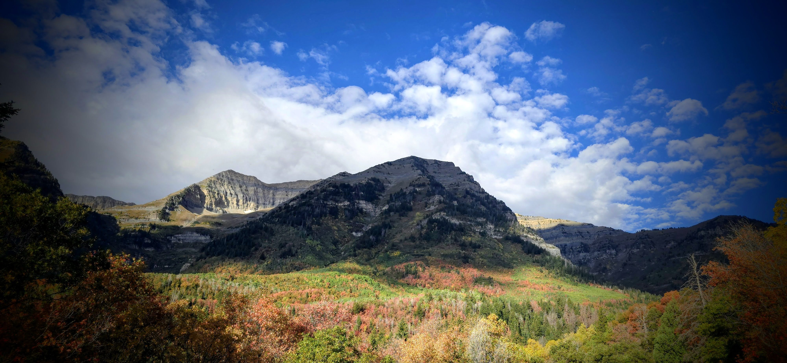

When I go photo hunting, Sister K expects updates:

Where I am.\
How long until I’m done taking pictures.\
When I’ll be home.

------------------------------------------------------------------------

This time, I was at the 2,300-meter level, watching the fall colors shift on the eastern side of a mountain.

Maybe it’s because I’ve been to this spot before.\
Or perhaps it’s because I now understand why leaves change color—\
Not simply from temperature drops or elevation changes,\

But from the shifting sunlight, the seasonal tilt of the Earth orbiting the sun.

Yet today, I couldn’t find a single tree or grove I hadn’t already captured before.
I messaged Sister K: *I’m wrapping up, heading home.*

One last turn-off.\
I stayed in the car, pulled out both the DSLR and the phone camera, and captured an image.

------------------------------------------------------------------------

Sister K replied with a link:

**Interviewer:** *What do you think happens when we die?*

**Ethan Hawke:** *I don’t think we die. I don’t think we understand the divine concept of time… Something much bigger is going on than we’re aware of in our day-to-day routines. I don’t have the intelligence or the DNA makeup to answer that question.*

------------------------------------------------------------------------

There are many things I’ve come to understand.
How certain mysteries of younger days have been explained as I work, learn and age.

And there are things I’m content not to know:\

What comes after this existence.

It’s enough to know where I am,\
And that I have a home to return to.\
That I can speak in words and communicate through action.

That each have access to resources and places that seem to explain a bit of eternity.

