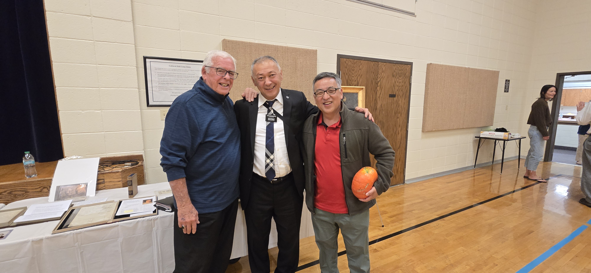

The neighborhood male group threw a party.

It was husband and wife event.

Wife wasn't able to go.

I went

It was a dinner followed by presentation on early prophet, J Smith

Noticed a gentlemen that didn't look like he was from this area.

He was from Kyrgyzstan.

Asked if he knew of Koreans, he said yes.

I didn't know how Koreans got to Central Asia.

| Country | Approximate Number of Ethnic Koreans / Koreans | Source / Year |
|---------|------------------------------------------------|---------------|

|                |                |                                                                                                                                                                                                                                                                                                                 |
|----------------|----------------|-----------------------------------------------------------------------------------------------------------------------------------------------------------------------------------------------------------------------------------------------------------------------------------------------------------------|
| **Kazakhstan** | \~ **120,686** | National Statistics Bureau of Kazakhstan, as of **2025**. [[Orda.kz]{.underline}](https://en.orda.kz/kazakhstans-largest-ethnic-groups-updated-figures-released-6214/?utm_source=chatgpt.com){alt="https://en.orda.kz/kazakhstans-largest-ethnic-groups-updated-figures-released-6214/?utm_source=chatgpt.com"} |

|                |                |                                                                               |
|----------------|----------------|-------------------------------------------------------------------------------|
| **Uzbekistan** | \~ **174,242** | From a recent ethnic composition breakdown; “Koreans – 174.2 thousand people” |

## Estimated Koryo-saram by country (best available figures)

> **Summary total (rounded): \~ 500,000 Koryo-saram across former Soviet states.** [[Wikipedia]{.underline}](https://en.wikipedia.org/wiki/Koryo-saram?utm_source=chatgpt.com){alt="https://en.wikipedia.org/wiki/Koryo-saram?utm_source=chatgpt.com"}

| Country                                       | Approx. population (figure)                            | Source / note                                                                                                                                                                                                                                                                                                                                                                           |
|-----------------------------------------------|--------------------------------------------------------|-----------------------------------------------------------------------------------------------------------------------------------------------------------------------------------------------------------------------------------------------------------------------------------------------------------------------------------------------------------------------------------------|
| **Uzbekistan**                                | **\~174,200**                                          | Wikipedia / Koryo-saram (summary figure; commonly cited 2021 estimate). Recent academic work documents a substantial decline from \~220k (1990s) to \~180k (2014), with continued out-migration to S. Korea. [[Wikipedia+1]{.underline}](https://en.wikipedia.org/wiki/Koryo-saram?utm_source=chatgpt.com){alt="https://en.wikipedia.org/wiki/Koryo-saram?utm_source=chatgpt.com"}      |
| **Kazakhstan**                                | **\~118,450 – 120,686**                                | Multiple sources report \~118k (2021 series) and \~120k (2025 est. series for ethnic Koreans in Kazakhstan). See Kazakhstan ethnic-groups tables and MOFA historical numbers. [[Wikipedia+1]{.underline}](https://en.wikipedia.org/wiki/Ethnic_groups_in_Kazakhstan?utm_source=chatgpt.com){alt="https://en.wikipedia.org/wiki/Ethnic_groups_in_Kazakhstan?utm_source=chatgpt.com"}     |
| **Russia**                                    | **87,819** (2021 census)                               | Russian 2021 census reported 87,819 Koreans. Note: earlier censuses (2002/2010) reported higher counts; differences reflect migration, undercounting, and census methodology. [[Wikipedia+1]{.underline}](https://en.wikipedia.org/wiki/2021_Russian_census?utm_source=chatgpt.com){alt="https://en.wikipedia.org/wiki/2021_Russian_census?utm_source=chatgpt.com"}                     |
| **Kyrgyzstan**                                | **\~17,094**                                           | Figure commonly cited in regional studies and summaries (2021 series). [[Wikipedia+1]{.underline}](https://en.wikipedia.org/wiki/Koryo-saram?utm_source=chatgpt.com){alt="https://en.wikipedia.org/wiki/Koryo-saram?utm_source=chatgpt.com"}                                                                                                                                            |
| **Ukraine**                                   | **\~12,700 – 13,524** (official older censuses / MOFA) | Ukraine’s 2001 census: 12,711. South Korean MOFA and other sources list a 2020s estimate \~13.5k (some estimates and reports give higher, up to \~30k, due to differing definitions and pre-war population flux). [[Wikipedia+1]{.underline}](https://en.wikipedia.org/wiki/Koryo-saram?utm_source=chatgpt.com){alt="https://en.wikipedia.org/wiki/Koryo-saram?utm_source=chatgpt.com"} |
| **Tajikistan**                                | **\~634**                                              | National census (2010) and aggregated sources report very small Korean communities (hundreds). [[ResearchGate+1]{.underline}](https://www.researchgate.net/publication/302379282_Koreans_in_Kazakhstan_Uzbekistan_and_Russia?utm_source=chatgpt.com){alt="https://www.researchgate.net/publication/302379282_Koreans_in_Kazakhstan_Uzbekistan_and_Russia?utm_source=chatgpt.com"}       |
| **Turkmenistan**                              | **\~400** (small community)                            | Very small numbers reported in aggregated demographic sources. [[Wikipedia]{.underline}](https://en.wikipedia.org/wiki/Koryo-saram?utm_source=chatgpt.com){alt="https://en.wikipedia.org/wiki/Koryo-saram?utm_source=chatgpt.com"}                                                                                                                                                      |
| **Belarus, Moldova, Baltic states, Caucasus** | **dozens → low thousands**                             | Small Koryo-saram communities scattered across these states (country counts often \<1,000). [[Wikipedia]{.underline}](https://en.wikipedia.org/wiki/Koryo-saram?utm_source=chatgpt.com){alt="https://en.wikipedia.org/wiki/Koryo-saram?utm_source=chatgpt.com"}                                                                                                                         |

------------------------------------------------------------------------

<https://www.youtube.com/watch?v=qKOIWFszPJI>

In 1863, at the edge of Asia,

13 Korean families crossed from Korea into Russia

in search of a better life.

At that time, Korea, under the rule of Joseon Dynasty

was going through hard times.

Drought, famine, social inequality, and the exploitation of peasants

by the ruling elite turned the lives of hundreds

of thousands of peasants into a living hell.

Until the 1900s, there were multiple waves of Korean peasants crossing into Russia

and settling in various parts of Primorsky Krai, mainly in the city of Vladivostok.

They engaged in farming,

fishing, and small-scale trade, contributing to the regional economy.

Additionally, a considerable number of Korean immigrants

worked in the Russian railroad industry as laborers.

The Koreans were initially welcomed in the Russian Far East,

where they were seen as hardworking and valuable settlers

for developing this sparsely populated region.

This land offered them opportunities, including abundant farmland,

which the Koreans quickly utilized.

In 1905, the

Russo-Japanese War resulted in a Japanese victory.

Five years later, in 1910, the Japanese army officially annexed

Korea as a colony, sparking another wave of Korean migration.

In Russia, the Korean population grew significantly,

eventually forming a large community in the country.

These Koreans came to be known as Koryo Saram,

which literally translates to “Korea person”.

“Koryo” is a historical name for Korea and “Saram” means person in the Korean language.

Pretty straightforward right?

From this point on to maintain a consistent tone, I will use the term

Koryo Saram to refer to these Koreans.

In 1917, the Koryo Saram community in Russia faced another major challenge.

Can you guess what it was?

Yes, the Bolshevik revolution.

This shift in the country's political landscape began

with the goal of uniting all ethnic groups and nationalities of the Soviet Union

under the ideals of justice, equality, peace and harmony.

Slogans like “Land to the peasants” and “Equal rights for all workers”

sparked immense excitement among the Koryo Saram.

Considering the hardships they had endured in Korea,

this new state seemed to offer them a dream.

The integration of the Koryo Saram into the Soviet Union was relatively smooth.

In the early years, they actively and willingly participated

in the Communist Party and joined the Soviet institutions.

This period also marked a renaissance of Korean culture within the Soviet Union.

A newspaper was printed in the Korean language, and Korean schools

and cultural institutions were established across the Russian Far East.

This allowed the growing Koryo Saram

population in the country to maintain their native language, which is

perhaps the most important cultural pillar of any ethnic group.

In 1863, when the first Koryo Saram settled in the Russian Far East,

their population was estimated at 13 families or around 100 people.

Just seven decades later, by the 1930s, this population had grown

to approximately 180,000 people, a massive increase.

The 1930s, however, were not kind to the Koryo Saram.

First, Joseph Stalin began consolidating absolute power within the Soviet Union.

Although he had held power since 1922,

the early 1930s marked a period when he gained full control of the state

without opposition.

Additionally, in 1931, Japan occupied Manchuria, the northeastern part of China.

This event increased tensions between the Soviet Union and Japan,

leading to frequent border clashes between Soviet and Japanese troops.

Six years later, in 1937, Japan invaded China,

and the specter of war between Japan and the Soviet Union loomed large.

Stalin, known for his extreme paranoia, grew increasingly fearful

of a potential Japanese attack on the Russian Far East.

His paranoia extended to the 180,000 Koryo Saram living in the region.

Despite the fact that Koreans had been subjugated by Japan for years

and had actively resisted Japanese forces, even fighting in partizan detachments,

Stalin viewed the Koryo-Saram

as potential Japanese spies and enemy collaborators.

In September 1937, as winter approached, Stalin ordered the forced relocation

of all Koryo Saram from the Russian Far East to Central Asia.

This marked the beginning of a tragic chapter for the Koryo Saram people.

They were given less than three days to gather their belongings before

being forced to leave their homes.

Families were packed into overcrowded trains and transported

in mass to areas primarily in Uzbekistan and Kazakhstan.

The conditions in the wagons were appalling.

There was barely any food, and elders, women and children died in large numbers.

Those who perished during the journey were thrown out of the wagons

and their bodies abandoned to rot in the desolate steps of Central Asia.

Koreans traditionally believe that

if a person lacks a proper funeral, their spirits may become a "gwisin" (ghost).

Gwisin are often depicted as wandering spirits, tied to the location of their death

or to the family they were connected to, sometimes causing misfortune.

Because of this belief, the Koryo Saram often refer to these trains

as ghost trains, believing that the restless spirits of the Koreans

who did not survive the journey still roam the steps of Central Asia.

The journey lasted over a month and spanned 6500km.

Approximately 100,000 Koryo Saram were relocated to Kazakhstan,

and 80,000 to Uzbekistan.

Just as they had when they crossed from Korea to Russia,

they were forced to start over again.

The Koryo Saram were scattered across the vast region.

Some managed to settle in abandoned houses, while others found work on farms.

However, the real tragedy struck the Koryo Saram, who were left

with no resources to survive on the harsh outskirts of the Kazakh town of Ushtobe.

The landscape, composed of steppes with scarce resources,

forced many to dig holes in the ground to survive the winter.

Over two years, thousands of Koryo Saram died

due to starvation, exposure and disease.

The Koryo Saram, known for their resilience,

managed to get back on their feet

within two years of their arrival in Uzbekistan and Kazakhstan.

Despite losing thousands of their kin and enduring immense hardships,

they built homes and schools

for themselves and found work in the agricultural sector.

At that time, the steps of Kazakhstan were dry with low soil fertility.

However, the Koryo Saram achieved the seemingly impossible,

transforming these barren lands into thriving farms.

Things appeared to be improving, and it seemed that after all the calamities,

the Koryo Saram had found a new home where they could grow and prosper.

Unfortunately, this hope was short lived.

A new directive from Stalin ordered the systematic closure of Korean language

schools and publications

as a part of broader efforts to assimilate the Koryo Saram population

and suppress any potential cultural or political dissent.

In addition, Stalin imposed a travel ban on the Koryo Saram,

preventing them from leaving the farms where they worked.

This period marked the beginning of the decline

of the Korean language among the Koryo Saram people.

Before we move further, I want to take a moment to delve deeper

into the Korean language spoken by the Koryo Saram.

Since most of the Koreans who migrated to Russia came from the Hamgyong province,

now a part of North Korea, they spoke the Hamgyong dialect of Korean.

For many years, until the banning of Korean schools

and the Korean language within the Soviet Union in the early 1940s,

the Koryo Saram preserved their native tongue.

Over time, however, the Korean spoken by the Koryo Saram evolved into a distinct dialect

known as Koryo-mar.

This dialect absorbed a significant number of loanwords

and grammatical influences from Russian and Central Asian languages

due to the Koryo Saram’s assimilation into local cultures

and the multilingual environment they lived in.

While Korean traditionally uses the Hangul script,

Koryo-mar speakers historically lacked consistent use of Hangul.

Instead, they often adopted the Cyrillic alphabet for practical

purposes, particularly in Soviet contexts.

Now let's jump back into our timeline.

We'll return to Koryo-mar in more detail later.

It's 1953, and guess what happened?

Yes, Stalin is dead.

With his death, the Koryo Saram gained more freedom to choose

where to live, what to do, and what kind of education to pursue.

While they were not completely free, their lives improved a lot more compared

to the Stalin era.

This year marked the beginning of a mass migration of Koryo Saram

into major cities.

They enrolled in colleges, pursued diverse careers,

and began to emerge across various layers of Soviet society.

Among all the Koryo Saram who built successful careers

in the Soviet Union, the most famous is often considered to be Viktor Tsoi.

He was the founder of Kino, the most iconic Soviet rock band.

Despite his untimely passing at the young age of 28,

Viktor Tsoi left behind an enduring legacy.

Today, he is remembered as one of the USSR’s greatest music legends.

His music became a unifying force for Soviet youth, transcending

regional and cultural differences across the country.

Ironically, Stalin's death further negatively

impacted the preservation of the Korean language.

Until this point, despite numerous obstacles such as the banning of Korean language

education and the closure of Korean schools,

the language had managed to survive within the Koryo Saram community.

This survival was largely because, since the earliest years of Korean

immigration to Russia, the community

had always stuck together, living side by side.

This close-knit

way of life enabled the language to be passed down to younger generations.

However, with Stalin's death and the newfound freedom for Koryo Saram

to choose their own paths,

they dispersed to different parts of the country.

As a result, Russian became increasingly relevant to their daily

lives, further eroding the use of the Korean language.

I found some pretty interesting data from previous Soviet censuses

that display the Koryo Saram population in different Soviet republics.

As we discussed a few moments ago, Kazakhstan and Uzbekistan had the largest

Koryo Saram populations by far.

Here, especially in the early years,

you can see that the number of Koryo Saram in other republics was quite low.

However, particularly after the 1959 census, we can observe

a sharp increase in their population across other Soviet republics.

I also found this quite interesting map

from 1976 showing the ethnic composition of the Soviet Union.

If we zoom in to the far eastern lands of the country,

we see no Korean presence on the map except for this tiny spot.

However, if we move west,

here in southern Kazakhstan, we see areas with a Korean majority.

Additionally, in Uzbekistan,

we can observe Korean presence in certain places.

This is truly an amazing map, which I believe we should explore in

a separate video.

All right,

years passed and in 1991, the Soviet Union collapsed.

The Koryo Saram people mainly stayed in Kazakhstan and Uzbekistan.

However, a considerable number of them also immigrated to countries like Russia,

Ukraine, Kyrgyzstan, Tajikistan, South Korea and the US.

Today, although pinpointing an exact number

for the Koryo Saram population worldwide is quite difficult,

it is estimated that their population is around 500,000.

To break down this number,

let's look at the population of Koryo Saram and Korean language speakers by country.

In Russia,

according to the 2021 census, the Korean population is 87,819.

In total, 26,662 people speak Korean in the country,

17,631 of whom named Korean as their native language.

However, keep in mind that these numbers include not only the Koryo Saram people,

but also the descendants of North Korean immigrants who came to the Soviet Union

after the Korean War, and Sakhalin Koreans who were brought to Russia’s Sakhalin Island

as laborers following the Japanese invasion of the island.

In Kazakhstan, the 2021 census recorded the Korean population in the country as 118,450.

Out of 19.1 million Kazakh citizens documented in the census, 59,397 of them spoke Korean.

However, it is important to note that 48,303 Korean speakers

out of the 59,397 identified as Koreans.

The rest of the 11,094 Korean speakers

were mostly registered as Kazakh, Russian, Uzbek, and Uyghur.

When it comes to Uzbekistan,

unfortunately we don't have detailed census data since the last national

population census was conducted in 1989 during the Soviet era.

However, the current estimates place

the Korean population in the country at around 174,000.

The Korean speaking population is estimated to be between 20 to 35,000.

In Kyrgyzstan, the 2022 census shows

that there are 5900 Koreans in the country.

Unfortunately, I was not able to find data on the number of Korean speakers.

In Ukraine,

the last national census was conducted in

2001, recording 12,700 Koreans in the country.

However, since this date, the country has undergone significant changes,

resulting in millions of people leaving Ukraine.

Today, the population of Koreans and Korean speakers in Ukraine is unknown.

Another country with a considerable Koryo Saram diaspora is the United States.

I was not able to find any data about the number of Koryo Saram,

since there are not registered as a separate ethnic group.

Today, although their population in the U.S is estimated to be in the hundreds,

it seems that they have managed to build

a tight community for themselves, mainly in New York.

Here, you can find restaurants serving Koryo Saram food,

which is ultimately a fusion of Korean and Kazakh, Uzbek, Russian cuisines.

Also, the All Nations Baptist Church in Brooklyn has a Koryo Saram pastor.

This multi-ethnic church has a Russian-speaking congregation,

consisting of people from various post-Soviet countries.

All right,

we covered all the countries where the Koryo Saram

have immigrated in large numbers.

But what about South Korea?

Since 1991, around 100,000 Koryo Saram

have returned to South Korea via special visa programs.

However, some of them spoke Russian as their native language

and have had a hard time integrating into Korean society.

Today, especially in Incheon,

there are multiple neighborhoods inhabited by Koryo Saram.

Since a considerable percentage of the population speaks Russian here,

it is quite common to see signboards in Russian on the streets.

In this day and age, the Koryo Saram in Kazakhstan and Uzbekistan can

be considered among the most successful ethnic groups in terms of business.

They primarily work in banking, agriculture, housing,

communications, trade, construction, and transportation.

In addition, many Koryo Saram run small and medium sized businesses.

Undoubtedly, the city of Almaty and Kazakhstan is the center of Koryo Saram

culture in the world.

Here you will find several Korean culture centers, Korean language

schools, and a Korean theater where one can watch plays in Korean.

Additionally, as I was researching contemporary Koryo Saram media,

I stumbled upon the Koryo Ilbo newspaper, which is published weekly in Korean

and Russian in Almaty.

Back in the 1970s and 80s it had a circulation of around 40,000.

However, today this number is down to 1000 weekly.

Unfortunately, today, most Koryo Saram

people don't speak Korean.

A large portion of the speakers are the elder members of the community.

As of 2025, there is some sort of linguistic revival of Korean

among the young Koryo Saram, especially in Kazakhstan and Uzbekistan.

However, this is not enough to stop the decline of Korean in the community.

Now, let's hear how the variety of Korean that the Koryo Saram speak,

also known as the Koryo-mar dialect, sounds.

Unfortunately, I was not able to find subtitles for this video,

so if any Korean speakers are watching this, please let us know what this lovely

old lady is saying.

Today, the Koryo Saram remain

one of the most unique and interesting diasporas in the world.

Let alone rest of the world,

even most Koreans haven't heard of this group.

The words of the famous Koryo Saram historian, German Kim

serve as a great testimony to the current state of Koryo Saram

in Central Asia.

To most people, ethnic revival means wearing

traditional clothing, eating Korean food, or learning the language.

But there is more to it than that.

It is not simply a matter of copying South Korean culture in a Central Asian context.

The Koryo Saram have a cultural tradition that has substantially diverged

from that of South Korea.

Over the past decades,

the Koryo Saram have lived together with peoples of various backgrounds

and cultures, including Russians, Europeans, and Central Asians.

These cultures are dramatically different from traditional Korean society,

and the Koryo Saram have substantially integrated

and acculturated, incorporating many aspects of these cultures into their own.
