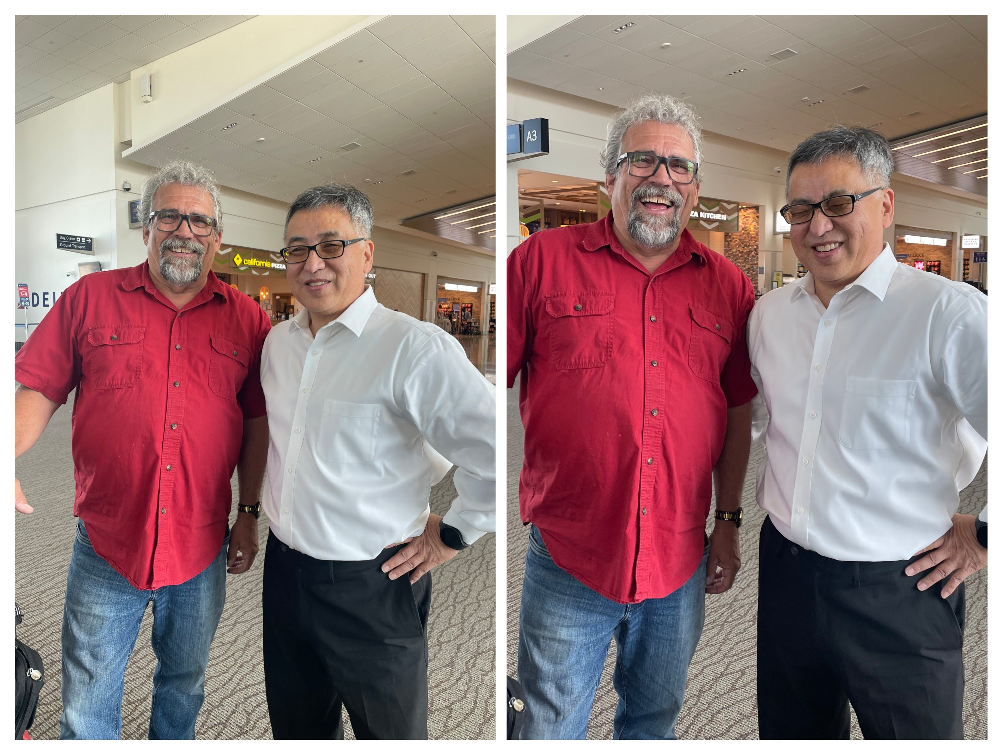

When I travel, I expect to meet people.

Whether I'm meeting new people or crossing paths with an old friend.

Because I live in a small town, our new, four-gate airport acts as a reliable social hub; I know that making a friendly encounter is a high probability event — much like trip to the local supermarket.

This experience is much different at the metropolis to our north.

That city, is a sprawling enclave with nearly ten times our population, funnels its air traffic through a massive 71-gate airport.

While our small airport concentrates human flow, their colossal facility disperses it, turning the simple act of recognizing someone in the crowd from an expectation into a statistical long shot.

------------------------------------------------------------------------

Took the requisite 1/4 mile (1735 ft or 530 meters) hike to the gate near the western end of Terminal A.

I found myself dwelling on the cost of this last-minute trip. I ended up paying nearly the same as a trans-Pacific flight just to travel 1,250 miles to the third-most-populous metropolitan area in the United States.

Then I saw a face I recognized, but I couldn't remember when and where we worked together.

Took the risk of being wrong and introduced myself. At that moment, I remembered when and where.

2008 to 2010 at NOC.

He tells me nearly everyone that worked there are millionaires, but not necessarily multimillionaires.[^1]

[^1]: when I last worked there, the stock was \$41, on 13 Oct 2025, the stock was \$618.88

We shared the notes on who we remember from those days. Jim B, Mike C, and Neal D.

He said he retired at my current age.

Tried to commit him to a role, but he was being evasive.

He didn't want to be associate with the "smart" group.

\[Found out later, through a LinkedIn search that he has a PhD.\]

He decided to go see his son play in a band.

A last minute decision that will set him back well over \$1000.

(Chicago Marathon was scheduled for this Sunday, which made hotel rooms both scarce and much higher than normal)

His son was playing at the Phyllis' Musical Inn on 1800 West Division Street.

Thought about joining him but we are here for a funeral and will have an early start.

---

Thought about retirement and our impromptu decisions.

Would I book a last minute flight to see a family member perform.

He stopped working early and is enjoying life.

I was glad that he recognized me and we were able to visit about the NOC days.

I need to reevaluate my priorities.

------------------------------------------------------------------------

I have known a number of individuals with advanced degrees.

Then there are those that I have worked with, like Dan, that I didn't know had advanced degrees.

They were just a normal, easy to get along person that got things done at work.

It seems to me there are 2 groups of people with PhDs.

Ones that announce and wants you to know their standing and understanding.

The second group takes more slow approach.

Letting others discover their understanding of the subject matter and slowly establish their standing.

Thanks Dan, for reminding me about setting priorities and letting the world catch up to you instead of the other way around.

Also, for maintaining your style so that I can recognize you in a crowd.

