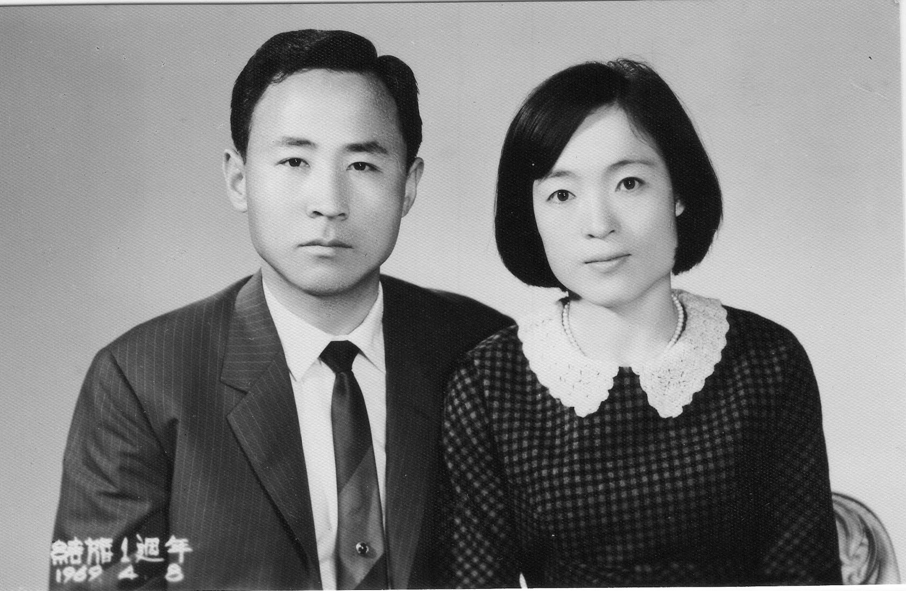

Services held at, 3918 W Irving Park Rd, Chicago, IL 60618. On 11 October 2025, 11AM Central Daylight Time.

## Invocation - Mike Lee (이명주) 1st Son

We are grateful that we can gather together at this time in remembrance of our mother.\

We thank Thee for the gift of life, and for our mother who gave life to my brothers and me.\

We ask Thee to bless her with peace, and to let us feel Thy Spirit with us in this moment.\

We offer this prayer in the name of Thy Son, Jesus Christ. Amen.\

오늘 이 시간 저희가 어머님을 기억하며 함께 모일 수 있게 하심에 감사드립니다.\

생명의 귀한 선물을 주시고, 저희 형제들에게 생명을 주신 어머님을 허락하신 주님께 감사드립니다.\

이 시간 어머님께 평안을 베풀어 주시고, 저희가 주님의 성령을 느낄 수 있도록 인도해 주옵소서.\

이 모든 말씀을 주 예수 그리스도의 이름으로 기도드립니다. 아멘.

## Young Lee (이영주) 2nd Son

[Audio Recording of Young's Message](01-Young-2.wav)

Well, I don’t know why I’m suddenly so nervous, but as David Kang introduced me, I’m her second child, Young Lee. I’m not sure why I’m the first to speak today—maybe it’s in the order of least to most favorite son.

My mom often told me, “You’re the most like me,” especially in the last few years. I took that as the greatest compliment, because my mom was truly great. Maybe not as great as King David or Nephi or Martin Luther King Jr., but in her own way, she was remarkable. And like all great people, she wasn’t without flaws—but compared to many, her flaws were small and insignificant.

If my mom was ambitious, she expected a lot from herself and from her family. I remember one instance from middle school: I came home excited, having earned straight A’s except for one A minus. I ran home from school—our middle school was miles away—but I met her in the car. I told her, “Mom, I got straight A’s except one A minus.” She looked at me and said, “Why don’t you get the A minus? Get in the car. We’re late for Steven’s Hope of America award.” That’s how my mom was—always pushing us to do our best.

Steve, if I can say, she adored you. Even in her last days, she spoke of you—how smart you were and how much potential she saw in you. I remember her saying that sometimes she might have seemed to play favorites, but she had always been told to pay special attention to the youngest child because there was something special about him.

If my mom had one regret, it was that she wasn’t as family-oriented as she wished she could have been. She admired family first in others—especially in her youngest, who loves his children deeply. Sometimes her ambition came first, and we may have felt we weren’t her priority. I think that was her biggest regret.

And then there’s my brother Mike. Who loved my mom more than Mike? He worked tirelessly in her restaurants from youth until her very last days. Yet even as much as he loved her, traveling with Mom could be tough. She could be demanding.

That brings me to my father, who shared a life with her for decades. Dad, you did your very best. You are an amazing father and husband. She was not easy to live with, but you tried your best, and we love you.

Mom, I know you are looking down on us, and I want to tell you how much we respect you. That was always the most important thing to you—to be respected and to accomplish something meaningful. And you did. You gave us three wonderful sons and ten amazing grandchildren. You were great. You were amazing.

For a brief history: Mom was born in 1940, though some records say 1941 because, as the second daughter in a time of hardship before the Korean War, her survival to her first birthday was uncertain. She lived to 85 and accomplished so much.

She grew up tough, losing her father in a male-dominated society. She worked harder than anyone I knew. She came to America at 37, not speaking English, and built a remarkable life: opening restaurants like Rick Shaw and China Place, Lisma Market, motels, and even a Holiday Inn Express from the ground up. All of that—starting from scratch, not speaking the language—is incredible.

Mom, we loved you. We forgive you. And we thank you for being such a wonderful mother. You were amazing, and we are so grateful for everything you gave us.

왜 이렇게 갑자기 긴장이 되는지 모르겠네요.\

방금 데이비드 강이 소개한 것처럼, 저는 어머니의 둘째 아들, 이영입니다.\

오늘 제가 첫 번째로 말씀드리게 된 이유는 잘 모르겠어요.\

아마도 어머니의 ‘덜 좋아하는 아들에서 더 좋아하는 아들 순서’로 정한 게 아닐까 싶습니다.

어머니는 종종 저에게 “넌 나를 가장 닮았어”라고 말씀하셨습니다.\

특히 지난 몇 년 동안 그 말을 자주 하셨죠.\

저는 그 말을 최고의 칭찬으로 들었습니다.\

왜냐하면 제 어머니는 정말 위대한 분이셨으니까요.\

물론 다윗 왕이나 니파이, 마틴 루터 킹 주니어 같은 위인들만큼은 아니더라도,\

어머니는 자신만의 방식으로 정말 대단한 분이셨습니다.\

모든 위대한 사람들과 마찬가지로 완벽하진 않았지만,\

그분의 단점은 너무 사소해서 거의 의미가 없을 정도였습니다.

어머니는 굉장히 야심찬 분이셨고,\

자신에게도, 가족에게도 항상 큰 기대를 거셨습니다.\

중학교 때 있었던 일이 기억납니다.\

그날 저는 A- 하나를 제외하고 전 과목 A를 받았어요.\

너무 기뻐서 몇 마일 떨어진 학교에서 집까지 뛰어왔죠.\

그런데 마침 차 안에서 어머니를 만났습니다.\

“엄마, A- 하나 빼고 전부 A 받았어요!” 하니까,\

어머니는 저를 보며 “왜 그게 A-야?” 하시더니\

“어서 차 타. 스티븐의 Hope of America 시상식 늦겠다.”\

그게 우리 엄마였어요. 항상 우리에게 최선을 다하라고 밀어붙이셨죠.

스티븐, 솔직히 말해서, 어머니는 널 정말 사랑하셨어.\

마지막 순간까지도 너 이야기를 하셨어.\

네가 얼마나 똑똑한지, 얼마나 큰 잠재력을 가졌는지 말씀하셨지.\

가끔 어머니가 편애하는 것처럼 느껴졌을 수도 있지만,\

막내는 특별하니까 더 신경을 써야 한다는 말을 늘 들으셨다고 하셨어.

어머니에게 한 가지 후회가 있었다면,\

가족을 자신이 원하는 만큼 우선순위에 두지 못했다는 거였을 거야.\

그분은 가족을 먼저 생각하는 사람들을 늘 존경하셨고,\

특히 자녀들을 진심으로 사랑하는 막내를 자랑스러워하셨어.\

가끔은 어머니의 야망이 가족보다 앞섰을 때도 있었고,\

그래서 우리에게는 우리가 우선이 아니라고 느껴질 때도 있었을지 몰라.\

그게 어머니의 가장 큰 아쉬움이 아니었을까 싶습니다.

그리고 우리 형 마이크.\

엄마를 마이크만큼 사랑한 사람이 또 있을까요?\

어릴 적부터 어머니의 식당에서 일했고,\

마지막 순간까지 함께 하며 헌신했죠.\

하지만 솔직히 말씀드리면,\

어머니와 여행하는 건 쉽지 않았어요.\

그만큼 요구가 많고, 완벽을 추구하셨으니까요.

이제 아버지 이야기로 넘어가야겠네요.\

수십 년을 함께하신 아버지,\

정말 최선을 다하셨습니다.\

아버지는 훌륭한 남편이자, 놀라운 아버지이십니다.\

어머니와 함께 사는 게 쉽지 않았다는 걸 저희는 잘 압니다.\

그래도 아버지는 끝까지 노력하셨고,\

저희는 그 점을 진심으로 존경하고 사랑합니다.

엄마, 지금 우리를 지켜보고 계시죠?\

엄마가 얼마나 존경받고 싶어 하셨는지 저희는 잘 압니다.\

의미 있는 삶을 이루는 게 얼마나 중요했는지도요.\

엄마는 그걸 이루셨어요.\

세 명의 훌륭한 아들과, 열 명의 멋진 손주들을 남기셨잖아요.\

엄마는 정말 위대하셨습니다. 정말 놀라운 분이셨어요.

조금만 어머니의 삶을 되돌아보자면,\

어머니는 1940년에 태어나셨습니다.\

어려운 시절, 한국전쟁 전이라 생존이 불확실했던 때라\

어떤 기록에는 1941년생으로 되어 있기도 합니다.\

하지만 결국 85세까지 사시며 많은 것을 이루셨죠.

아버지를 일찍 여의고, 남성 중심 사회에서 강하게 자라셨습니다.\

제가 아는 누구보다 성실히 일하셨고,\

37세에 영어 한마디 못한 채 미국으로 오셔서\

식당(Rick Shaw, China Place), 리스마 마켓, 모텔,\

그리고 Holiday Inn Express까지—모두 처음부터 세우셨습니다.\

언어도 통하지 않는 땅에서 이룬 그 모든 건\

정말 믿기 어려울 만큼 대단한 일입니다.

엄마, 저희는 엄마를 사랑합니다.\

엄마를 용서하고, 무엇보다 감사드립니다.\

정말 놀라운 어머니였어요.\

저희에게 주신 모든 것에, 진심으로 감사합니다.

## Mike Lee (이명주) 1st Son

[Audio Recording of Mike's Message](02-Mike-2.wav)

I mean, how can I top that? Mine is going to be much shorter because Young basically said everything I wish I could.

I just want to say that my mom died a happy woman. For the past year and a half, maybe two years, she had found her joy—and that joy was painting.

When you went to her apartment, you could see it everywhere. She started painting in her 80s, and she could paint twenty times better than I ever could. She was so passionate that half the things she told me about were about her paintings.

When we went to Korea, she bought thousands of dollars’ worth of supplies so she could paint when she returned. I asked her, “Mom, why did you spend so much?” And she said it was because everything was four times more expensive in America.

When we first went into her apartment after she passed, we could see she had been in the middle of a painting. She must have run out of some supply. That painting was of my brother Steven’s family. When Steven saw it, he broke down, because she had been in the middle of doing her favorite thing—with the people she loved most in her life.

I am so grateful that she was able to choose that moment to return to her Father in Heaven, doing what she loved.

And everything Young said was right on. We love you so much, Mom.

아니, 이걸 내가 어떻게 이어가겠어요?\

제 말은 훨씬 짧을 겁니다.\

왜냐하면 영이가 제가 하고 싶었던 말을 다 해버렸거든요.

저는 다만 한 가지 말씀드리고 싶습니다.\

우리 어머니는 행복한 분으로 생을 마감하셨습니다.\

지난 1년 반, 어쩌면 2년 동안 어머니는 진정한 기쁨을 찾으셨습니다.\

그 기쁨이 바로 **그림 그리기**였습니다.

어머니의 아파트에 가 보면, 그 흔적이 곳곳에 가득했습니다.\

여든이 넘은 나이에 그림을 시작하셨는데,\

저보다 스무 배는 더 잘 그리셨습니다.\

그만큼 열정이 대단하셔서,\

어머니가 저에게 하시는 말씀의 절반은 늘 그림 이야기였습니다.

한국에 가셨을 때는, 돌아오셔서 그림을 계속 그리시려고\

수천 달러어치의 미술 도구를 사 오셨습니다.\

제가 “엄마, 왜 이렇게 많이 사셨어요?” 하고 여쭤봤더니,\

“미국에서는 네 배나 비싸잖아.” 하시더군요.

어머니가 돌아가신 후 처음으로 아파트에 들어갔을 때,\

그림이 한가운데 멈춰 있는 걸 보았습니다.\

재료가 조금 모자라 멈추셨던 것 같았습니다.\

그 그림은 형 스티븐의 가족을 그린 작품이었습니다.\

스티븐이 그 그림을 보고 무너졌습니다.\

어머니가 가장 사랑했던 사람들을,\

가장 사랑하는 일을 하면서 그리시다가 떠나셨기 때문입니다.

저는 어머니가 그렇게,\

하늘의 아버지 곁으로 돌아가실 때\

자신이 가장 사랑하던 일을 하며 떠나실 수 있었다는 게\

너무나 감사하고 위로가 됩니다.

그리고 영이가 말한 모든 것이 다 맞습니다.\

엄마, 저희는 정말 엄마를 많이 사랑합니다.

## Steven Lee (이승주) 3rd Son

[Audio Recording of Steven's Message](03-Steven-3.wav)

Thank you everyone for coming. I’m the youngest son. The past couple of weeks have felt surreal. I always thought my mom was indestructible—just too tough to be taken away. There were times in her life when things happened that should have killed her, but she was just too strong.

This weekend was supposed to be a fun celebration. My brothers had bought plane tickets months ago for my mom’s 85th birthday. But instead, here we are at her funeral. In some ways, though, a funeral is also a chance to celebrate her life.

Everyone who knew her would agree that she was one of the hardest-working people imaginable. I remember when we were younger, she literally worked 100 hours a week—14 hours a day, 7 days a week—running a restaurant. And yet, she would come home and make us dinner. She worked tirelessly and still made sure we were cared for.

In my opinion, she was also the smartest person in our family. She had an incredible mind. Sometimes I would show her puzzles or math problems I was studying, and I was always shocked at how easily she solved them. She never had the chance to pursue an advanced degree because she was born in 1940 in Korea. If she had been born in modern America, she would have excelled—no question about it. I know this because both my wife and Mindy are doctors, and she would have been just like them.

Instead, she spent her life making egg rolls, cleaning motel rooms, and raising her family. In some ways, I feel sorry she didn’t get the opportunities she deserved. But ultimately, I’m grateful she was born when she was. Her life shaped all of us. My brothers and I are here because of her. Her grandkids are here because of her.

So today, as we remember her, let’s celebrate the life she lived and the incredible impact she had on all of us.

여러분, 와 주셔서 감사합니다.\

저는 막내아들입니다.

지난 몇 주는 정말 비현실적으로 느껴졌습니다.\

저는 항상 어머니가 절대 쓰러지지 않을 분이라고 생각했습니다.\

너무 강한 분이라 세상이 아무리 흔들려도 절대 무너지지 않을 거라고요.\

어머니 인생에는 정말 죽을 수도 있었던 순간들이 있었지만,\

그때마다 어머니는 놀라울 만큼 강하셨습니다.

이번 주말은 원래 즐거운 축하의 시간이 될 예정이었습니다.\

형들이 몇 달 전부터 어머니의 85번째 생신을 축하하려고 비행기표를 사 두었거든요.\

하지만 이렇게 장례식장에서 뵙게 되었습니다.\

그래도 한편으로는, 장례식 또한 어머니의 삶을 기념하는 시간이라고 생각합니다.

어머니를 아는 모든 분들이 동의하실 겁니다.\

그분은 상상할 수 없을 만큼 성실하고 부지런한 분이셨습니다.\

제가 어릴 때 기억하기로, 어머니는 일주일에 100시간,\

하루 14시간씩, 7일 내내 식당을 운영하셨습니다.\

그런데도 집에 돌아오면 저녁을 직접 차려주셨습니다.\

그토록 지치지 않고 일하시면서도,\

언제나 가족을 먼저 챙기셨습니다.

제 생각에, 어머니는 우리 가족 중에서도 가장 똑똑한 분이셨습니다.\

정말 놀라운 머리를 가지신 분이었습니다.\

제가 퍼즐이나 수학 문제를 보여드리면\

너무나 쉽게 푸셔서 늘 깜짝 놀라곤 했습니다.\

1940년대 한국에서 태어나셔서 고등교육의 기회를 얻지 못하셨지만,\

만약 현대 미국에서 태어나셨다면 분명히 큰 성공을 거두셨을 겁니다.\

이건 확신합니다. 제 아내와 민디가 의사인데,\

어머니도 그런 길을 걸으셨을 분이기 때문입니다.

하지만 어머니는 인생 대부분을\

만두를 빚고, 모텔 방을 청소하고, 가족을 키우는 데 바치셨습니다.\

그런 생각을 하면, 어머니가 받지 못한 기회들이 안타깝기도 합니다.\

하지만 결국 저는 어머니가 그 시대에 태어나 주신 게 감사할 뿐입니다.\

그분의 삶이 우리 모두를 만들었기 때문입니다.\

저와 형들이 존재하는 것도,\

그분의 손주들이 존재하는 것도 다 어머니 덕분입니다.

그러니 오늘, 어머니를 기억하면서\

그분의 삶을, 그리고 우리 모두에게 남긴 놀라운 사랑과 영향력을 함께 기념합시다.

## Sophia Lee (이소희) Mike's 2nd Daughter

[Audio Recording of Sophia's Message](04-Sophia-3.wav)

Hi, I’m Sophia, my dad Mike’s second daughter.

My grandma really loved to paint, but she also had a passion for calligraphy. She would write all sorts of poems in both Korean and English. In her memory, I’d like to share a poem.

The poem is *Warm Summer Sun* by Walt Whitman:

*Warm Summer Sun, shine kindly here.*\
*Warm southern wind, blow softly here.*\
*Green sod above.*\
*Light lie.*\
*Good night, dear heart.*\
*Good night. Good night.*

안녕하세요, 저는 마이크 아빠의 둘째 딸 소피아입니다.

할머니는 그림 그리는 걸 정말 좋아하셨지만,\

캘리그래피(서예)에도 깊은 열정을 가지고 계셨어요.\

한글과 영어로 다양한 시를 쓰곤 하셨죠.

오늘은 할머니를 기리며, 제가 한 편의 시를 나누고 싶습니다.

그 시는 월트 휘트먼의 **〈따뜻한 여름 햇살〉(Warm Summer Sun)** 입니다.

따뜻한 여름 햇살이여, 이곳을 다정히 비추소서.\

따뜻한 남풍이여, 이곳을 부드럽게 스치소서.\

초록빛 흙 위에, 가볍게 누워.\

잘 자요, 사랑하는 마음이여.\

잘 자요. 잘 자요.

## Lee Kwang Oo (이광우) Husband

[Audio Recording of Uncle Lee's Message](05-Uncle.wav)

I want to thank everyone who attended.

Since our sons have already said a lot, there’s not much left for me to add.

But what I can say is that I have always cared deeply about their studies. Even when I was in Korea, I strongly encouraged them to go to the U.S. to study.

The reason I came to the U.S. was in 1976. At first, I didn’t know anyone here, but the principle was to bring my wife and children along. We came to a good land, and the most important thing is that this is a land with excellent opportunities for education.

So we all came here together, and I encouraged the children very strongly to study well and work hard. There were, of course, some challenges, but they did well nonetheless.

I am deeply grateful and have loved my family so much that it’s impossible to fully express it. What I want to say is that our new sons and their families are all working hard, so now let’s be at peace and meet again in the future.

많이 참석해 주신 모든 분들께 진심으로 감사드립니다.

우리 아들들이 이미 많은 이야기를 해 주었기 때문에,\

저는 짧게 몇 말씀만 드리겠습니다.

제 아내는 평생 공부에 관심이 많고 배움에 열정이 있는 사람이었습니다.\

그래서 제가 한국에 있을 때도, 미국에 가서 공부하라고 늘 격려했지요.

1976년에 미국에 올 기회가 생겼을 때,\

저는 아내와 아이들을 모두 데리고 오는 것이 좋다고 생각했습니다.\

미국은 교육 환경이 참 좋은 나라니까요.

그렇게 온 가족이 함께 와서 아이들이 공부를 잘하고,\

열심히 성장할 수 있도록 아내가 정말 열심히 격려했습니다.\

가끔은 너무 열정적이라 조금 힘들 때도 있었지만,\

결국 그 덕분에 아이들이 이렇게 잘 자라준 것 같습니다.

저는 지금까지 아내에게 너무 감사하고,\

가족들을 향한 그 깊은 사랑을 다 표현할 수 없을 만큼 고맙습니다.

제가 오늘 드리고 싶은 마지막 말씀은 이것입니다.

우리 세 아들과 그 가족들 모두 정말 잘하고 있으니,{alt="Close document tab"}\

이제는 마음 편히 계시길 바랍니다.\

그리고 훗날 다시 만나길 바랍니다.

이상입니다.

## Benediction - 이정숙

사랑이 충만하신 하나님 아버지,\

오늘 저희가 함께 모여 하나님의 귀한 자녀이신 고 이정혜 어머님을 추모하는 예배를 드릴 수 있음에 감사드립니다.

이 예배를 준비하고 주관해 주신 분들과 이 자리에 함께한 모든 분들을 주님의 은혜로 축복해 주시고,\

사랑과 헌신으로 평생을 살아오신 어머님의 삶 속에 언제나 주님의 손길이 함께하셨음을 감사드립니다.

이별의 슬픔 가운데서도 부활의 소망으로 위로받게 하시고,\

우리 마음속의 그리움이 감사와 평안으로 바뀌게 하여 주옵소서.

남은 가족들에게 주님의 위로와 축복을 가득 부어주시고,\

어머님께서 보여주신 사랑과 헌신의 길을 본받아\

서로 더욱 사랑하며 주님의 뜻 안에서 살아가게 하옵소서.

이 자리에 함께한 모든 분들의 발걸음을 주님 기억해 주시고,\

어머님을 주님의 품 안으로 평안히 인도하여 주옵소서.

어머님의 사랑과 헌신에 다시 한번 깊이 감사드리며,\

이 모든 말씀을 예수 그리스도의 이름으로 기도드립니다.\

**아멘.**

**Loving and gracious Heavenly Father,**\

We thank You for allowing us to gather here today to offer this memorial service for Your beloved daughter, the late mother, Lee Jung-ui.

We ask for Your blessing upon all who prepared and led this service, and upon everyone gathered here.\

We are grateful that Your guiding hand was always present in the life of our mother, who lived each day with love and devotion.

In the midst of our sorrow, may we find comfort in the hope of resurrection,\

and may the longing in our hearts be transformed into gratitude and peace.

Pour out Your comfort and blessing upon the family who remain,\

and help us to follow the path of love and selfless devotion that our mother showed us—\

to love one another more deeply and to live always within Your will.

Please remember the steps of all who are gathered here,\

and gently lead our mother into Your eternal embrace.

We thank You once again for her life of love and sacrifice,\

and we pray all these things in the name of our Lord and Savior, Jesus Christ.\

**Amen.**

