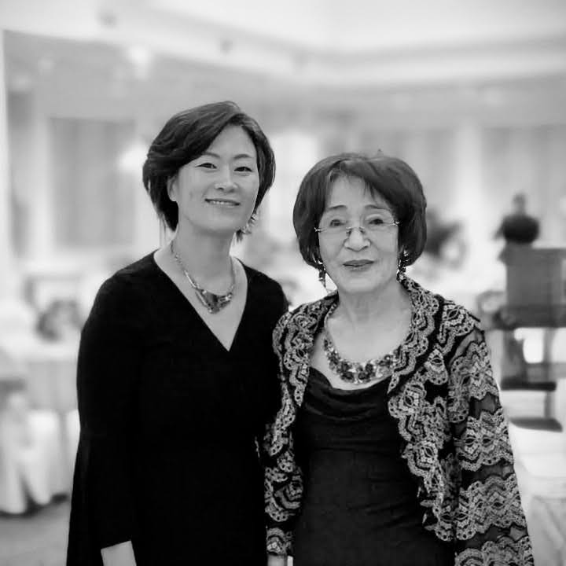
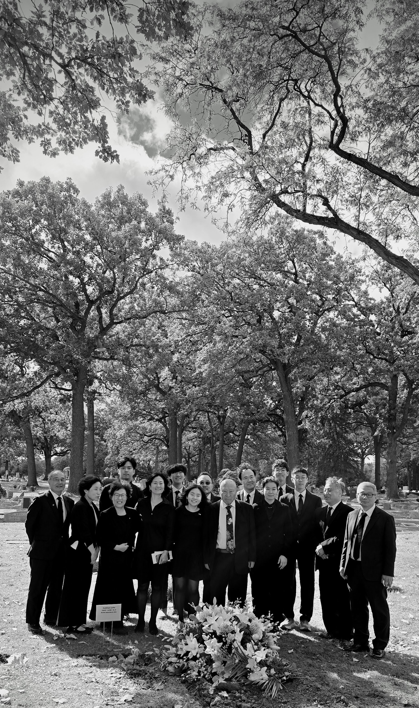

Services held at, 3918 W Irving Park Rd, Chicago, IL 60618. On 11 October 2025, 11AM Central Daylight Time.

## Young Lee (이영주) 2nd Son

[Audio Recording of Young's Message](01-Young-2.wav)

Well, I don’t know why I’m suddenly so nervous, but as David Kang introduced me, I’m her second child, Young Lee. I’m not sure why I’m the first to speak today—maybe it’s in the order of least to most favorite son.

My mom often told me, “You’re the most like me,” especially in the last few years. I took that as the greatest compliment, because my mom was truly great. Maybe not as great as King David or Nephi or Martin Luther King Jr., but in her own way, she was remarkable. And like all great people, she wasn’t without flaws—but compared to many, her flaws were small and insignificant.

If my mom was ambitious, she expected a lot from herself and from her family. I remember one instance from middle school: I came home excited, having earned straight A’s except for one A minus. I ran home from school—our middle school was miles away—but I met her in the car. I told her, “Mom, I got straight A’s except one A minus.” She looked at me and said, “Why don’t you get the A minus? Get in the car. We’re late for Steven’s Hope of America award.” That’s how my mom was—always pushing us to do our best.

Steve, if I can say, she adored you. Even in her last days, she spoke of you—how smart you were and how much potential she saw in you. I remember her saying that sometimes she might have seemed to play favorites, but she had always been told to pay special attention to the youngest child because there was something special about him.

If my mom had one regret, it was that she wasn’t as family-oriented as she wished she could have been. She admired family first in others—especially in her youngest, who loves his children deeply. Sometimes her ambition came first, and we may have felt we weren’t her priority. I think that was her biggest regret.

And then there’s my brother Mike. Who loved my mom more than Mike? He worked tirelessly in her restaurants from youth until her very last days. Yet even as much as he loved her, traveling with Mom could be tough. She could be demanding.

That brings me to my father, who shared a life with her for decades. Dad, you did your very best. You are an amazing father and husband. She was not easy to live with, but you tried your best, and we love you.

Mom, I know you are looking down on us, and I want to tell you how much we respect you. That was always the most important thing to you—to be respected and to accomplish something meaningful. And you did. You gave us three wonderful sons and ten amazing grandchildren. You were great. You were amazing.

For a brief history: Mom was born in 1940, though some records say 1941 because, as the second daughter in a time of hardship before the Korean War, her survival to her first birthday was uncertain. She lived to 85 and accomplished so much.

She grew up tough, losing her father in a male-dominated society. She worked harder than anyone I knew. She came to America at 37, not speaking English, and built a remarkable life: opening restaurants like Rick Shaw and China Place, Lisma Market, motels, and even a Holiday Inn Express from the ground up. All of that—starting from scratch, not speaking the language—is incredible.

Mom, we loved you. We forgive you. And we thank you for being such a wonderful mother. You were amazing, and we are so grateful for everything you gave us.

## Mike Lee (이명주) 1st Son

[Audio Recording of Mike's Message](02-Mike-2.wav)

I mean, how can I top that? Mine is going to be much shorter because Young basically said everything I wish I could.

I just want to say that my mom died a happy woman. For the past year and a half, maybe two years, she had found her joy—and that joy was painting.

When you went to her apartment, you could see it everywhere. She started painting in her 80s, and she could paint twenty times better than I ever could. She was so passionate that half the things she told me about were about her paintings.

When we went to Korea, she bought thousands of dollars’ worth of supplies so she could paint when she returned. I asked her, “Mom, why did you spend so much?” And she said it was because everything was four times more expensive in America.

When we first went into her apartment after she passed, we could see she had been in the middle of a painting. She must have run out of some supply. That painting was of my brother Steven’s family. When Steven saw it, he broke down, because she had been in the middle of doing her favorite thing—with the people she loved most in her life.

I am so grateful that she was able to choose that moment to return to her Father in Heaven, doing what she loved.

And everything Young said was right on. We love you so much, Mom.

## Steven Lee (이승주) 3rd Son

[Audio Recording of Steven's Message](03-Steven-3.wav)

Thank you everyone for coming. I’m the youngest son. The past couple of weeks have felt surreal. I always thought my mom was indestructible—just too tough to be taken away. There were times in her life when things happened that should have killed her, but she was just too strong.

This weekend was supposed to be a fun celebration. My brothers had bought plane tickets months ago for my mom’s 85th birthday. But instead, here we are at her funeral. In some ways, though, a funeral is also a chance to celebrate her life.

Everyone who knew her would agree that she was one of the hardest-working people imaginable. I remember when we were younger, she literally worked 100 hours a week—14 hours a day, 7 days a week—running a restaurant. And yet, she would come home and make us dinner. She worked tirelessly and still made sure we were cared for.

In my opinion, she was also the smartest person in our family. She had an incredible mind. Sometimes I would show her puzzles or math problems I was studying, and I was always shocked at how easily she solved them. She never had the chance to pursue an advanced degree because she was born in 1940 in Korea. If she had been born in modern America, she would have excelled—no question about it. I know this because both my wife and Mindy are doctors, and she would have been just like them.

Instead, she spent her life making egg rolls, cleaning motel rooms, and raising her family. In some ways, I feel sorry she didn’t get the opportunities she deserved. But ultimately, I’m grateful she was born when she was. Her life shaped all of us. My brothers and I are here because of her. Her grandkids are here because of her.

So today, as we remember her, let’s celebrate the life she lived and the incredible impact she had on all of us.

## Sophia Lee (이소희) Mike's 2nd Daughter

[Audio Recording of Sophia's Message](04-Sophia-3.wav)

Hi, I’m Sophia, my dad Mike’s second daughter.

My grandma really loved to paint, but she also had a passion for calligraphy. She would write all sorts of poems in both Korean and English. In her memory, I’d like to share a poem.

The poem is *Warm Summer Sun* by Walt Whitman:

*Warm Summer Sun, shine kindly here.*\
*Warm southern wind, blow softly here.*\
*Green sod above.*\
*Light lie.*\
*Good night, dear heart.*\
*Good night. Good night.*

## Lee Kwang Oo (이광우) Husband

[Audio Recording of Uncle Lee's Message](05-Uncle.wav)

I want to thank everyone who attended.

Since our sons have already said a lot, there’s not much left for me to add.

But what I can say is that I have always cared deeply about their studies. Even when I was in Korea, I strongly encouraged them to go to the U.S. to study.

The reason I came to the U.S. was in 1976. At first, I didn’t know anyone here, but the principle was to bring my wife and children along. We came to a good land, and the most important thing is that this is a land with excellent opportunities for education.

So we all came here together, and I encouraged the children very strongly to study well and work hard. There were, of course, some challenges, but they did well nonetheless.

I am deeply grateful and have loved my family so much that it’s impossible to fully express it. What I want to say is that our new sons and their families are all working hard, so now let’s be at peace and meet again in the future.

