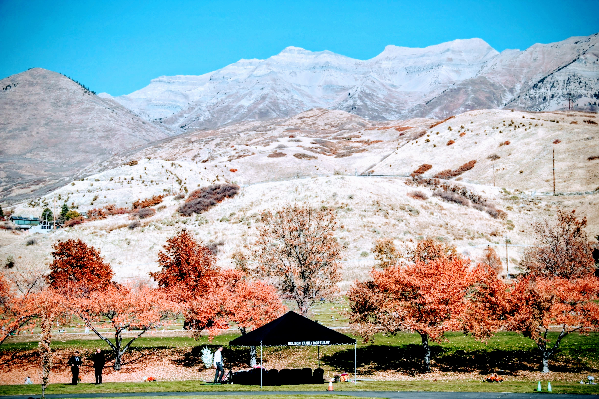
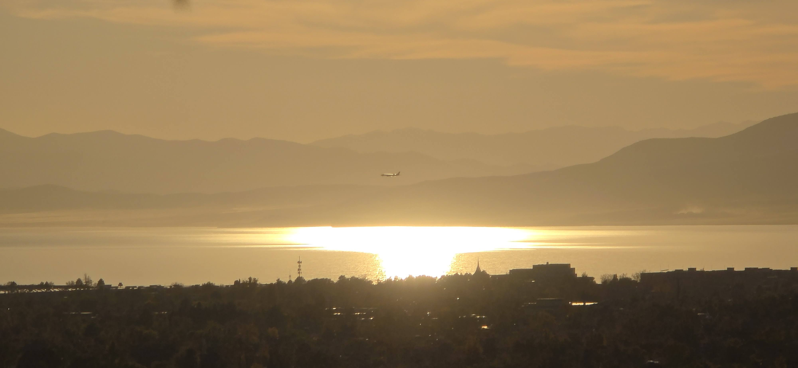

```{r, echo=F}
# Leaflet map centered on given coordinates
# Coordinates: lat = 40.96326175959413, lng = -74.03993340797206

# Install packages if missing (uncomment if needed)
# install.packages(c("leaflet", "htmlwidgets"))

library(leaflet)
library(htmlwidgets)

# Coordinates
lat <- 40.96326175959413
lng <- -74.03993340797206

# Create leaflet map
m <- leaflet(options = leafletOptions(minZoom = 2, maxZoom = 18)) %>%
  setView(lng = lng, lat = lat, zoom = 15) %>%                     # center map
  addProviderTiles(providers$CartoDB.Positron) %>%                 # clean base map
  addMarkers(lng = lng, lat = lat,
             popup = paste0("<strong>Location</strong><br>",
                            "Lat: ", format(lat, digits = 12), "<br>",
                            "Lng: ", format(lng, digits = 12)),
             label = "Click for details") %>%
  addCircles(lng = lng, lat = lat, radius = 100,                     # 100 m radius circle
             color = "#FF5722", weight = 2, fillOpacity = 0.1,
             popup = "Approx. 100 m radius") %>%
  addScaleBar(position = "bottomleft", options = scaleBarOptions(imperial = TRUE)) %>%
  addMiniMap(toggleDisplay = TRUE)                                  # small overview map (toggle)

# Print to RStudio viewer
m

# Save to a self-contained HTML file (in working directory)
outfile <- "leaflet_map_location.html"
saveWidget(m, file = outfile, selfcontained = TRUE)
#cat("Saved map to:", normalizePath(outfile), "\n")


```

Everywhere Korean people congregate there seems to be,

Korean run, for Korean businesses.

The minimal number to support such set up is small.

The other ever present element are Churches set up for Koreans.

Often they start by utilizing or sharing a space with existing churches.

Then they outgrow and purchase or build their own churches.

This is repeated wherever Koreans immigrate to.

This pattern was repeated and enlarged in the Los Angeles area.

------------------------------------------------------------------------

Wherever Korean communities take root abroad, two institutions seem to appear almost without fail: **Korean-run businesses** and **Korean churches**.\

The number of people required to sustain these is surprisingly small. A few families, a handful of entrepreneurs, and soon a network forms — a grocery store, a restaurant, a beauty salon, a travel agency.

Alongside these enterprises, churches arise as the spiritual and social heart of the community.\

Often they begin humbly, sharing space with an existing congregation, renting a hall on Sunday afternoons.\

But as the congregation grows, so does its ambition: they purchase land, construct buildings, and establish permanent institutions.

This pattern seems to repeat itself wherever Koreans have immigrated — based on my experiences of living in Washington DC area and from spending time at a sprawling metropolitan area in Southern California.\

Nowhere is this more visible than in Los Angeles, where the concentration of Korean churches has made religion not only a matter of faith but also a marker of ethnic presence and solidarity.

------------------------------------------------------------------------

"I am your father", said Darth Vader

"I will be your father", Dallin Oak's maternal grandfather upon his father's death

Koreans have taken on group agreement that says, they will be the family that others have left behind.

> “I am your father,” said Darth Vader.\
>
> “I will be your father,” said Dallin Oaks’s maternal grandfather upon the death of his own son.

Among Koreans, there exists an unspoken covenant — a shared understanding that they will become the family others have lost.

Recently, when a husband passed away after a brief illness, the Korean community rallied around his widow.\

They became the family that was not present — grandparents, uncles, aunts, and even children — ones that this couple had never had but now, through love and compassion, were fulfilled by the community.

Recently, the husband passed away after short illness.

The Korean society rallied and became the family that wasn't present.

They were the grandparents, uncles and aunts, as well as children which this couple didn't have.

------------------------------------------------------------------------

My parents always wished for a separate Korean speaking unit within the church they attended.

The results varied, they met for Sunday School only at times.

They also started a monthly Fireside meetings, followed by dinner at their home.

When a Korean unit was formed in Virginia, they traveled their, a distance of nearly 30 miles.

While these were short lived. Their desire to be among fellow Koreans and believers never waned.

One of the trips we made was to a church in Northern New Jersey.

This was to attend a combined meeting with 3 branches in NY/NJ area.

Saints from Philadelphia and Washington area joined.

The distance traveled was over 200 miles.

I didn't know why they did that at the time.

But I am beginning to understand.

------------------------------------------------------------------------

My parents always longed for a Korean-speaking unit within the church they attended.

Their efforts met with mixed results. At times, they gathered only for Sunday School. They also organized monthly fireside meetings, often followed by dinner at their home.

When a Korean group was finally formed in Virginia, they traveled nearly 30 miles each week to attend. Though these gatherings were often short-lived, their desire to worship among fellow Koreans and believers never faded.

I remember one trip to a church in northern New Jersey for a combined meeting of three branches from the New York and New Jersey area. Saints from as far as Philadelphia and Washington also came. The distance we traveled was more than 200 miles.

At the time, I didn’t understand why my parents went to such lengths.\

Now, I am beginning to understand.

------------------------------------------------------------------------

When they retired and moved to Utah, their wishes were realized.

There was a Korean speaking unit, and they could walk and be there in 5 minutes.

After 35 years of yearning, they were able to attend a fully Korean services.

> Now therefore ye are no more strangers and foreigners, but fellowcitizens with the saints, and of the household of God;

They were strangers and foreigners in this land for most of their lives. Yet, they had found a fellowship with saints — ones that spoke their language and filled in for missing or lost family members and relatives.

------------------------------------------------------------------------

When my parents retired and moved to Utah, their long-held wish was finally fulfilled.

There was a Korean-speaking unit nearby — close enough that they could walk there in five minutes.

After thirty-five years of yearning, they were able to attend worship services entirely in their own language.

> *“Now therefore ye are no more strangers and foreigners, but fellowcitizens with the saints, and of the household of God.”* — *Ephesians 2:19*

For most of their lives, they had indeed been strangers and foreigners in this land.\

Yet, at last, they found fellowship among saints — people who spoke their language, understood their hearts, and became the family they had lost or left behind.




