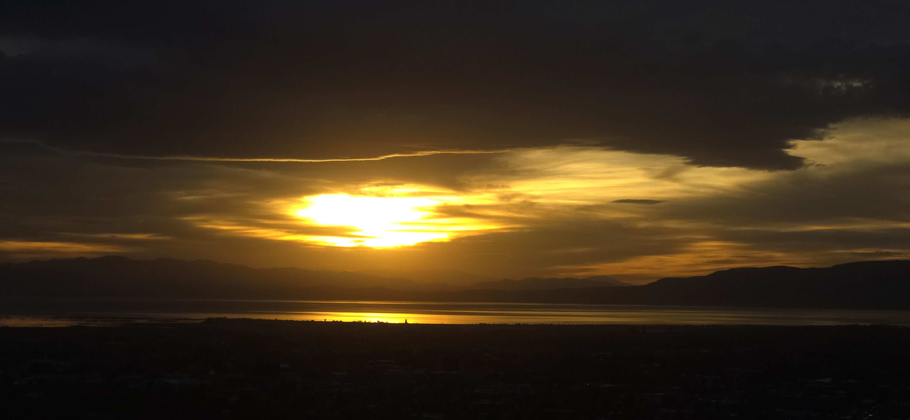

Finding out or having a better understanding of the complexity of the temporal world around us does not diminish its mysteries or meaning in our lives.

Seasons in the northern hemisphere and its attendant changing colors or foliage.

Creation of a new person and followed by a 9 month gestation period, and a miraculous birth and the sacrifice of the mother.

Death of individuals are individualist yet all appointed to close this chapter in the eternal journey.

------------------------------------------------------------------------

The Four season cycle seems eternal when young.

As one matures, the lessons are given and received

And the finite nature of our lives are understood and accepted.

However, in the eternal sense, the cycles of season does repeat and we will be renewed.

------------------------------------------------------------------------

Autumn has a peculiar stillness that invites reflection. The air cools and sharpens, carrying the faint sweetness of decay — the scent of leaves surrendering their color to time. Light, once bright and commanding, grows tender and slanted, as if aware of its own diminishing. Shadows stretch longer, and the days seem to exhale.

In these quiet transformations, we sense something profoundly human. The trees do not resist their fading; they release with grace. Their surrender is not defeat but fulfillment — the completion of a cycle written into their being. Watching them, we are reminded that our own lives, too, must learn to let go — of seasons, of people, of selves we once were.

The four-season cycle seems eternal when we are young. Each spring returns as if nothing had changed, and time feels circular, generous, and unending. But as one matures, the lessons are given and received; the rhythm that once seemed endless reveals its deeper truth. We begin to understand, and even accept, the finite nature of our own lives.

Yet in the eternal sense, the cycles of the seasons do repeat — and through them, we are promised renewal. The falling leaf is not an end, but a pause before the quiet work of winter and the green return of spring.

Whether it is the season of the year or the period of life, the fall (秋) is most melancholy season of all.

Particularly this year, there seems to be many deaths.

Don't know if there are more deaths in one season versus another.

Even so, the death seems more poignant during the fall season

------------------------------------------------------------------------

Falling leaves drift by my window...

The falling leaves drift by the window\
The autumn leaves of red and gold\
I see your lips, the summer kisses\
The sun-burned hands I used to hold\
\
Since you went away the days grow long\
And soon I'll hear old winter's song\
But I miss you most of all my darling\
When autumn leaves start to fall\

The falling leaves drift by the window\
The autumn leaves of red and gold\
I see your lips, the summer kisses\
The sun-burned hands I used to hold\
\
Since you went away the days grow long\
And soon I'll hear old winter's song\
But I miss you most of all my darling\
When autumn leaves start to fall

------------------------------------------------------------------------

Chapels in serve a multitude of functions for the Church of Jesus Christ of Latter-Day Saints.
