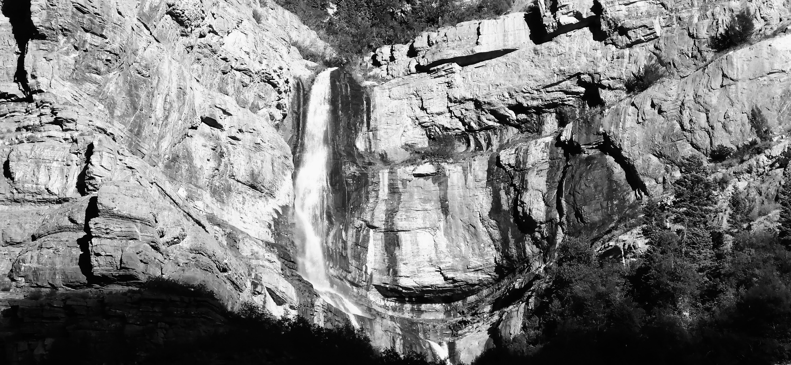
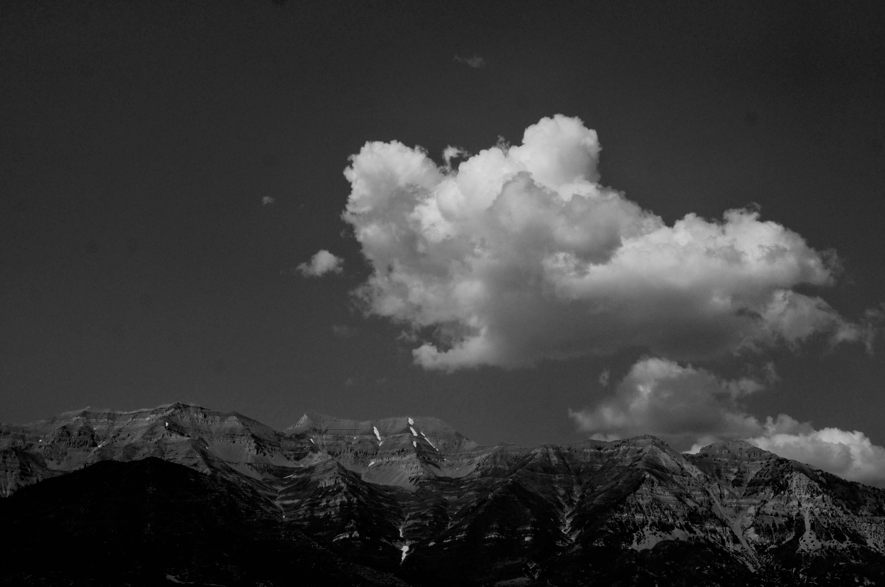

In a span of 33 days, attended three memorial services.

Each offering a glimpse into different paths in this life.

Two of the departed were about two decades older than me, the third roughly a decade older.

Two of them either earned PhDs themselves or raised children who achieved that distinction.

The third had neither advanced degrees nor children of their own.

One had drifted toward worldly achievements. Two remained steadfast in their faith throughout life.

Yet each life carried its own quiet depth.

Together, their services reminded me that legacy is shaped in many ways—by achievement, by community, by faith, and by the quiet character we embody and leave with the family.

The services were lovingly prepared by families, supported by their friends and their congregations --- who were their neighbors.

That congregation or the family of believers, had become their mothers and fathers, daughters and sons.

> Therefore, as we have opportunity, let us do good to all people, especially to those who belong to the family of believers.
>
> New International Version, Galatians 6:10

Through spoken words and music, we were given a window into their private lives and the legacies they left with loved ones.

In addition, we understood more fully our sojourn on this earth and how it fits within the great Plan of Happiness

After these services, made a resolve:\

To love every soul I meet with a fullness that leaves no doubt.\

To offer a steady, unqualified love, not grounded in earthly measures--a love that becomes its own quiet testimony—\

a reminder that we are eternal beings,\

known and cherished before this life,\

and welcomed by love again when we leave it.

It is the legacy my parents lived,\

and the one I hope my life will echo.

