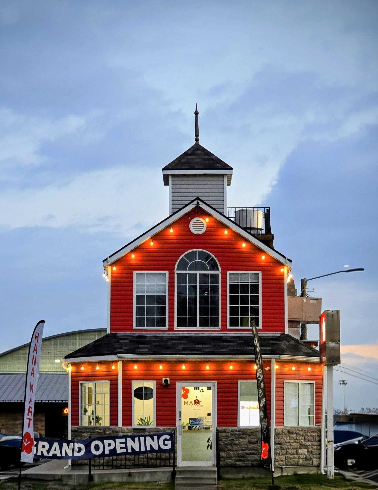

It felt at first like stepping into the lobby of a small, old-world hotel—quiet, warm, and softened by music drifting from the southwest corner.

The source wasn’t a sleek sound bar or Bluetooth speaker, but a sturdy white box from an earlier era—the kind Steve Jobs might have unveiled onstage. Yet from it came something unmistakably timeless.

If you listened with just a bit of imagination, you could almost hear Autumn Leaves by Johnny Mercer floating through the room:

> The falling leaves drift by the window, The autumn leaves of red and gold…


And in this space, the melody felt perfectly at home.\
Like Goodwood Park Hotel.

```{r}
library(leaflet)

# Goodwood Park Hotel, Singapore
lat <- 1.3085658228056107 
lng <- 103.83439328540615

leaflet() %>%
  addTiles() %>%                        # OpenStreetMap tiles
  setView(lng = lng, lat = lat, zoom = 16) %>% 
  addMarkers(lng = lng, lat = lat, 
             popup = "Selected Location")
```

The room carried a gentle nostalgia—simple tables, soft natural light, and the faint aroma of simmering broths or pan-seared dishes lingering from the kitchen. It echoed the familiar charm of eateries tucked away in East Asian side streets:

서울 · 東京 · 台北 · 香港

Places where the food is honest, the hospitality understated, and the atmosphere unpretentious enough that you relax without thinking about it.

Sometimes we go searching for places like these—seeking flavors, sounds, and textures from faraway cities. Other times, if we’re patient, those places come to us instead, quietly settling into our own neighborhoods, waiting to be noticed.

This spot is one of them.


Familiar yet foreign, modest yet comforting, it rewards anyone willing to step inside, take a seat, and let the experience unfold.

If you find yourself nearby with a quiet moment to spare, stop in—some places reveal their charm only when you sit down and stay awhile.

Let Hana Mart carry you back to the quiet side streets you remember, and the ones your heart still hopes to visit.

Be sure to say 안녕하세요 to Sister K, aka, Mama June.



```{r}
library(leaflet)

# 88 Cougar Blvd
lat <- 40.250430014877374 
lng <- -111.65711840878373

leaflet() %>%
  addTiles() %>%                        # OpenStreetMap tiles
  setView(lng = lng, lat = lat, zoom = 16) %>% 
  addMarkers(lng = lng, lat = lat, 
             popup = "Selected Location")
```
