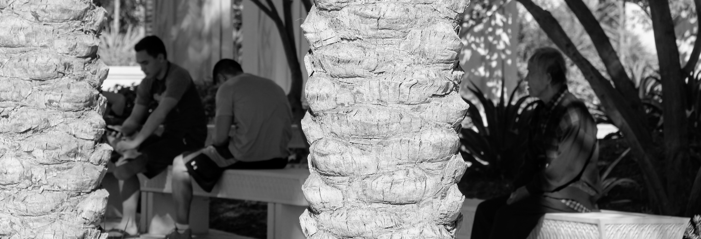
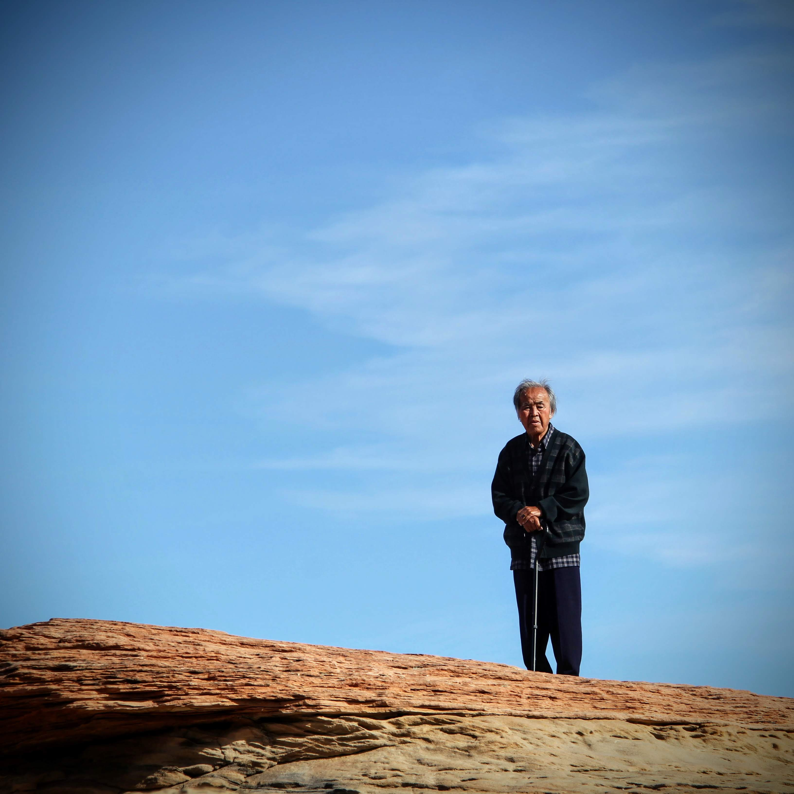
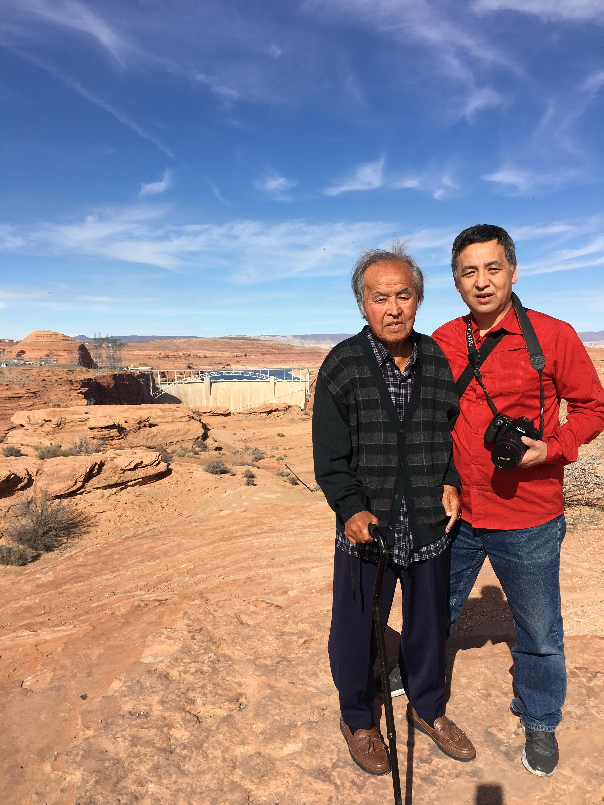

We switched drivers at a stop along Highway 89, just before reaching Glen Canyon Dam.

I had taken the morning shift, and my 23-year-old son was set to drive the rest of the way.

Unlike in years past, we encountered no weather-related slowdowns as we crossed Highway 20.

Traveling with us was my 87-year-old father.\
We were on our way to attend a wedding in the Valley of the Sun.

As my son pulled the van out of the rest area, my father quietly said,\

> **“내 나이에 이렇게 같이 여행할 수 있으니까 너무 좋다.”**

(“At my age, it is a blessing that we can travel together like this.”)

------------------------------------------------------------------------

We found ourselves making a few extra sightseeing stops along the route. Dad’s spirits were noticeably brighter, and somehow the long drive felt shorter than the map had predicted.

Dad was now walking with the help of a cane.

Yet his mind was still clear and his recollections remarkably vivid.

------------------------------------------------------------------------

He enjoyed seeing my sisters gathered together, and he fully participated in all of the festivities—ever present and ever optimistic, just as he had been throughout his life.

He passed away two years after this trip.\

---

My mom told us about a dream.

She was in a valley, between 2 low mountains, much like the ones in Korea.

There was a well and a gentleman with long white beard appears
He is holding a book.

Although my mother never met our paternal grandfather, she recognized that it was him.

Further, she realized the book was the family record, a genealogy book.

We waited for that book to appear for a long time.
We are still waiting.

However, in some ways, maybe our father became the 신선(神仙) that my grandfather represented.

---

That is a very interesting and evocative dream! Dreams can often carry deep cultural and emotional significance.

Here are a few options for improving the grammar and flow, depending on the desired tone (from simple narrative to more poetic/formal).

---

## Option 1: Simple Narrative

This version is clean, direct, and maintains a narrative flow.

> My mother recently shared a profound dream with us.
>
> She found herself in a valley, situated between two low mountains, much like the terrain in Korea. In this valley, there was a well. A gentleman with a long white beard appeared, holding a book.
>
> Although my mother had never met our paternal grandfather, she immediately **recognized that it was him**. She then realized the book he held was the **family record**, a genealogy book we have long waited for.
>
> We are still waiting for that book to appear.
>
> In some ways, however, it's possible our father has become the *Seon-in* or **Sinseon (神仙)**—the immortal hermit—that his own father (our grandfather) represented.

---

## Option 2: More Poetic and Formal

This version uses stronger transitional phrases and slightly more formal language, suitable for recording a significant memory.

> My mother recounted a deeply meaningful dream.
>
> **The setting** was a gentle valley nestled between two low mountains, reminiscent of the Korean landscape. Beside a well, a venerable gentleman with a long white beard materialized, holding a book.
>
> Despite never having met her husband's father, my mother instantly **recognized the man as our paternal grandfather**. Moreover, she understood that the book he carried was the **family genealogy record**—a document we have long sought and are still waiting for in reality.
>
> **Perhaps**, in a symbolic sense, our father has now embodied the role of the *Seon-in* or **Sinseon (神仙)**—the spiritual immortal—that his father had personified in the dream.

---

I’m grateful that my son and I had the chance to travel with him and share a full day of conversation about life.

------------------------------------------------------------------------

Sister K describes my father's later years as 신선 (神仙) days.

Someone who is no longer bound by worldly standards, without materialistic desires.

Much like old Daoist Sages.

1.  1\.

    중국의 신선 사상(神仙思想)과 도교(道敎)의 이상(理想)으로 여기는 인간상(人間像). 곧, 인간계를 떠나 산 속에 살며, 불로불사(不老不死)의 기술을 닦고 신통력을 얻은 사람. 선자(仙子). 선자(仙者). 선인(仙人). 어풍지객(馭風之客). 연객(煙客). \[준말\] **선(仙)**.

2.  2\.

    세속적인 상식에 구애되지 않는, 무욕(無欲)한 사람. 선객.
