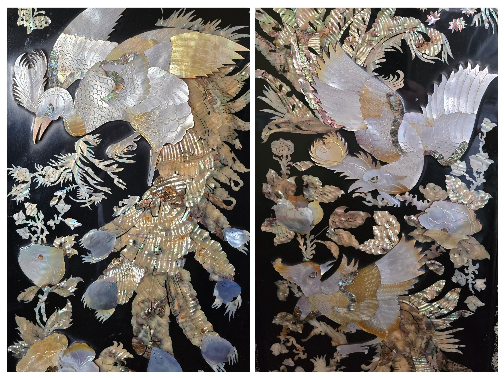

My parents purchased a matched set of storage cabinets—bedroom and living room—beautifully crafted, with 1960s mother-of-pearl inlays.

Technically, the **찬장** was meant for the kitchen.\

But in my parents’ home, it became the centerpiece of the living room.

When they moved west—2,100 miles (3,400 km)—those cabinets came with them. They made the journey just as faithfully as my parents’ hopes and fears.

It wasn’t that my parents were unaware of trends.\

They saw friends upgrade to bigger houses in newer neighborhoods.\

They watched their children move into modern homes with modern decor.

Yet they held onto these familiar, outdated cabinets.\

Hopelessly out of style… and yet irreplaceable.

Now that Sister K lives in the home, we sometimes wonder whether we should let them go. Sell the furniture. Start fresh. Move out of the past.

But neither of us can.\

Not yet.

To discard them feels like discarding a part of our parents—a piece of their immigrant journey, their sacrifices, their hopes for something better. Those cabinets hold more than clothes and keepsakes; they hold the echoes of a life built through effort, persistence, and faith.

So, for now, we will keep them.\

Maybe for a long time.

They are the last, tangible link to the memories and spirit of our ever-seeking, ever-striving parents—and we’re not ready to let that go.

------------------------------------------------------------------------

My parents purchased a matched set of storage cabinets—bedroom and living room—beautifully crafted, with 1960s mother-of-pearl inlays.

Technically, the **찬장** was meant for the kitchen.\

But in my parents’ home, it became the centerpiece of the living room.

When they moved west—2,100 miles (3,400 km)—those cabinets came with them. They made the journey just as faithfully as my parents’ hopes and fears.

It wasn’t that my parents were unaware of trends.\

They saw friends upgrade to bigger houses in newer neighborhoods.\

They watched their children move into modern homes with modern decor.

Yet they held onto these familiar, outdated cabinets.\

Hopelessly out of style… and yet irreplaceable.

Now that Sister K lives in the home, we sometimes wonder whether we should let them go. Sell the furniture. Start fresh. Move out of the past.

But neither of us can.\

Not yet.

To discard them feels like discarding a part of our parents—a piece of their immigrant journey, their sacrifices, their hopes for something better. Those cabinets hold more than clothes and keepsakes; they hold the echoes of a life built through effort, persistence, and faith.

So, for now, we will keep them.\

Maybe for a long time.

They are the last, tangible link to the memories and spirit of our ever-seeking, ever-striving parents—and we’re not ready to let that go.

