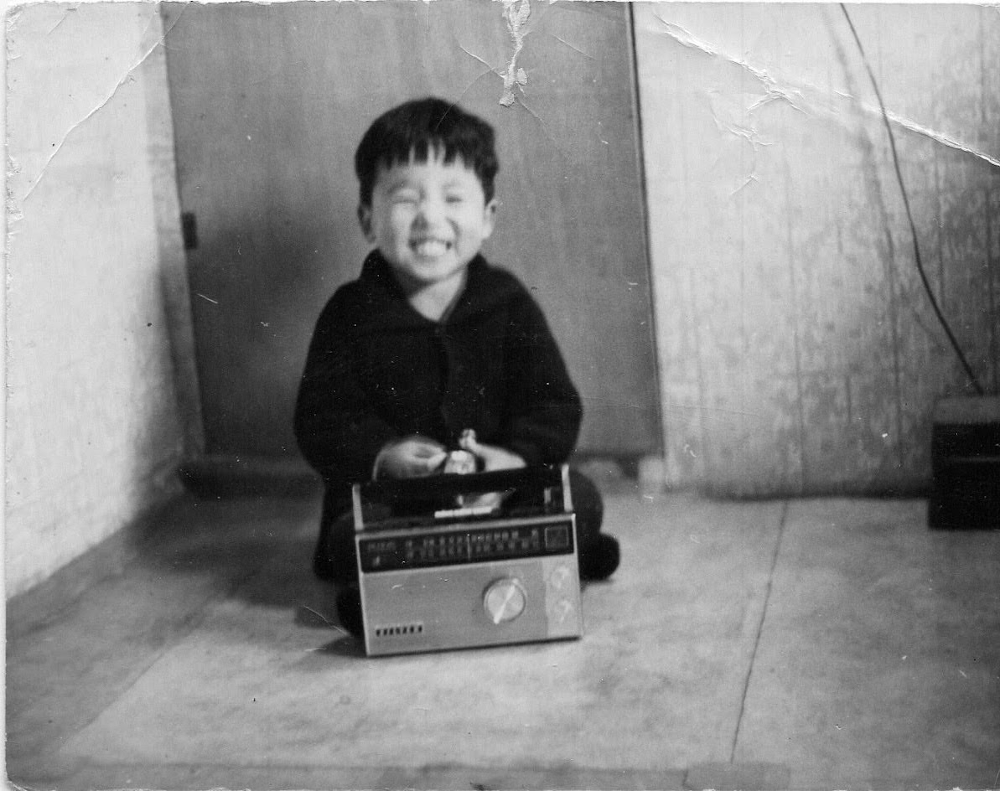

Family's first audio or video receiving equipment was a transistor radio.

Most likely purchased in HK (香港) by my father. After working in Vietnam for 2 years, he was given a leave to visit home.

Because propeller planes had limited ranges, he had to have layover at HK or Taipei on his way home.

How fortunate for him our family.

That gave him an opportunity to shop for those things not found in Korea at the time.

Like hats, coats, bags and cosmetics for my mom and a radio for the family.

------------------------------------------------------------------------

This sounds like a wonderful piece of family history! I've formatted your recollection to capture that warm, narrative tone often used when sharing cherished memories.

------------------------------------------------------------------------

## 📻 The First Sounds of Home: Our Transistor Radio

Our family's first foray into the world of electronic entertainment wasn't a television, but a small, remarkable piece of technology: a **transistor radio**.

This radio was most likely purchased by my father in **Hong Kong (香港)**. He had been working overseas in Vietnam for two long years, and when he was finally granted leave to visit home, the limited range of propeller planes necessitated a layover—either in Hong Kong or Taipei—on his journey back to Korea.

### A Fortunate Stopover

How fortunate that layover turned out to be, both for him and for our family!

That precious time gave him a rare opportunity to shop for things that simply could not be found in Korea at the time. He returned with a bounty of gifts:

-   Beautiful **hats, coats, bags, and cosmetics** for my mother, tokens of affection from a world away.

-   And, most importantly for us all, that treasured **transistor radio**—the first piece of audio-receiving equipment our family ever owned. It brought the world's sounds and stories right into our home.

------------------------------------------------------------------------

Advantages of audio over video include

That is an excellent question that touches on cognitive psychology, communication theory, and media design. The data overwhelmingly favors **video (audio-visual)** for conveying information, especially when it comes to **long-term retention** and **complex topics**.^1^

Here is a comparison of how much information can be conveyed and retained using audio-only versus audio-visual (video) methods, based on common research findings:

------------------------------------------------------------------------

## 📊 Comprehension and Retention Data

The primary reason video is generally superior is due to the **Dual Coding Theory**, which suggests that information is better recalled when it is encoded both visually and verbally.^2^

|                                               |                            |                                           |                                                                        |
|-----------------------------------------------|----------------------------|-------------------------------------------|------------------------------------------------------------------------|
| **Communication Method**                      | **Information Channel(s)** | **Typical Retention Rate (After 3 Days)** | **Key Strength**                                                       |
| **Audio-Only (e.g., Podcast, Voice Message)** | Auditory (Verbal)          | \$\sim\$10% to 20%                        | **Flexibility/Multitasking** (Can be consumed while doing other tasks) |
| **Video (Audio-Visual)**                      | Auditory (Verbal) + Visual | \$\sim\$65% to **95%**                    | **Comprehension & Retention** (Visuals anchor the spoken message)      |
| **Text-Only**                                 | Visual (Verbal)            | \$\sim\$10% to 20%                        | **Reference/Review** (Easy to scan and reread at own pace)             |

------------------------------------------------------------------------

### 1. The Power of Visuals (Video)

The visual channel in a video dramatically increases the brain's capacity to process and store information.^3^

-   **Faster Processing:** Studies suggest that the brain processes visuals **60,000 times faster** than text.^4^ Viewers can grasp the sense of a visual scene in less than $1/10$ of a second.

-   **Long-Term Memory:** As Dr. Lynell Burmark notes, unless words and concepts are "hooked onto an image," they tend to be processed only by the short-term memory.^5^ Visuals directly engage the long-term memory, making the content **indelibly etched**.^6^

-   **Information Density:** Video allows you to communicate multiple layers of information simultaneously:

    -   **Verbal:** Spoken words.

    -   **Visual Demonstration:** Showing *how* something is done (e.g., a physical process, a software tutorial).

    -   **Nonverbal Cues:** Facial expressions, gestures, and body language (crucial for emotional messages or social interactions).^7^

    -   **Reinforcement:** On-screen text, charts, or diagrams that reinforce the spoken word.

> **Example:** In a study comparing the effectiveness of instruction, an **illustrated text** was found to be ^8^$\sim83\%$ more effective than text alone when comprehension was tested after a delay.^9^ This illustrates the compounding value of the visual component over time.^10^

### 2. The Strengths of Audio-Only

While video conveys more dense information, audio-only has distinct advantages related to **flexibility** and sometimes, **engagement** or **focus**.

-   **Multitasking:** Audio messages (podcasts, voice notes) are highly effective when the recipient needs to consume the information while performing other activities (driving, exercising, cooking).^11^ This is where audio's convenience is unmatched.

-   **Cognitive Focus (for some):** For certain topics or for people who are strong auditory learners, removing the visual channel can force greater concentration on the verbal content, leading to deeper listening.

-   **Emotional Connection:** Research suggests that purely audio content can sometimes lead to a **stronger physiological emotional response** (higher heart rate, etc.) because the listener must actively engage their imagination to fill in the missing visual details.^12^ This is especially true for narrative or dramatic content.

### 3. The Contextual Factor: **Complexity**

The effectiveness gap between video and audio widens based on the **complexity** of the information being conveyed:

|                                      |                        |                                                                                                                                                   |
|--------------------------------------|------------------------|---------------------------------------------------------------------------------------------------------------------------------------------------|
| **Type of Information**              | **Recommended Medium** | **Reason**                                                                                                                                        |
| **Simple Concepts/Routine Updates**  | **Audio-Only**         | Faster to create; allows multitasking for the listener; verbal tone conveys urgency/emotion well.                                                 |
| **Technical Instructions/Processes** | **Video**              | The visual demonstration of a sequence (the "how-to") is essential for reducing ambiguity and cognitive load.                                     |
| **Complex Relationships/Data**       | **Video**              | Necessary to use charts, graphs, and visual organizers to explain connections that would be difficult or impossible to describe with words alone. |
