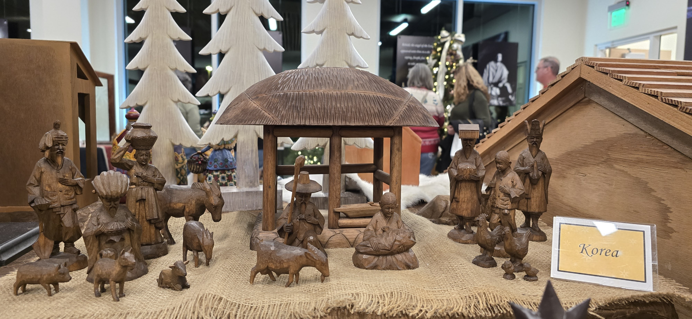
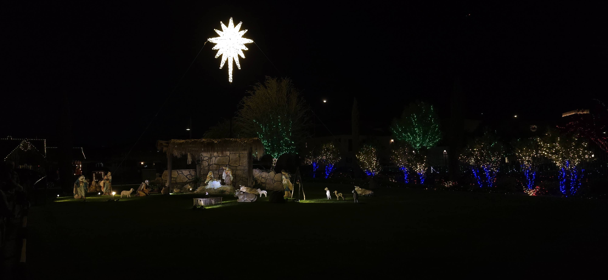

For most of my life, my home has straddled latitudes of 37 to 40 degrees north.

Which meant, Decembers were dark, cold and with an occasional snow.

Especially those early years, after the Korean War.

Being outdoors longer meant more exposure to the cold, because we were either walking or taking buses or trains.

------------------------------------------------------------------------

Christmases from early stay longer.

Memories of gathering at L Family during Maryland years evoke lasting memories.

Maybe because we were new to America and still searching for ways to get established.

We had no tradition.

But a number of families in one area did.

We were invited to attend.

No set time, all seemed to be invited and enjoying themselves.

Resolved to follow that manner of celebration

Christmas is universally celebrated.

Grew up in areas with winters, sometimes harsh and on some magical December, enough snow to cancel schools for a month in East Coast school districts.

Never thought about how southern hemisphere celebration is like.

Closest I got to the Southern Hemisphere was a visit to an island city state. Located few miles north of equator.

Familiar decorations were out. Designed to put people into a shopping mood I suppose.

------------------------------------------------------------------------

My recollections of Christmas was mostly centered around material things. Until recently.

When I was very young, it was to receive candies.

Then gifts that were received and gave away.

Only recently have I try to learn the deeper meaning of Christmas/

------------------------------------------------------------------------

Western stories are more personal.

Wondered if Eastern stories could tell the story of Christ's birth.

Cameo by Magi's are closest we may come.

Recently visited a desert city with over 4 million inhabitants.

Weather reminiscent of fall or spring.

Christmas lighting put one in the Christmas spirit.

Then the nativity collection sealed it for me

^**13**^ And suddenly there was with the angel a multitude of the heavenly host praising God, and saying,

^**14**^ Glory to God in the highest, and on earth peace, good will toward men.

