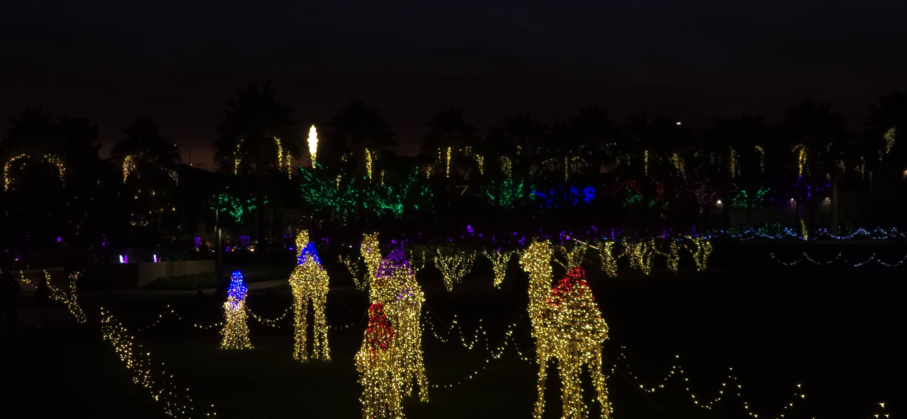

Wondering Awe

> “With Wondering Awe” is a Christmas carol unique to the Latter-day Saint hymnal; but it is not of Latter-day Saint origin, and its author and composer have remained a mystery. The current hymnal indicates both words and music are anonymous, from *Laudis Corona*, a Catholic collection published at Boston in 1885.

Excerpt from [With Wondering Awe, [**Latter-day Saint Hymnology**](https://ldshymnology.wordpress.com/)] (https://ldshymnology.wordpress.com/2018/12/23/with-wondering-awe/)

1\.

With wond’ring awe the wisemen saw
The star in heaven springing,
And with delight, in peaceful night,
They heard the angels singing:

Hosanna, hosanna, hosanna to his name!

2\.

By light of star they traveled far
To seek the lowly manger,
A humble bed wherein was laid
The wondrous little Stranger.

Hosanna, hosanna, hosanna to his name!

3\.

And still is found, the world around,
The old and hallowed story,
And still is sung in ev’ry tongue
The angels’ song of glory:

Hosanna, hosanna, hosanna to his name!

4\.

The heav’nly star its rays afar
On ev’ry land is throwing,
And shall not cease till holy peace
In all the earth is growing.

Hosanna, hosanna, hosanna to his name!

