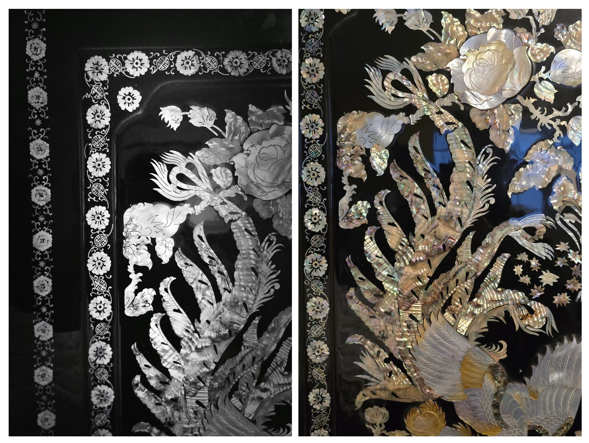
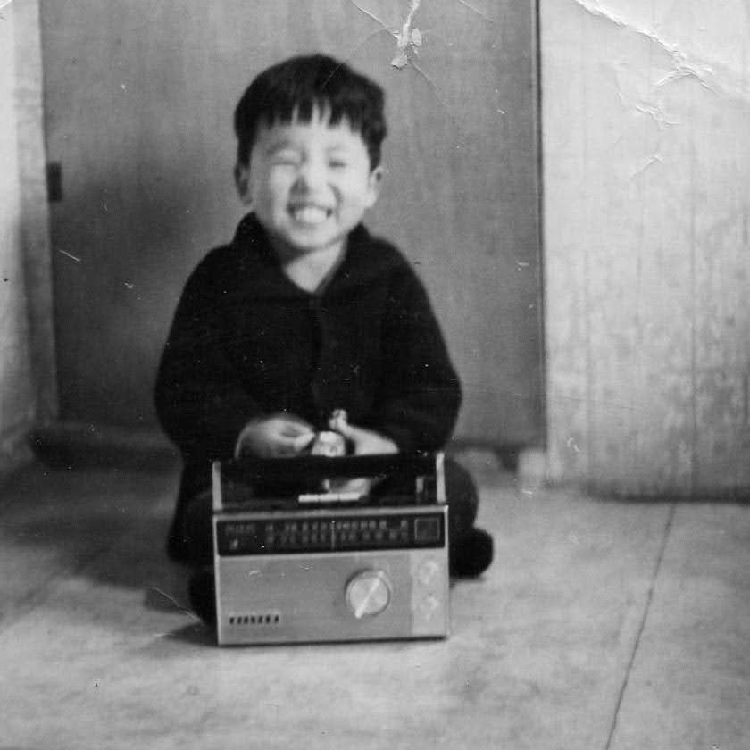

I recently decided to position a selected audio device six feet (183 cm) above the floor, resting atop the 장농 (Jangnong)—a traditional Korean Mother of Pearl wardrobe dresser—in the northeast corner of my bedroom.

I chose the smallest unit for this experiment.

Over the years, I have gathered a wide array of devices for recording and reproducing sound, spanning both analog and digital formats and utilizing every imaginable medium.

However, I’ve had a recent realization: instead of chasing higher specifications for 'louder' or 'better' performance, I should focus on the environment and my own state as the receiver of that sound.

To clear the path for the music, I began removing objects that might block or disperse the sound waves.

One effective—if not always conventional—method is to raise speakers to ear-level or higher.

By utilizing the flat surface of the wardrobe chest as a natural pedestal, the results were striking.

Even at low volumes, the sound was surprisingly clear, penetrating the room with a new-found intimacy.

In the privacy of the bedroom, away from public distractions, I found myself more relaxed and truly focused on the message within the music.

---

In today’s society, messages are pervasive—often carried through the omnipresent medium of music.

This sound is now entirely portable.

If we choose, we can transmit it directly to our inner ears, mechanically shielding ourselves from the external 'noise' that surrounds us.

It allows us to create a private world, isolated from the rest.

Yet, when I am out in the world—moving through nature or traveling between places—I find myself wanting to see, hear, and feel what the world is saying in that exact moment.

What some dismiss as mere noise are actually the messages of our environment.

To truly be 'in' the world is to absorb and attempt to understand these public signals.

They provide the raw material that we later process in private, aided by the comfort of our memory-inducing devices and the playlists curated by others.

.jpg)

---

The streaming audio device above the dresser is currently tuned to 89.1 MHz on the FM dial.

Some nights, as I drift toward sleep, the sound feels as though it is descending from above—ethereal and almost other-worldly.

I find myself listening not just for the melody being played, but for the memories it evokes.

I think of the individuals who dedicated their lives to mastering these instruments and vocals.

The performances I had attended and feeling the intentionality with which they delivered their messages.

This practice of intentional listening and association has helped me develop my own voice, my own music, and my own center.

Independent from and of other voices or messages, one that connects me back to my beginnings.

Perhaps returning me, to that childhood moment when I first held a device that could receive and transmit messages from this world and beyond.

