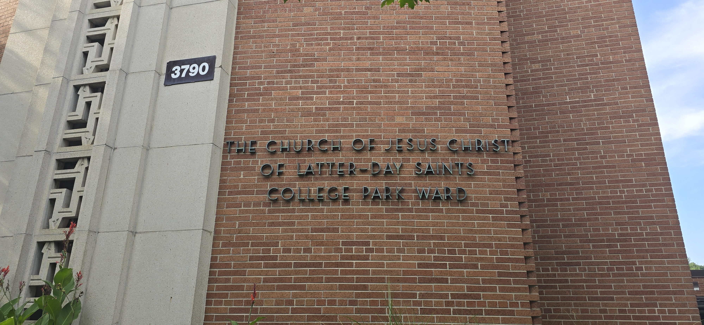
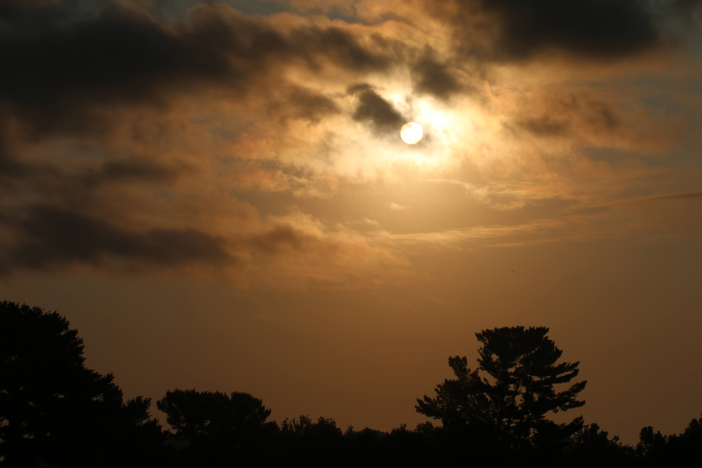
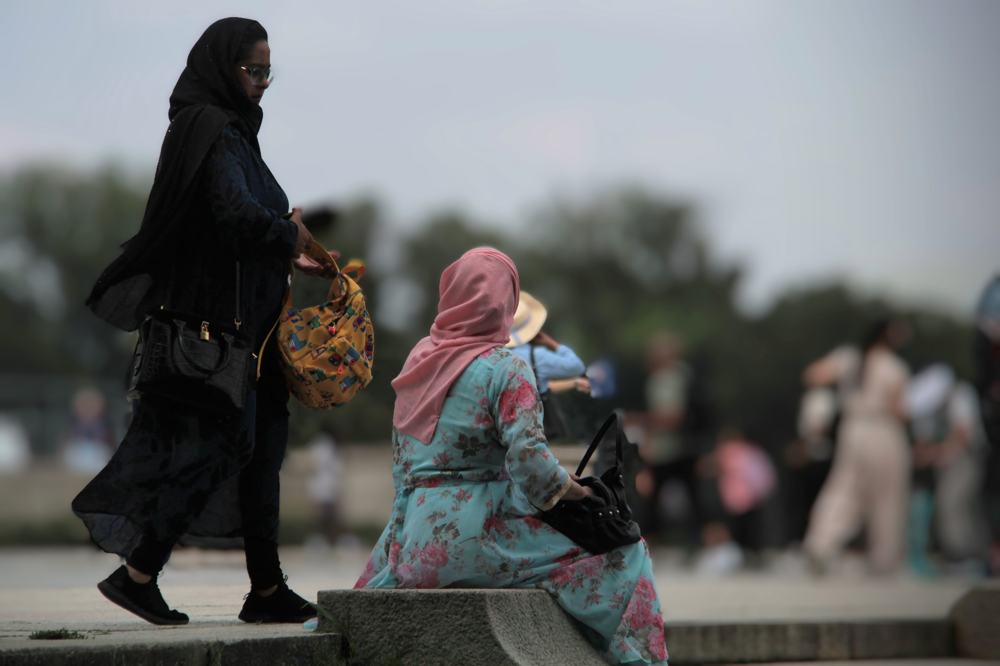

As we prepared for the congregational hymn, the choir director—visible and striking in her Christmas-red outfit—stood to lead us. Her enthusiasm and love were unmistakable, radiating through the choir and out into the pews. I am certain the congregation felt that same warmth, though I couldn't see their faces; I was facing forward, which was a fortuitous, as I had begun to cry.

In that moment, I was transported back in time to 3790 MD-410, on the East-West Highway in Hyattsville—the place I called my spiritual home for nine years.

I vividly remembered that same spirit in Sister L. and the others who led us in songs so long ago.

My heart began to soften, and my spirit lifted.

It felt as though the veil had thinned, and perhaps the angels and those who have passed on had descended just enough to join their voices with ours.

------------------------------------------------------------------------

We are known as the United States of America, but perhaps we would be better described as the United Communities or United Families of America.

When I first joined that congregation fifty-one years ago, we possessed virtually nothing in the way of physical belongings. We had a budding spiritual understanding, but we lacked established family traditions—especially for the Christian celebration of Christmas.

Everything we learned and experienced was church-centered and supported by our "Ward Family." We immersed ourselves in Christmas devotionals, and I still vividly remember a powerful message regarding the importance of a father’s involvement. Later, I watched with pride as my own father participated, playing the role of one of the Three Wisemen.

We gathered in the homes of other families to learn Christmas carols and to observe, for the first time, what a true holiday gathering looked like. I took note and expressed gratitude internally, hoping to practice those traditions so I could carry them forward into my own life.

------------------------------------------------------------------------

The messages and the music were terrific. Every year I find myself saying the same thing:

> "It simply cannot get any better than this."

But it does.

How is it possible for a gathering of only three hundred individuals to produce a performance of this caliber? Even with minimal practice, the result matched the beauty and professional standard required to invite the Spirit.

As the Bishop mentioned, our Ward has undergone significant demographic changes; we are now, officially, a "top-heavy" ward.

There was a time when certain families in our midst could have fielded an entire string ensemble on their own.

Today, while the internal talent pool may not be as vast as it once was, it has become more refined—-augmented beautifully by the presence of friends and visitors.

It was a gentle and a sweet reminder that a nation is sustained by a union of communities, and those communities are built upon a foundation of dedicated families.

We gather not just to celebrate, but to learn and practice the mandates of life—striving, year after year, to move a bit closer to the ideals of our faith.

It is through practicing these ideals that my heart is opened.

By exercising the very concepts that make a community thrive, we help our country excel.

In this land, we prove that the old familiar story can be or should be, and so it has changed:

> There is a room in the Inn—the one we call America.

