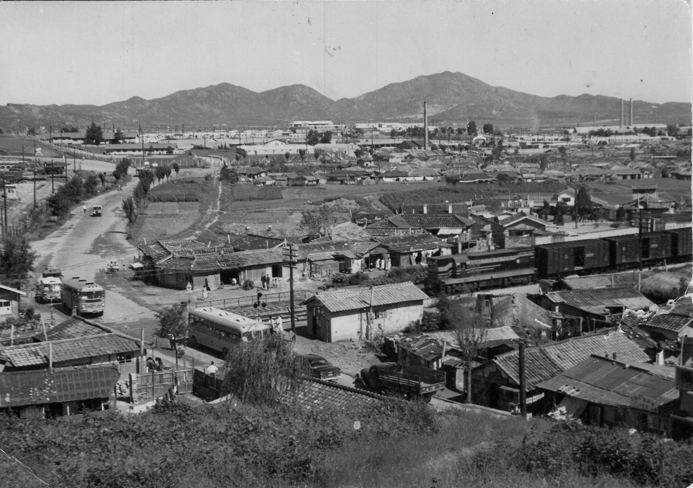

As a group of neighbors, we waited in line to greet the newly married couple. Most of us had already married off our children, while our neighbor—the bride’s family—was just beginning this new chapter.

As we approached the groom’s side of the reception line, his mother looked at us and said with a smile:

*"You are Koreans, aren't you?"*

I was caught off guard. I immediately found myself scanning my outfit for any possible visual clues.

*How did she know?*

She explained that she had observed us as we moved through the line. Perhaps aided by the popularity of K-Dramas, she had noticed a distinct habit: Koreans tend to bow slightly upon meeting a person.

I was impressed by her keen observation.

It set my mind racing—what other subtle visual clues do we unknowingly broadcast to the world when we meet others?

------------------------------------------------------------------------

Sister K was somewhat disappointed early in our marriage.

She knew that I had lived in the United States for over fifteen years by the time we married; even though I was born in Korea, she expected me to have been refined by Western ways of thinking and living.

Instead, she found a person who was nearly 100% Korean in his mannerisms and mindset.

Aside from eighteen months in the "City of Angels," I spent my formative years in the suburbs of Washington, D.C., part of a small wave of Korean immigrants who settled in the northeast quadrant of that diamond-shaped city.

Though we attended public schools and navigated the American landscape, our lives were anchored by our home life—a world governed by our North Korean-born parents.

We were surrounded by imported Korean news and entertainment, and our social circles were almost exclusively other Korean immigrants.

The only exception was our chosen church, while other Korean attended churches that were extension of their social circles, we continued attending the new faith that started in Korea.

Where we associated with members who had mostly emigrated from the Western United States. It was a unique collision of cultures, but the domestic influence won out.

I realized then that it is not necessarily the place or the duration of one's stay that defines who they become. Rather, it is the private environment—the "micro-culture" of the home—that shapes the person the world eventually sees in public.

.jpg)

------------------------------------------------------------------------

Mass media and social networks have captured and amplified the public aspects of Korean culture for the world.

For that, I am grateful; it is a bridge of understanding that didn't exist when I first arrived in the United States.

Yet, the groom's mother seeing the "Korean" in me makes me wonder: How would I answer if someone asked me,

> "What are the essentials of being a Korean Christian in America today?"

The answer lies in the balance and an additional burden.

It is the commitment to carry on the deep, ancestral traditions of my parents while simultaneously espousing the positive, independent, and ever-evolving spirit of America.

It can be a heavy burden to recognize, refine, and carry two or more cultures at once.

Yet, as a nation of immigrants, we have always done this, and we must continue to do so.

We refine these cultures so that others may recognize our foundations—not just in the "micro-bows" of a public wedding line, but in the private integrity of our daily lives.

In the words Gerald O’Hara in Gone with the Wind, though with a personal adjustment. He famously asked:

> "Do you mean to tell me, Katie Scarlett O'Hara, that Tara—that land—doesn't mean anything to you? Why, land is the only thing in the world worth workin' for, worth fightin' for, worth dyin' for, because it's the only thing that lasts."

In my own life, I would replace "the land" with **family** and **traditions**.

