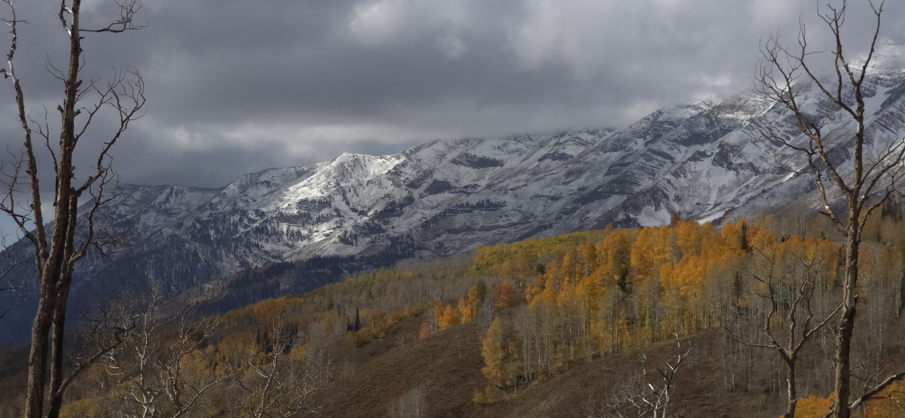
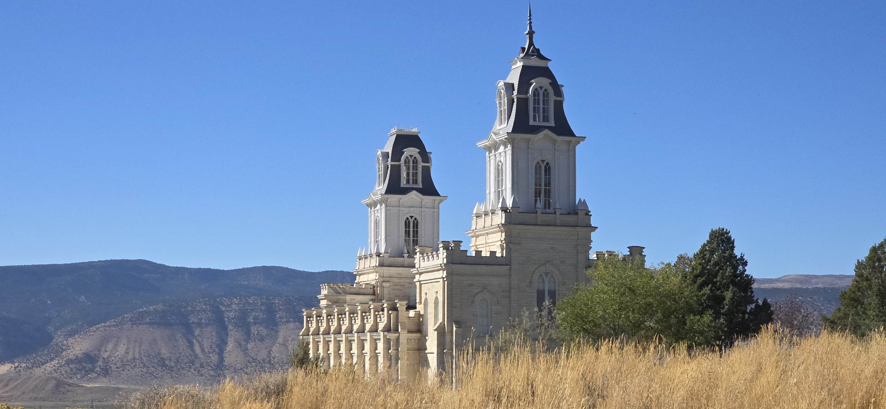
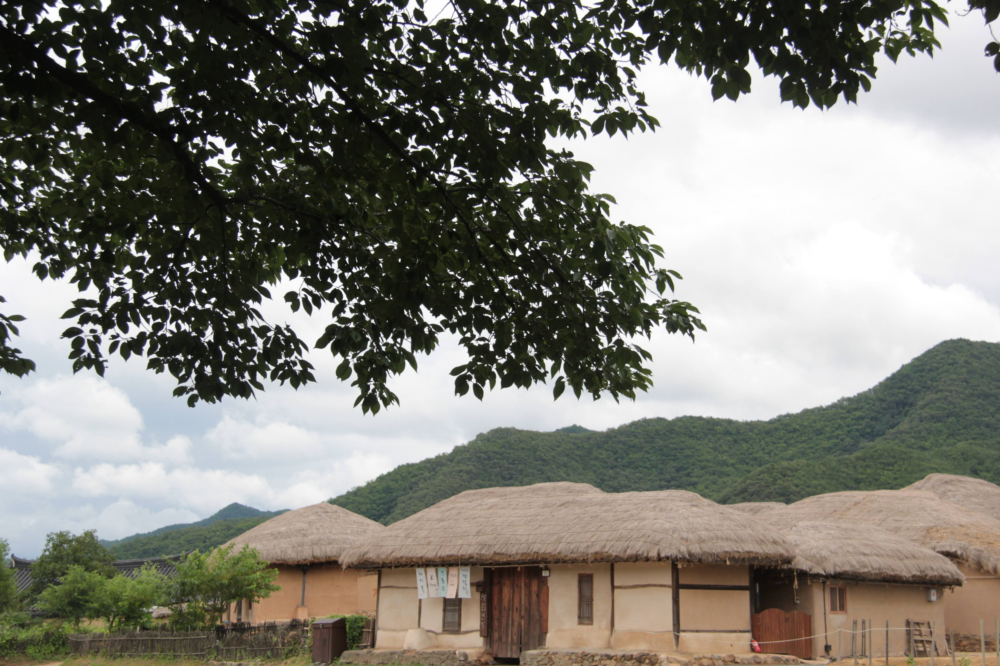

Learning a foreign language after the teenage years is an exercise in humility.

It is a struggle.

Same challenge is faced by those trying to reclaim a "mother tongue" that was either never fully learned or long forgotten.

One of the hurdles is the "near-miss"—words that sound almost identical but carry vastly different, even contrasting, meanings.

My son, who served a mission in the western islands of 日本, recalls a time he was teaching about God sending His **kind and gentle** son to earth.

He intended to use the word **温厚 (Onkou)**, but in the heat of the moment, a similar-sounding word slipped out with a totally different meaning. Fortunately, the gravity of his message and the listener's tolerance for a "rookie" mistake saved the discussion.

I can relate. Even with a native tutor (my wife) for over thirty years, I still struggle with the subtle nuances of Korean and the weight of Chinese-character-based words (한자, 漢字).

I used to wonder why missionaries were considered so "valuable" upon their return.

In Korean, the word for **"Return"** is **귀환 (Gwihuan), 返回, 帰還**, while the word for **"Precious"** or **"Valuable"** is **귀한 (Gwihan), 貴重 or 寶貴的**.

Perhaps the value of the returnee isn't just in the work they did, but in the "precious" perspective they gained while struggling to distinguish subtle differences in language.

But in doing so, conquering the small nuances can bring about bigger changes or bridge those languages and cultural differences.

------------------------------------------------------------------------

The power of these two words became real to me recently when we set out to find the missionaries who taught and baptized Sister K’s family over forty years ago.

While we had maintained a lifelong friendship with Elder A—even attending his homecoming from a Mission Presidency—we had lost contact with Elder B decades ago.

Thanks to the persistent efforts of Sister K’s sister and her husband, we finally located him.

We traveled 100 kilometers into Sanpete County, arriving at a small town near a temple dedicated in 1888.

I was given a difficult task: approach the door and introduce our family to a man I had never met, bridging a four-decade gap in a single conversation.

Standing on his doorstep, I felt like a new missionary back in CLAM (California Los Angeles Mission). I Awkwardly began to recount the story of Sister K’s conversion. At first, there was only the blank surprise of a stranger. But slowly, the veil of time lifted. His memory returned, his face transformed, and he invited me in.

Sister K joined us shortly after, and for ninety minutes, the room was filled with the spirit of the early Church in Korea.

We relived the days of the pioneers—the members and elders who shaped the foundations of our faith. We especially enjoyed his stories of teaching English to Korean businessmen, those same men whose donations eventually allowed the *New Horizon* and *Tender Apples* groups to perform in Daejeon.

In that living room in Sanpete County, the distance between Utah and Korea, and the four decades between us, nearly vanished.

------------------------------------------------------------------------

During my early days with the Korean Branch, some of the members used to tease me. Because my Korean was so lacking, they would joke:

> "Surely you must be 화교 (Overseas Chinese)!"

I took the teasing in stride and persevered. Over time, I became as proficient in the language as any 귀환 선교사 (returned missionary). But more than just language, my understanding of the gospel and my love for the people of 나성 (Los Angeles) deepened into something permanent.

Moreover, I developed a foundation for life that has served me well: A Korean person, living in the United States, belonging to the Church of Jesus Christ of Latter-day Saints. In that intersection of identities, a root was firmly planted.

I feel a deep gratitude for the missionaries who sacrificed so much to work among the Korean people—especially those who served in the 1960s and 70s, when living conditions were far from easy. Those missionaries didn't just teach us a new religion; they taught us our universal roots within the gospel.

Because of their efforts, we were given the chance to dream big within the "gospel tent." Many of us have since realized the very dreams our parents first set forth for us. This journey has helped me realize anew that missionaries are both 귀한 (precious) and 귀환 (returned).

They are precious for what they gave, and they are returned to us to remain as lifelong brothers and sisters.

I can now clearly envision a grand reunion—not just in a small town in Sanpete County or in megapolis that is 서울, but a heavenly one—where missionaries are welcomed home and rewarded by the generations of those they taught and influenced.

