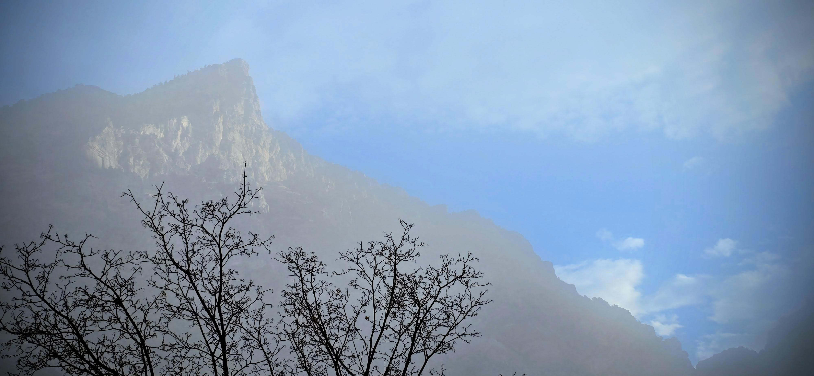
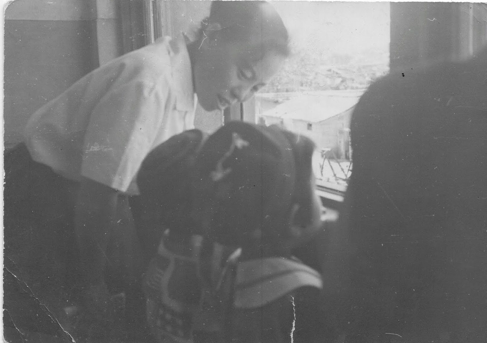

信言不美，美言不信。

> **“Truthful words are not beautiful;\
> beautiful words are not truthful.”**

— *Tao Te Ching*, Chapter 81

Lao Tze suggests it is not possible to have both.

But in the lives of our parents, we saw how to live within this seeming dichotomy.

We felt their deep love and understanding.

Having this as a foundation allowed us to view this world and the universe, not only as a wonder or a school, but also a place or source of truth.

> There is beauty all around\
> When there’s love at home;\
> There is joy in ev’ry sound\
> When there’s love at home.

-   Love at Home

------------------------------------------------------------------------

About ten minutes from our home is the mortal resting place of my parents and Sister K's parents.

We visit often, to remember them through the legacy of their words and deeds.\
And sometimes, we share with them our concerns.\
And at times, we ask for their assistance.

We can recall their lessons through their truthful words.\
Sometimes we want to have that feeling of being heard and accepted--just once more.\
At times, we desperately want to hear those beautiful words of wisdom, ones that heal.

------------------------------------------------------------------------

Our parents were the rotation center that we orbited around.\
Satellites that needed nurture, guidance and correction.

We each struggled to establish our own independent orbit and at times deviated from our designated paths.

But we knew what our foreordained, true paths were, because our parents not only taught but lived its principles.

Now both Sister K and I long for those days that we lived under their direct influence.

We miss the presence of the ones who knew us best, yet loved us far beyond our faults.

With them, we didn't just have a physical home; we had a home in their hearts—a place infinite in its capacity to hold us.

It is our turn to be that center of rotation for the next generation.

We must become the steady anchor they orbit around, so that they, too, can learn to become a source of acceptance and healing for the generations that follow.

