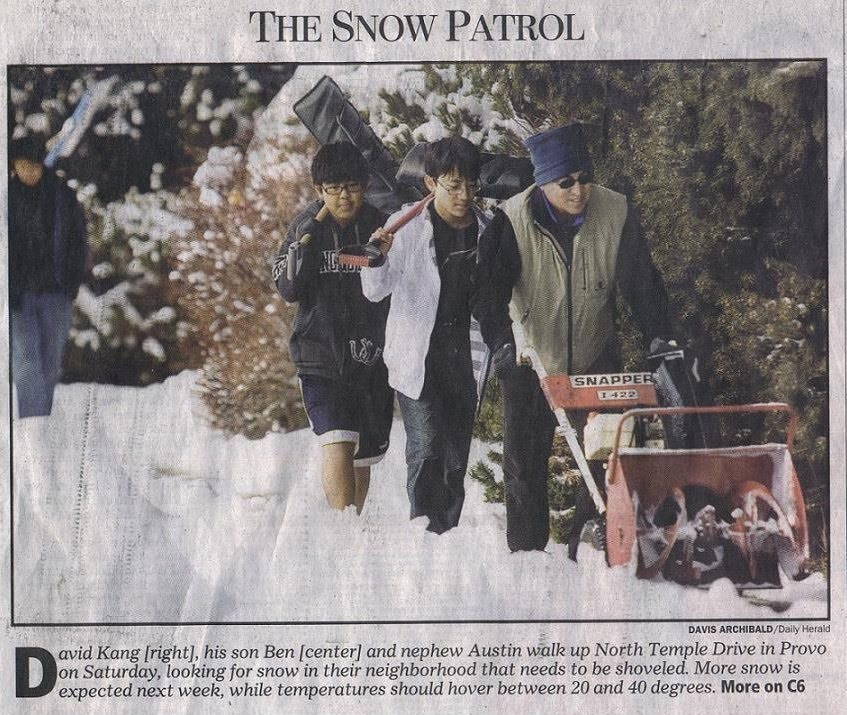
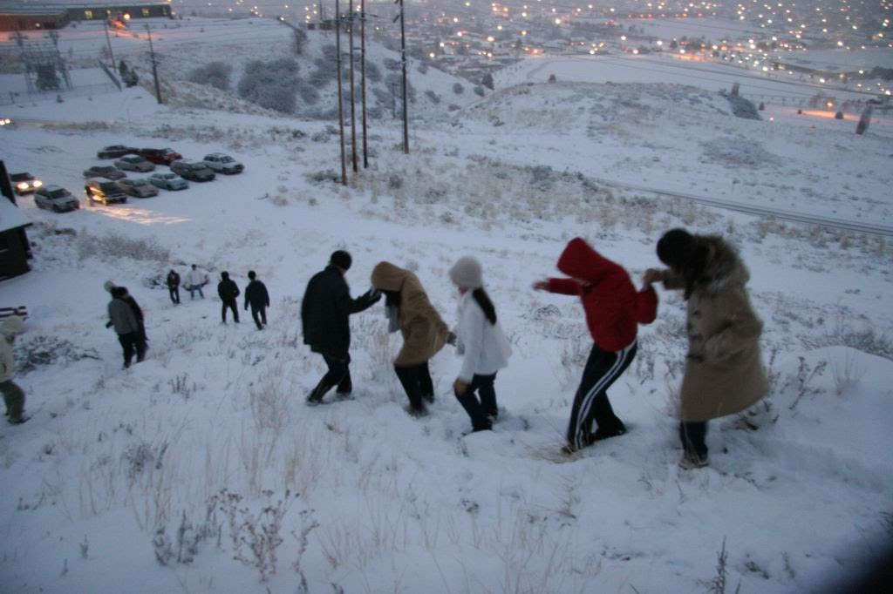
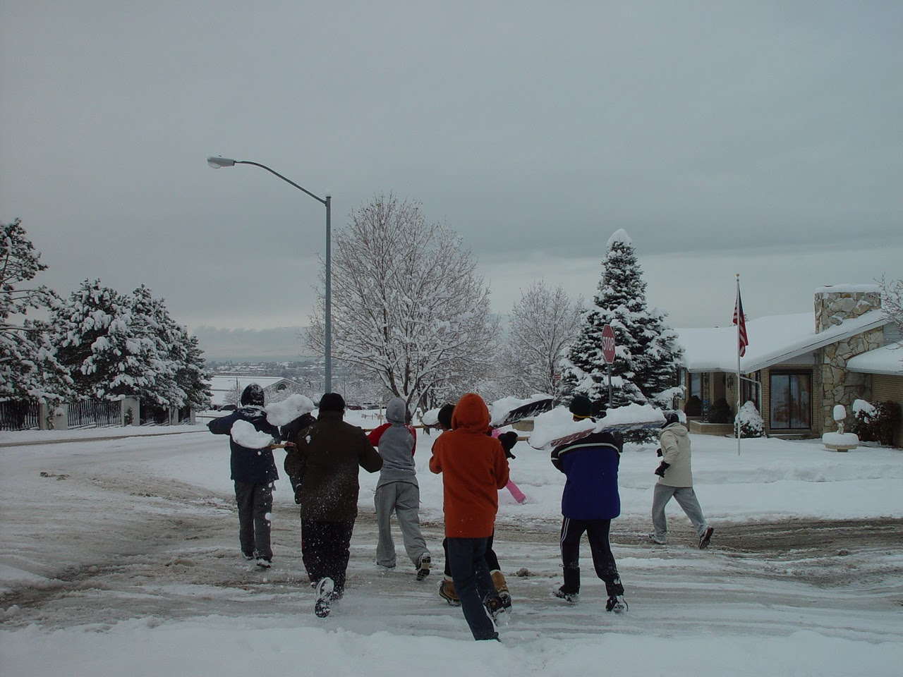
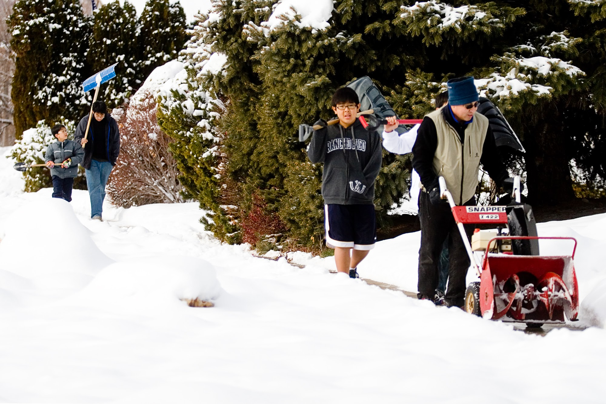

As if to spur or seed the moisture that has been lacking in the valleys and mountains this year, local media recently ran this headline **"Remembering Utah's Epic Snowstorms."**^[https://www.ksl.com/article/51421062/remembering-utahs-epic-snowstorms-heres-the-top-6-that-made-history]

For those of us who live along the Wasatch Range, snow is more than just weather; it is a shared history.

The article provided a list of the single greatest 24-hour accumulations in recent history:

|                  |                           |
|------------------|---------------------------|
| **Month-Year**   | **Amount in Inches (cm)** |
| October 1984     | 18.4 (46.7)               |
| December 2003    | 19.4 (49.3)               |
| January 1996     | 19.8 (50.3)               |
| February 1998    | 20.4 (51.8)               |
| March 1944       | 21.6 (54.9)               |
| **January 1993** | **23.3 (59.2)**           |

The article concluded with a staggering figure:

**50.3 inches (127.8 cm)** fell in total during that single month of January 1993—the most on record in Utah’s history.

The author then invited readers to "share your memories of Utah's greatest snowstorms."

As I scanned the list, I realized that except for the 1944 storm, I was in town for every single one of them.

------------------------------------------------------------------------

We moved into the Indian Hills area of Provo in December 1992.

It was our first home, that nearly doubled our living space compared to the student housing we had occupied for the previous three years.

I remember the warmth of the community—neighbors welcoming us by caroling on our front porch.

Then, about two weeks later, the sky opened up.

The great snowstorm began on January 5th.

According to the records, it snowed for twenty-two hours straight, leaving 23.3 inches (59.2 cm) on the ground in a single day.

But the storm was just the beginning; the snow kept coming throughout the month.

By the time January came to a close, the totals had climbed to a staggering 50.3 inches (127.8 cm).

There were reports of people climbing—and inevitably falling off—their roofs in an attempt to clear the mounting weight.

As a first-year homeowner, I was paralyzed by a lack of experience. I had no basis for comparison and no idea if my roof was in danger or if I should climb the roof.

I took no action.

In that instance, the indecision of not knowing what to do probably saved my life—or at least my back.

------------------------------------------------------------------------

These photos are not from 1993 or 2003.

------------------------------------------------------------------------







In those years, before regular airline service was common, our trips to Phoenix were always measured in highway miles.

We had general plans for our Christmas visit in 2003, but we hadn’t settled on a departure date—until we saw the weather map.

Realizing we needed to outrun a massive incoming front, we made the sudden decision to depart on Christmas Eve.

For the first few hours, our choice seemed correct. But as we reached Buckskin Valley on Utah Road 20—the high-altitude artery connecting Panguitch to I-15—the storm finally caught us.

```{r}
library(leaflet)

lat <- 38.03401190428473 
lon <- -112.53340794745634

leaflet() %>% 
  addProviderTiles(providers$OpenStreetMap) %>% 
  setView(lng = lon, lat = lat, zoom = 12) %>% 
  addMarkers( 
    lng = lon, 
    lat = lat, 
    popup = "Project Location" 
    )
```

At the summit, visibility vanished.

My headlights hit the driving flakes, transforming the world into a shimmering, impenetrable white curtain.

Descending the steep, hairpin turns of the downgrade became a terrifying driving lesson I hope never to repeat.

I said many prayers throughout those endless, winding miles, my hands white-knuckled on the wheel.

We eventually reached US-89, and as the terrain flattened out, we pushed forward until we reached the safety of Kanab.

Even after we finally lay down to sleep, the image of that white blanket remained burned into my vision.

I attribute our survival that night to a brand-new set of Michelin tires and a great deal of help from above.

It took me a while to recover from that ordeal.

------------------------------------------------------------------------

During the January 1993 storm, inaction saved me from harm.

However in 2003 Christmas storm, my decision to push through the snowstorm may have resulted in making the news for all the wrong reasons.

Grateful that I can remember these snowstorms and draw lessons from them.

As I look at the mountains today, I find myself hoping that the cycle of epic snow—or something close to it—returns to this part of the West.

Without the chaos or the life-threatening situations.


