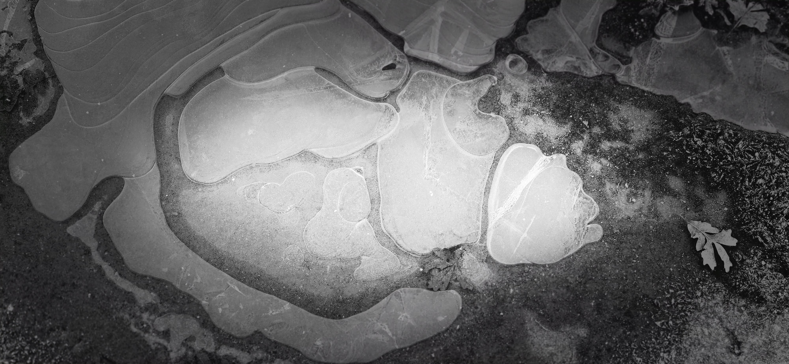
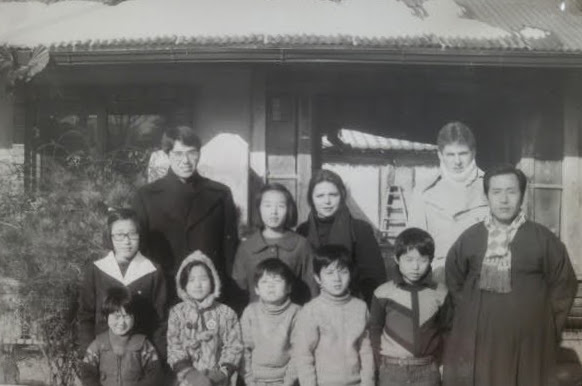

The generation that preceded me often quoted a proverb:

> **“말 한마디로 천 냥 빚을 갚는다”**

*A single word can repay a debt of a thousand nyang.*

Suggesting that the right phrase at the right time can settle the heaviest of accounts.

But lately, I have found myself wondering:

> Rather than searching for the remedy after the fact, are there ways to prevent the debt from occurring at all?

> Is there a way of being that stops the offense before it takes place?

I believe the answer lies in what I call "Middle Korea Approach"

------------------------------------------------------------------------

Perhaps due to its location, the provinces of **Chungcheong (忠淸道)** possess some of the most relaxed and unhurried tones in the peninsula.

Situated approximately 100km from the capital, 300km from the southern seashores, and 500km from the northern borders with China, it is a region defined by its "middleness" or neutrality.

Perhaps it is this specific location—buffered from the harsh edges of the borders and the high pressure of the city—that has shaped the people of Chungcheong.

They are known to be among the most relaxed and pleasant people to deal with. Their speech doesn't rush to settle a debt because it isn't in a hurry to create one.

------------------------------------------------------------------------

For Christmas, our children gave us a gift.\
A gift that takes us back to a time and place in Korea that is fading away.

It was a subscription to a global streaming service.

After 5 year hiatus, the first series that I viewed was 사랑의 불시착 (愛の不時着)

Not for the stories or actors but for the regional dialects of Northern Korea that reminded me of my parents and the way all Koreans lived during the difficult years.

If one listens long enough and carefully, it is possible to locate the speaker's hometown within a few dozen miles, based on their dialect.

The scenes depicted in the Crash Landing on You, is a touching reminder of how far 2 separated countries of Korea have progressed and advanced -- albeit at very different rate.

Longing for a home and a culture that is no longer found. As a son of a northerner.

I am grateful to those who created this series; they preserved a piece of my beginnings, and in doing so, allowed a process of healing to begin.

------------------------------------------------------------------------

## Characteristics of 충청도 화법, Middle Korea Style Speech

I recently came to a realization about the way Sister K communicates. It is a style rooted in a discipline of 충청 area:

> 말은 적게, 속뜻은 깊게, 판단은 듣는 사람이 하게 하는 화법 \> *Few words, slow delivery, and a meaning left for the listener to infer*.

It is a deliberate and unhurried approach, punctuated by meaningful pauses. It is indirect and non-confrontational, avoiding the bluntness of a simple "yes" or "no."

She often withholds firm conclusions, politely allowing the listener the space to decide for themselves.

In her way, silence and understatement are not awkward gaps; they are part of the communication itself—restrained, polite, and often carrying a subtle, dry humor just beneath the surface.

I realized that this is the environment in which she was raised, how she views the world's issues, and how she practices her belief each day.

It all made sense.

8 "For my thoughts are not your thoughts, neither are your ways my ways, saith the Lord."

*(내 생각은 너희 생각과 다르며 내 길은 너희 길과 달라서)*

9 "For as the heavens are higher than the earth, so are my ways higher than your ways, and my thoughts than your thoughts."

*(하늘이 땅보다 높은 것같이 내 길은 너희 길보다 높고 내 생각은 너희 생각보다 높다.)*

I have made a lot of progress since those early days of our marriage, yet I often feel as though I am still catching up—in a state of late recognition and slow realization.

I am beginning to see that Sister K has not just been speaking words of comfort in her own unique way; she has been practicing deeds that heal.

She is the bridge.

Through her quiet restraint, she connects our current generation back to the foundations of the prior ones, proving that sometimes, the most "truthful" words are the ones left unspoken.

