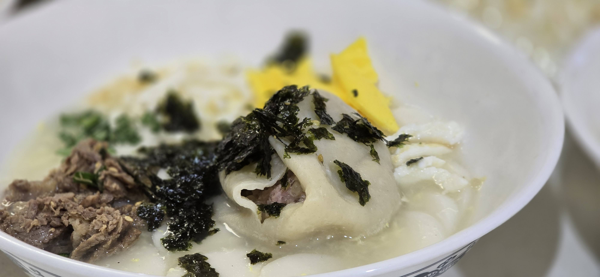
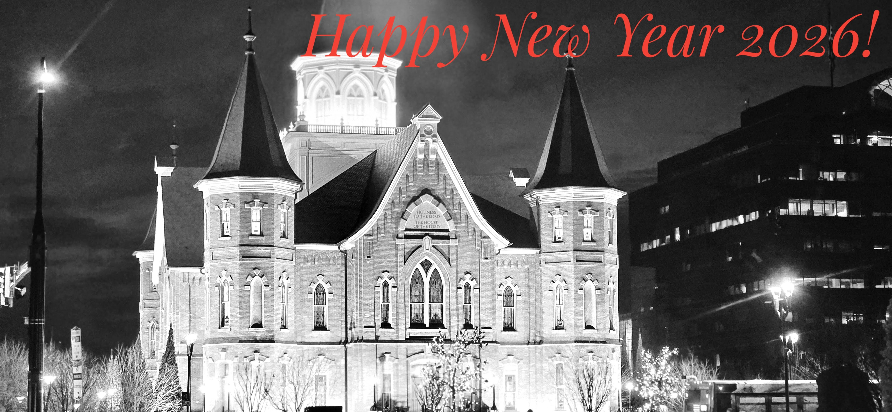

I went to bed without welcoming the new year, expecting a quiet New Year’s morning

But while I slept, Sister K and her sister were at work, transforming those modest plans into a multi-family celebration involving the younger generation, like the ones we used to enjoy

All 5 of Sister K's sibling's family members, that were within driving range, were invited.

As she has done in the past, there was more than enough food prepared to feed the invited guests and perhaps a dozen or so more.

As I age, the gathering, especially the ones involving the young people gives me great anticipation as well as reassurance.

About the present and the future.

------------------------------------------------------------------------

Although I didn't know at the time, 설날 (Korean New Year) carried a lot of symbolism.

Including 첨세병(添歲餠) add, year, food; the dish that symbolically and physically added another year to one's life.

> "The centerpiece is the 떡국 (Tteokguk). It is a simple, elegant soup—pure white rice cakes swimming in a clear, savory broth. Every element carries a wish: the long cylinders of rice cake 가래떡 (garaetteok) used to make it represent a long and healthy life, while the thin, coin-like rounds they are sliced into are symbols of future prosperity. Eating it feels like consuming a bowl of good luck."

Every year growing up we ate this same food.

One year we were invited to go to 영등포, about 20km from our house. The family was my father's uncle on the mother's side. (영등포 외삼촌)

We were all served the traditional food. The 2 part dish, with sliced rice cake (떡) and the dumplings (만두).

My sister, eagerly ate the part she didn't like, the 떡, saving the part she enjoyed.

The host, 외숙모 upon seeing this, said

> "you must really enjoy that 떡, here have some more"

And ladled out another healthy serving. We talked about that for years and years.

.jpg)

------------------------------------------------------------------------

We noticed and confirmed a familiar phenomenon: the family member who lived the furthest away arrived first.

There appears to be an inverse relationship between travel distance and arrival time: the longer the journey, the more buffer time is built in.

No one needed a review of how the dish is prepared; each person knew their role.

In matter of minutes, the 떡국 was cooked and decorated with the five traditional colors: savory meat, vibrant green chives, the distinct yellow and white strips of pan-fried egg 지단 (jidan), and finally topped with a sprinkle of toasted seaweed flakes.

------------------------------------------------------------------------

In earlier days, the importance of holiday food was rooted in scarcity.

Eating during these celebrations meant a filling meal, a luxury unlike the other days of the year.

Today, the role of the holiday celebration has changed and the role of food diminished, but the meaning captured in this single dish has carried generations of Koreans through hardship and prosperity alike.

The dreams of one generation are being fulfilled by the next.

As are traditions; they are kept alive and passed on one gathering, one bowl, and one story at a time.

Felt a sense of peace, after we said goodbyes after the family grave visit.

Also gained a great sense of hope and a feeling of prosperity, by having family members gather.

To the next generation: thank you for participating in traditions and carrying it forward.

