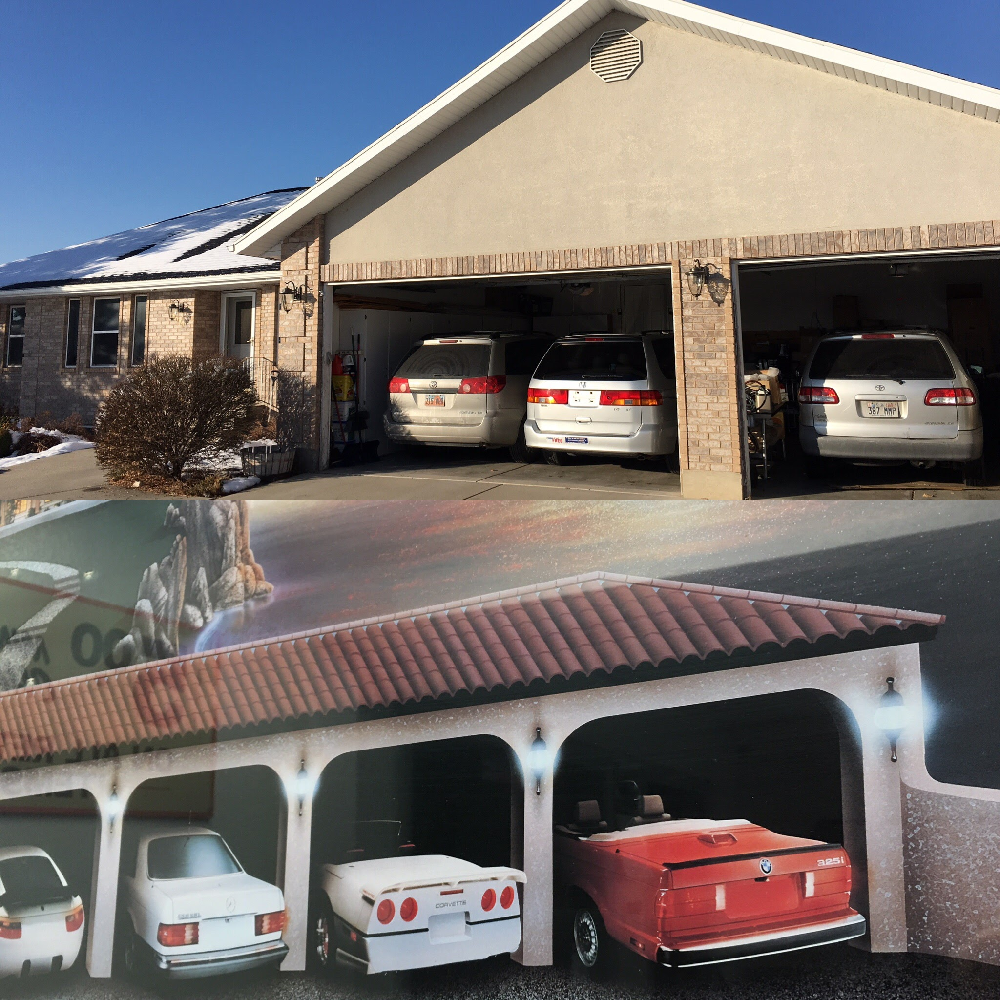
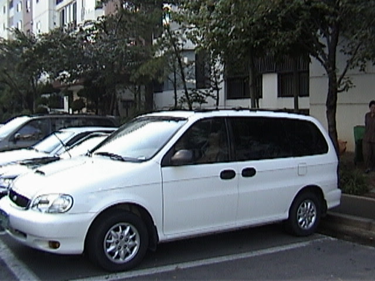

During my college years, a popular poster combined motivation and the outcome using fancy cars and a mansion.

It depicted a hypothetical (pre AI) mansion facing a beach, its five-car garage is left opened, to reveal a fleet of desirable automobiles: a **Lamborghini Countach**, a **Porsche 928**, a **Mercedes Benz S-Class**, a **Chevrolet Corvette**, and a **BMW 3-Series**.

Across the top, the headline says,

> **"Justification for Higher Education."**

Decades later, despite having pursued that "higher education," my reality looked a bit different.

The closest I ever got to that poster was a brief stint with a very old Mercedes S300, that broke down after 2 years of driving from the train station to work.

\[My daughter owned a 325i convertible for a season.\]

*Where did I go wrong? Or was the saying simply untrue?*

------------------------------------------------------------------------

If my life were a poster, the garage wouldn't be filled with foreign exotic cars.

Instead, it would be a collection of popular minivans of this century.

Since Sister K and I were married, we have owned five of them:

-   **1993 Mercury Villager**

-   **1999 Kia Carnival** (with the Turbo Diesel)

-   **2001 Toyota Sienna**

-   **2002 Honda Odyssey** (still running)

-   **2007 Toyota Sienna** (used daily)

Our children learned to drive behind the wheel of one of these models.

Aside from the utility of accommodating people, groceries, and gear, minivans also offer, higher perspective than most cars.

------------------------------------------------------------------------

In the corporate world of 구미 (Gumi), the hierarchy was usually announced in chrome and leather of the car.

The Country Manager traveled in a chauffeur-driven SsangYong (쌍용) Chairman, and nearly all our neighbors drove the top-tier luxury sedans from Hyundai.

By then very few families had more than two children, those sleek, luxury cars were the standard.

But we were the outliers.

With four children, we didn't need a status symbol; we needed a nine-passenger bus.

While the families around us opted for the 2.5L V6 LPG engines—standard, quiet, and predictable—the company allowed me a different path.

I chose the highest trim of the Kia Carnival: the "Park" edition, equipped with a 2.9L Turbo Diesel.

Its power train was capable of a 200km/h top speed, a van that felt more like a freight train with a momentum and an attitude.

Despite its size, the best part of owning that van wasn't the horsepower—it was a loophole in the seating design.

Because of the drop-down seat between the driver and the front passenger, the Carnival officially qualified as a high-occupancy vehicle. In the congested arteries of South Korean travel, this was like having a Lighting Lane Premier Pass at Disneyland.

We had the ultimate combination:

-   Cheaper Fuel: The efficiency and lower cost of Turbo Diesel.
-   Respectable Speed: The ability to hold our own on the highway.
-   The HOV Lane: The absolute freedom to bypass lines of luxury sedans trapped in gridlock.

We we drove all over Korea—from the high-speed highways to the narrowest country roads to visit relatives near and far.

Also visits by relatives were handled with ease because of the 9-seat capacity.

------------------------------------------------------------------------

I have wondered, from time to time, what my life would have been like had I never left Korea.

I likely would not have met Sister K. I probably would not have made to a prestigious university. I likely would have followed the prevailing social trends, settling on a small family of one or two children—though we know a few religious families who bravely chose to have nine.

I would have lived a life that "made sense" to those around me, perhaps seeking to drive the luxury sedan.

Instead, our family moved to the United States, and lived a life of immigrants.

In doing so, learned a fundamental truth about the American spirit: Americans, for the most part, are a practical people.

They pay little or no attention to what others think of them.

It is the land that pioneered the Station Wagon, perfected the Minivan, and embraced the Sport Utility Vehicle.

The **"Justification for Higher Education"** isn't the ability to buy the five cars on that poster.

Higher education, and the higher income that often follows, provides something much more valuable than a car: it affords a higher understanding.

It also gives you the confidence to be an outlier.

It provides the intellectual foundation to hold onto your beliefs despite shifting fashions or societal trends.

It is the insight to know that while the world may admire the "show horse," your life is made better by the "practical beast."
