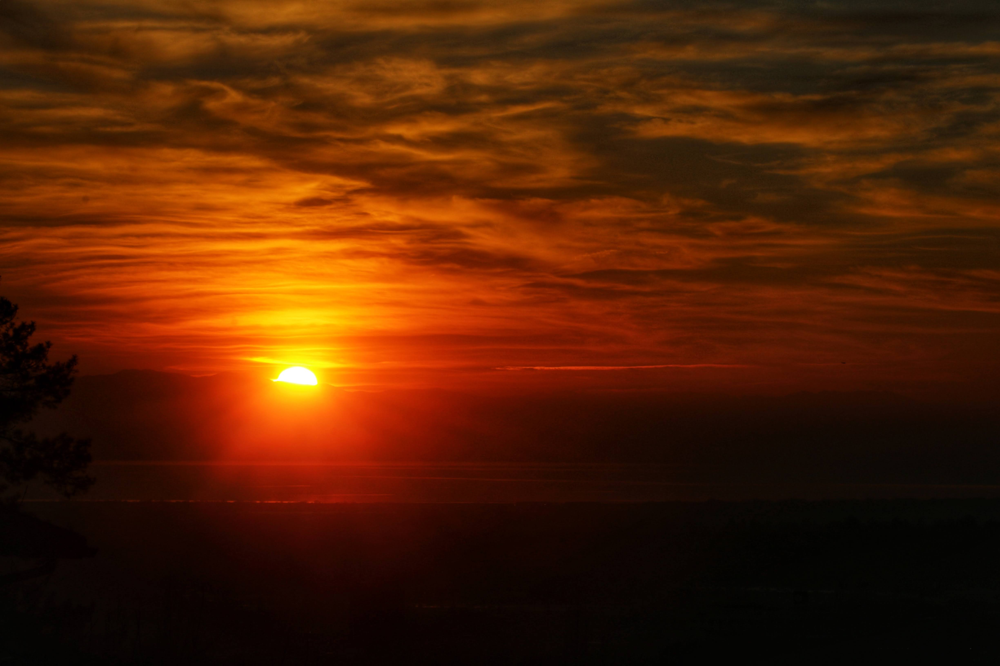

I was listening to music as if I were binge-watching a drama-series.

It started out as a simple A-B test between a built-in speakers of my computer monitor and a **Yamaha YSP1100 Soundbar** paired with a **YST-FSW050 Subwoofer**.

Yamaha set-up was the clear winner.

Every familiar song became punchier, delivering more memories per minute of listening.

YouTube algorithm was humming, keeping pace with my memory and dictated my listening for next 90 minutes — all commercial free.

Was transported back to teenage and early 20s days back in Maryland – much like **Back to the Future** and the vehicle was music.

Those were carefree days, largely because I didn't know much, and not much was expected of me or from me.

A virtual trip along the memory lane ended when Sister K announced the music was penetrating the wall and it was bedtime.

---

If I gathered all of the audio equipment that I have owned, I could power a small gymnasium and host my own listening party.

Unlike those lean years of listening music on the radio waiting to catch a song to create mixtapes and watching musicians like **Blondie** perform "*Heart of Glass"* on ***Midnight Special***.

At the listening party, a playlist would provide hours upon hours of memory filled selections.

For the hardware and playlist are nearly limitless.

However, the capacity to hold more memories of people and places is diminishing.

Not able to relive the golden years when all paths seemed possible.

Cannot go back to time of past decisions and undo the mistakes.

Unable to spend more time with ones that are no longer with us.

However, listening to these melodies from that era brings back certain feelings and memories. It is the soundtrack that is ingrained in long-term portion of our memories.

---

The global music scene of the past is set and it is available to on many formats, and often on-demand.

It is easy to adopt those songs from earlier periods as our life's soundtrack and be immersed in past memories

However, our individual story is still being written or re-written, accompanied by new hope generated by this generation.

By writing down our collective memories and then utilizing technology to forge the words that will become the song of our later years.

Perhaps we will hold a group listening session soon (dancing optional).

And Sister K, I will start these listening party early enough that it will not interfere with our sleep.

Maybe we will start with **"Crazy"** by **Patsy**.

.jpg)
