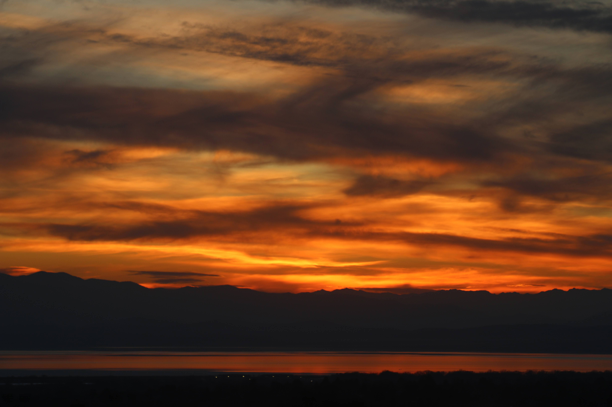
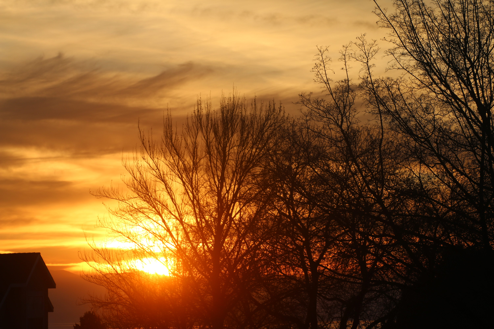

During my traveling days, a phenomenon followed me across Asia.

Whether I was navigating the corridors of Singapore’s Dhoby Ghaut MRT station, waiting to board Hong Kong’s MTR, or descending the several levels of Tokyo Station, locals would stop and ask me for directions.

I remember standing on the second underground level of **Tokyo Station (東京駅)**, recounting this phenomenon to my director. Mid-sentence, a woman interrupted us.

She wanted to know if she was on the right platform for the Narita Express (NEX). Her Japanese had the slight, familiar cadence of a *Gaikokujin* (外国人, foreigner).

It turned out she was a fellow Korean, finding her way home.

Apparently, I possess "Certain Look" when I travel:

> *"I am from here, and I am in no hurry to get home."*

I need to cultivate a different expression:

> *"I am just as lost as you are—I just don’t know it yet."*

------------------------------------------------------------------------

For much of my life in the U.S., I longed to blend in.

Especially during high school, belonging to the group was crucial.

But as an Asian in a predominantly Western neighborhood, my identity was established the moment I walked into a room.

For years, the effort of explaining exactly where Korea was exhausting.

Now, nearly everyone seems to know where Korea is, and familiar with its culture as depicted on the mass media.

But now that I find myself in the group, I am tempted to look further to see if there is family graft and can trace my family history to the **Heilongjiang 黑龙江 region of China**, continuing the "outsider" status.

------------------------------------------------------------------------

When I return to Korea, I blend in—to an extent.

My clothes, my colors, and my mannerisms give me away to anyone paying attention.

But the moment I open my mouth, all the locals know I’ve spent a significant time overseas.

Even so, there is a specific peace there.

In my home country, I can finally access and maintain a version of anonymity.

I can rest from being "a different one".

-01.jpg)

------------------------------------------------------------------------

Despite spending multiple decades in the **land of the free and the home of the brave**, I still feel like a guest, ever learning and adjusting.

I have learned ways to adopt and make a living in a diverse, multi-cultural society.

By developing and carrying an internal "Universal Access Passport."

This mindset allows me to navigate not only secured and fortified ports but also to view and understand the human heart and mind.

Tang Zi-Chang translates the 9th Chapter this way,

> When merits have been achieved, fame has been completed - one may withdraw himself. That is to follow the law of Nature (功遂身退天之道)

Will continue to follow previous generation's goal. Of staying anonymous to the world but being present and known to one's closest, family and friends.

And if the law of Nature leads me back to take 新幹線 at 東京駅, I hope to navigate the labyrinth with a look that says,

> I know where I am going and I have all the time that I have been alotted to get there.

