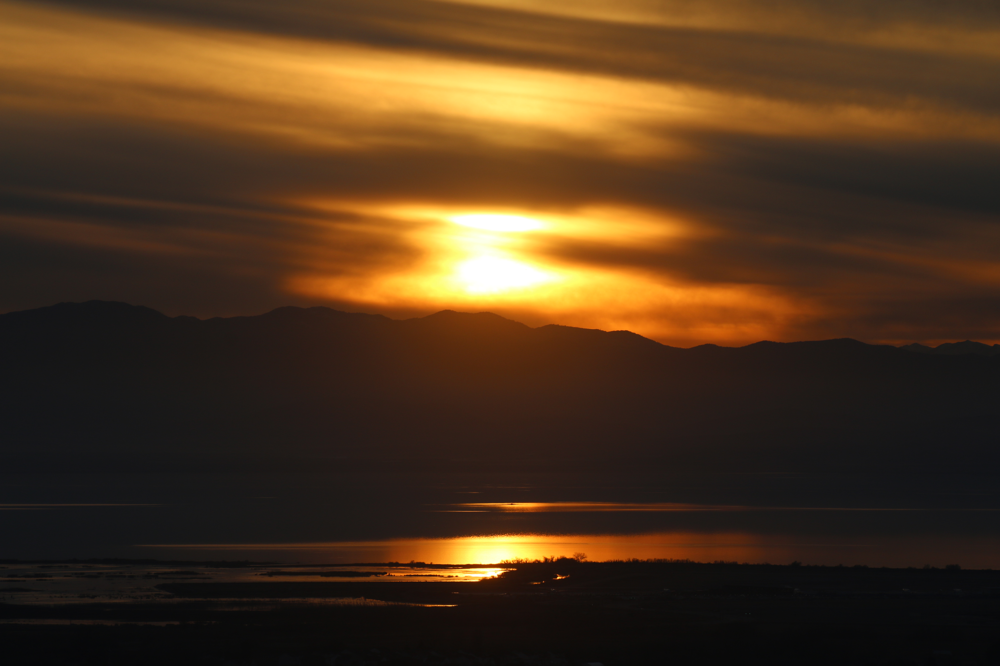
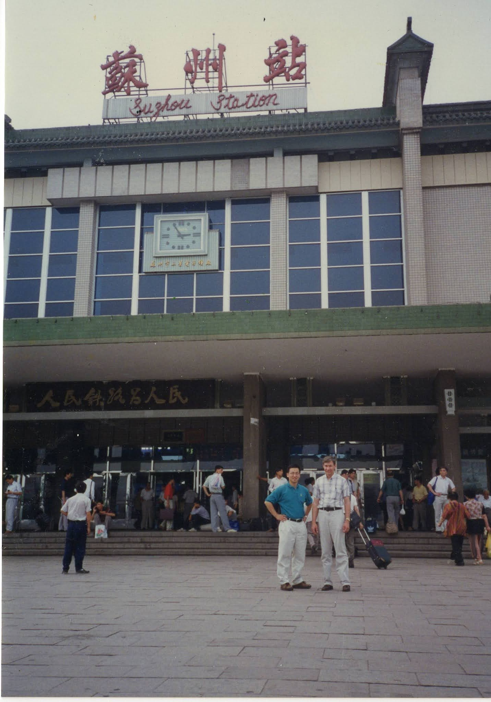
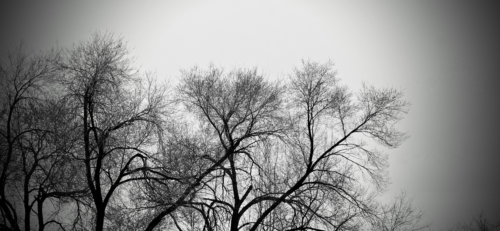

> 上有天堂，下有蘇杭

"above, there is heaven; below, there is Suzhou and Hangzhou"

------------------------------------------------------------------------

As our train pulled out of the Hangzhou (杭州) station, I saw a man standing next to his house near the tracks.

He was a brief image in the window, but he remained in my mind long after the visit.

I wondered:

-   Would he ever travel away from those surroundings in his lifetime?
-   What kept him going?
-   How did he reconcile his daily reality with old sayings?
-   Why are some given a horizon of endless options, while others remain fixed in one place?

## The Cambodian Guide

I was part of a contingent from Utah helping a newly established factory in Suzhou (蘇州) build IV catheters.

Among us was Henry, a man of Chinese heritage who had escaped the horrors of Cambodia.

Henry and his wife were our guides to sights in Suzhou. We visited Humble Administrator's and Master of the Nets Gardens to see how the nature was replicated in the early days.

Then they suggested we visit another city, Hangzhou.

They arranged the lodging and transport, leading us to a hotel on the north end of West Lake (西湖) off North Mountain Road (北山路).

In the early morning, with fog still clinging to the water, we joined the locals walking across the ancient causeways. The scenes were unforgettable, yet the man by the tracks held my attention more than the beauty of the lake.

## The Vision of the Sage

That man at the Hangzhou station may never have traveled to surrounding provinces, staying in Zhejiang (浙江省) his entire life.

But perhaps he didn't need to seek the "new" or the "novel" to find greatness.

He reminded me of the quote by the physicist Erwin Schrödinger:

> "The task is not so much to see what no one has yet seen; but to think what nobody has thought yet, about that which everybody sees."
>
> [link](https://incheon-dk.github.io/Blog2025/posts/20260107%20Our%20Tasks/)

Perhaps that man had achieved insights in a different manner. While travelers like me moved horizontally and across the map seeking new sights, he was moving vertically—thinking what nobody else thought about the very things everyone else merely glanced at.

Magnifying his family name through implementing the teachings of sages in his daily walk.

## The Conclusion of the Soul

By focusing on the meaning within the life he was given, a person in a small house by the tracks can arrive at the same conclusion as the most seasoned pilgrim.

He discovers that the "Secret Formula" isn't found in a different latitudes and longitudes, but in a different state of being.

As the Western scripture records:

> "And this is life eternal, that they might know thee the only true God, and Jesus Christ, whom thou hast sent."

## The Temporal and the Eternal

Suzhou and Hangzhou; the Gardens, the trains and the West Lake mists, are beautiful temporal markers.

They are reminders of what "better" looks like—the "Heaven on Earth" we are permitted to glimpse.

But when the higher way is revealed, the meaning becomes clearer.

We realize that the beauty of the "Below" is merely a shadow designed to point our eyes upward. Whether we are on a high-speed train or standing by the tracks, we eventually understand the true weight of the first half of that proverb:

> 上有天堂 — Above, (there) is Heaven.
