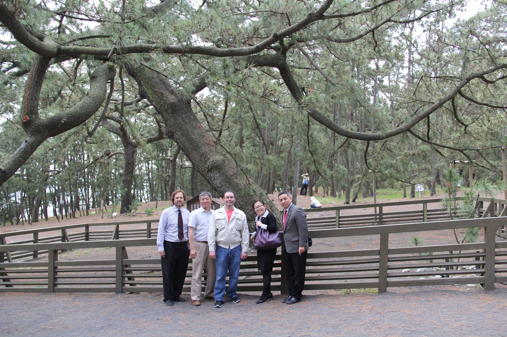
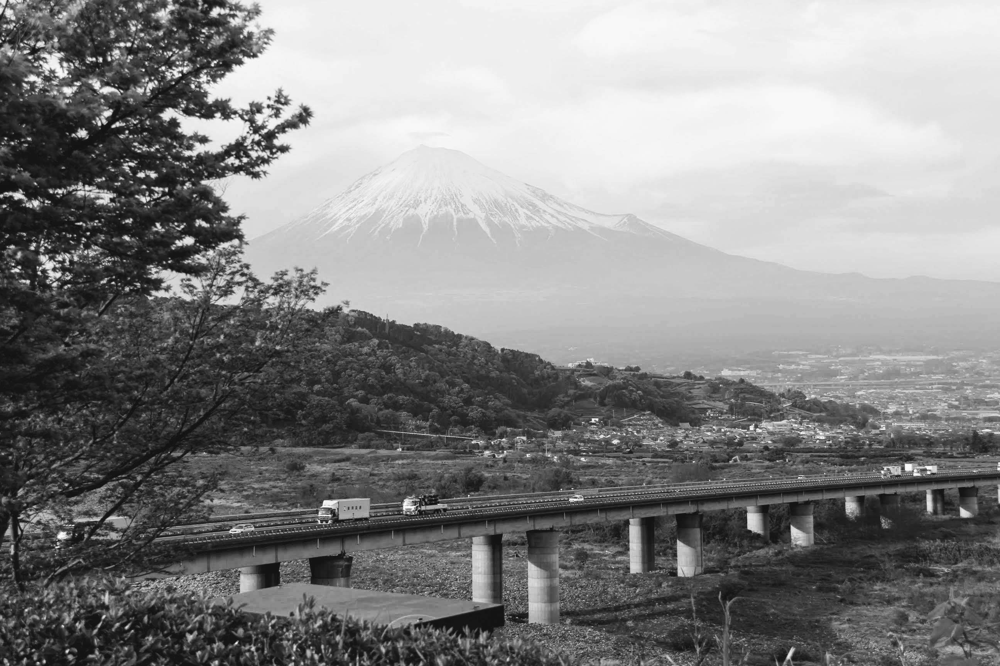
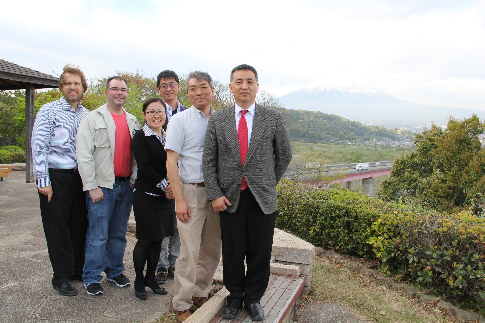
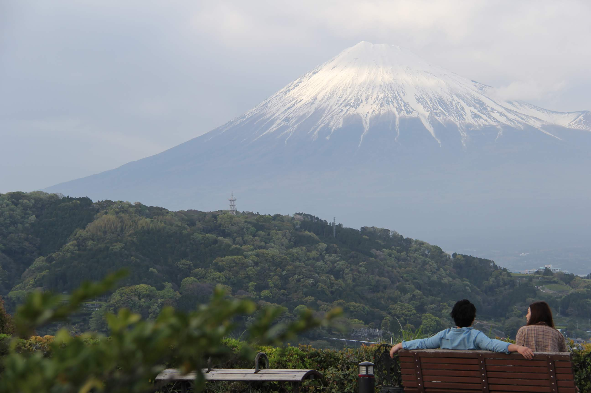

One year, we went from Asahi Intech in Fukuroi, Shizuoka to Omiya Seki in Fujinomiya, Shizuoka.

We were to inspect the progress of extrusion equipment that we had ordered.

It is a 102 km journey and normally we would take one of the Tokhaido Trains. (東海道新幹線)

But when we showed up in the morning there was a 12 passenger van waiting for us.

The people of Asahi Intecc was taking the scenic route

First stop was place called Miho no Matsubara (Miho Pine Forest) near Shimizu.

From there one can see Mt. Fuji in the distance on a clear day.

Due to the clouds we weren't able to see Mount Fuji that day.



We spent time with people of Ohmiya Seki.

The father, as the chairman was overseeing the business transfer to his CEO son.

On the way back we stopped at a rest area called Fujikawa and there I saw Mount Fuji



```{r}
library(leaflet) 
library(dplyr)

locations <- tibble::tibble( 
  name = c( "Asahi", "Ohmiya", "Matsubara", "Fujikawa" ), 
  lat = c(34.76987482591177, 35.24565262817182, 34.994924787490696, 35.15838615985957), 
  lng = c(137.90722510531205, 138.61375090322454, 138.52518273463642, 138.61970742041026) 
  )

leaflet(locations) |>
  addTiles() |>
  fitBounds(
    lng1 = min(locations$lng),
    lat1 = min(locations$lat),
    lng2 = max(locations$lng),
    lat2 = max(locations$lat)
  ) |>
  addMarkers(
    ~lng,
    ~lat,
    popup = ~name
  )
```

We took a group photo and a couple had stopped and they were sitting in a nearby bench.

The girl wanted to make longer, more significant conversation

However man was not cooperating, as if in another sphere all together





Appreciated the efforts of our hosts for making the full day business trip so that we can learn about their culture and experience one of the most sought after views in Japan.

------------------------------------------------------------------------

### The Legend of Hagoromo

The story follows a fisherman named **Hakuryo** who lived in the Miho region. One day, while walking through the ancient pine grove, he found a beautiful, ethereal robe hanging from a pine branch. The robe was unlike anything he had ever seen—luminous, fragrant, and seemingly woven from light.

As he moved to take it home, a beautiful woman appeared. She was a **Tennin** (a celestial maiden or angel) from the moon. She pleaded for the robe's return, explaining that without her *Hagoromo*, she could not fly back to heaven.

### The Bargain of the Dance

Hakuryo, moved by her tears but curious about the world above, made a deal: he would return the robe if she would perform a **Celestial Dance** for him.

The maiden agreed, but Hakuryo initially hesitated to hand over the robe first, fearing she would fly away without dancing. The maiden replied,

> *"Doubt is for mortals. In Heaven, there is no deceit."*

Shamed, Hakuryo returned the robe. She donned the feathered garment and danced with such grace that the air filled with music and flowers. As she danced, she slowly ascended, drifting over the pines and toward the peak of **Mount Fuji**, eventually vanishing into the clouds of the lunar palace.
