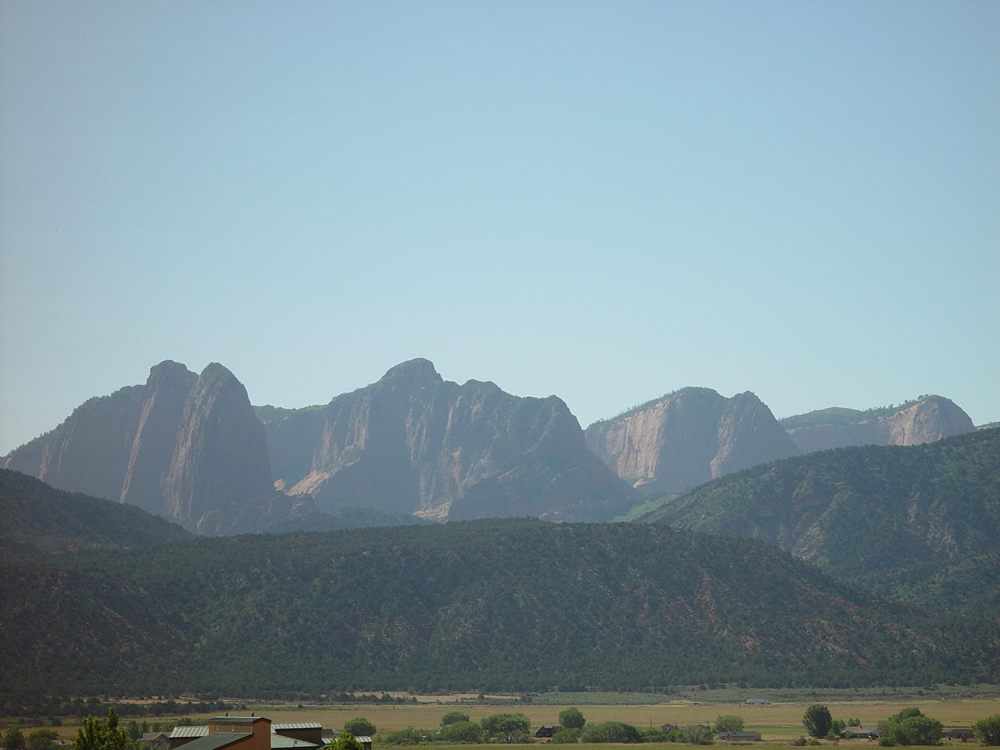
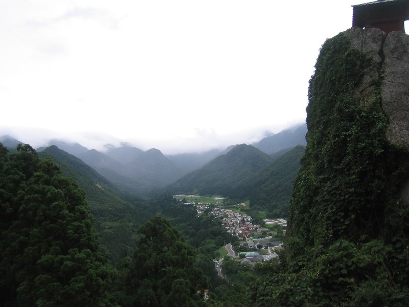

I arrived in the City of Angels in February, trading the biting winter of Provo, Utah, for the warm, heavy air of Southern California.

My senior companion, a native of Murray, Utah, picked me up from the California Los Angeles Mission Home.

Instead of taking the utilitarian Santa Monica Freeway, he took the scenic route through Westwood and Beverly Hills.

Coming from a month of snow and gray skies, I felt like I had entered another world or returned to the Garden of Eden.

As we cruised past palm trees and manicured estates, I thought to myself:

> *I could live here.*
>
> *I could definitely do missionary work in Beverly Hills.*

The illusion didn't last long.

By the time we reached our actual apartment, reality set in. Our street was named **Country Club Drive**, which sounded prestigious, but our lodging was anything but.

We lived at the top of a dangerously steep driveway in what appeared to be the dilapidated servants' quarters of a home that had seen its glory days decades ago.

The adjustment period was a shock to the system.

The soundtrack of my new life consisted of nightly gunshots and police helicopters circling overhead, their search beacons sweeping across the neighborhood.

During the day, our mission was a game of cultural detective work.

Like many other immigrant groups, the newest arrivals tended to concentrate in specific pockets of Koreatown.

We ventured out, training our eyes to spot the subtle signs of Korean life—the window treatments, the grocery bags, the specific vibe of a complex.

We got surprisingly good at it.

Then, the moment I had been waiting for arrived.

We were given a referral: a Korean family living in Beverly Hills. I was finally going back to the world my companion had teased me with on my first day—this time, not as a tourist, but as a guest.

------------------------------------------------------------------------

### The Pink Elixir of Beverly Hills

When we entered the threshold of that Beverly Hills home, we were led into a living area that was both immaculate and strikingly simple.

It turned out their surname was same as mine; I liked the sound of it—the **"K Family of Beverly Hills."**

The family was the picture of courtesy, displaying manner and speech that were a comfortable blend of English and Korean.

They explained that their interest had started during a trip to Yellowstone. They had stopped at Temple Square in Salt Lake City and, after the tour, filled out a card requesting a missionary visit.

Now, here we were—two young men from a cramped apartment on Country Club Drive, sitting in the heart of one of the world's most famous zip codes.

Then, they brought out a drink. It was a vibrant, translucent pink.

At the time, I was convinced I was being served something exclusive—a rare beverage reserved only for the wealthy.

I later discovered it was simply pink grapefruit juice (though whether it was freshly squeezed or from a concentrate remains a mystery).

In that environment, and at that age, it tasted like an elixir.

**It tasted like success.**

That day, a goal took root in my mind. I decided that one day, I would buy a home in an established neighborhood that would not deteriorate. And when visitors came to my door, I would offer them a glass of fresh juice.

Since then, I have often wondered about the "metabolism" of a neighborhood. Why does one area sustain its reputation and legacy for a century, while another, seemingly identical area, loses its way? It is a question of sociology, economics, and time.

I plan to explore this further, researching the works of social scientists and AI to understand the variables of a **"sustainable legacy."**

In the meantime, I think I’ll go have another glass of fresh grapefruit juice.

