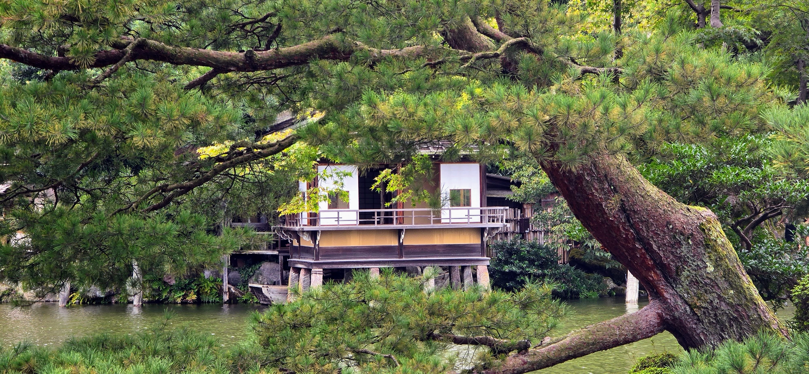
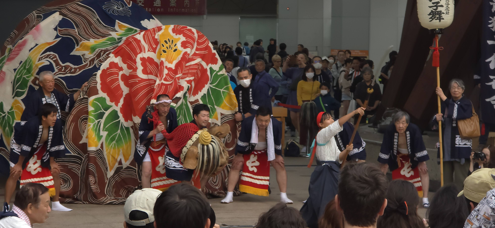

Made a first visit to Japan when I was 38. It wasn't to one of the large cities.

It was a city in Ishikawa, a prefecture with population of 1.1 million, along the west coast of Japan.

We were visiting a medical device manufacturing equipment vendor in outskirts of Kanazawa[^1].

[^1]: population 457,000

Surprise to see Mr Shimizu meet us at the Komatsu airport[^2].

[^2]: population 105,000

I have never met him and knew him only because we work for the same global company. Whereas the BD Korea belong to Asia Pacific. BD-Japan was an entity unto itself.

He guided us to the town of business, Kanazawa. Took care of dining, a private chef that fed us continuous tempura, cooked to order.

It was a magical beginning.

```{r}
library(leaflet)

# Airport data
airports <- data.frame(
  name = c("Incheon International Airport (ICN)", "Komatsu Airport (KMQ)"),
  lat  = c(37.4602, 36.3946),
  lon  = c(126.4407, 136.4070)
)

# Leaflet map
leaflet(airports) |>
  addProviderTiles(providers$CartoDB.Positron) |>
  
  # Airport markers
  addCircleMarkers(
    lng = ~lon,
    lat = ~lat,
    radius = 6,
    fillColor = "steelblue",
    fillOpacity = 0.9,
    color = "white",
    weight = 1,
    label = ~name
  ) |>
  
  # Line connecting airports
  addPolylines(
    lng = airports$lon,
    lat = airports$lat,
    color = "firebrick",
    weight = 2,
    opacity = 0.8
  ) |>
  
  # Fit map bounds
  fitBounds(
    lng1 = min(airports$lon),
    lat1 = min(airports$lat),
    lng2 = max(airports$lon),
    lat2 = max(airports$lat)
  )
```

Made a pact with my children that we would visit the areas of their mission.

First was a return trip to Japan who served in the Fukuoka mission.

As part of a return visit to Japan, we took shinkansen from Tokyo to Kanazawa

Went back to Kanazawa with my son. Although we didn't retrace my earlier visit to industrial area of Kanazawa.

The good feeling that I had as a first time visitor lingered.

On the shinkansen ride, after Nagano my son, a returned missionary was able to engage a conversation with a local person who used to be SCM executive.



```{r}
library(leaflet)

# Location data
locations <- data.frame(
  name = c(
    "Custom Location",
    "Komatsu Airport (KMQ)",
    "Kanazawa Station"
  ),
  lat = c(
    36.61651465885327,
    36.3946,
    36.5781
  ),
  lon = c(
    136.71598695390838,
    136.4070,
    136.6487
  )
)

# Leaflet map
leaflet(locations) |>
  addProviderTiles(providers$CartoDB.Positron) |>

  addCircleMarkers(
    lng = ~lon,
    lat = ~lat,
    radius = 6,
    fillColor = "steelblue",
    fillOpacity = 0.9,
    color = "white",
    weight = 1,
    label = ~name
  ) |>

  fitBounds(
    lng1 = min(locations$lon),
    lat1 = min(locations$lat),
    lng2 = max(locations$lon),
    lat2 = max(locations$lat)
  )

```

Initial guide was a Japanese business colleague. 24 years later that guide was replaced by my own son.

https://photos.app.goo.gl/vzNuWuHuSpLJHThx7

Had a chance to witness a performance at the train station.

Performed underneath the modern interpretation of a torii gate.

Local heroes and legends performed by the young and old. no tickets, no lines, just people choosing to stop and watch We were invited to sip drinks and enjoy the show by the locals.

thereby supporting and continuing the tradition of the 加賀地方 (Kaga region)



A visitor's impression vs business visit.

Thanks to people of Kaga region for you hospitality and sharing the community spirit.
