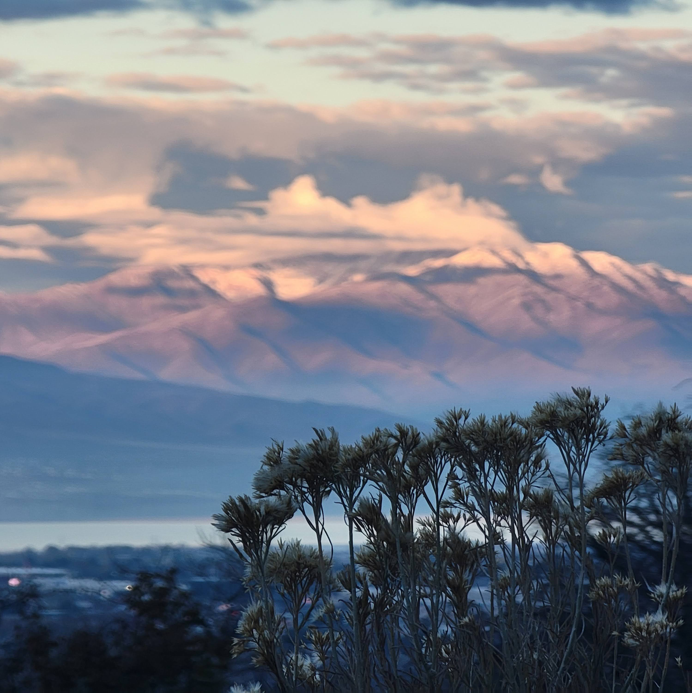
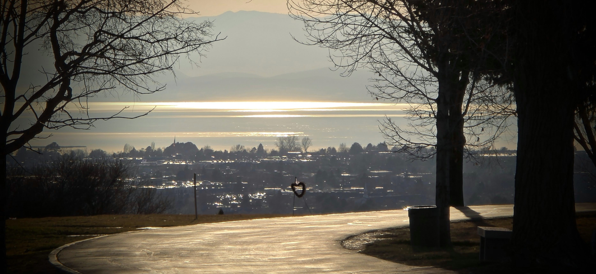

Twenty years ago, our family gathered in Maryland.

The goal was to spend time with my parents and my sister’s family.

For this visit, we planned a road trip—a loop through Upper New York State and the New York City.

We rented an eight-passenger van, the only available model large enough to hold our family of six plus my parents.

My mother, as she had done many times before, had planned the food for the entire journey.

In her world, a road trip meant eating her home-cooked meals along the way, not at a restaurant.

I, handled the logistics, booking our lodging entirely with travel points from my years on the road.

------------------------------------------------------------------------

We began our journey north.

We trip started with a visit to the **Niagara Falls** \[$43.084, -79.063$\] and later attended the Hill Cumorah Pageant in **Palmyra, NY** \[$43.007, -77.225$\].

Then we followed the route that led to popular sites.

Smith Family Home, Sacred Grove, Grandin Printshop, and Fayetteville.

We settled into our hotel in **Elmira, NY**.

From there, the "Big Apple" was a half-day drive—Manhattan and the Empire State Building were just 233 miles away.

The itinerary was set. The points were spent. We were ready for the city.

```{r}
library(leaflet)
library(dplyr)

# Create a data frame of locations
locations <- tibble::tibble(
  name = c("Location 1", "Location 2", "Location 3"),
  lat  = c(43.0071445096345,
           43.084411193294976,
           42.09101831497403),
  lng  = c(-77.2256303378867,
           -79.0638765645874,
           -76.80447526353687)
)

# Create leaflet map
leaflet(locations) %>%
  addTiles() %>%
  addCircleMarkers(
    ~lng, ~lat,
    radius = 6,
    stroke = FALSE,
    fillOpacity = 0.8,
    popup = ~name
  ) %>%
  fitBounds(
    lng1 = min(locations$lng),
    lat1 = min(locations$lat),
    lng2 = max(locations$lng),
    lat2 = max(locations$lat)
  )
```

Then, my mother spoke. She softly suggested that we should go to **Ohio** instead.

At first, I resisted.

I didn't want to understand her reasoning.

The plans were made.

In my mind, NYC was the place we wanted to go.

But as she had throughout her life, she held her position with a quiet, firm grace.

She didn't argue; she simply waited until I simmered and cooled down.

I lost and the plans changed.



Instead of going southeast, we headed west toward **Kirtland, Ohio**—roughly 285 miles in the opposite direction.

In those days before the mobile internet, changing plans meant long calls to 1-800 toll-free numbers, explaining ourselves to agents to get our points back and secure new lodging.

It was a hassle, and at the time, I didn't fully appreciate the significance of the pivot.

Initially, I thought to myself, *These church sites will always be there. We can visit anytime.*

I was partially right.

------------------------------------------------------------------------

I was right about these sites, but I was wrong about the timing. The landmarks would always be around, but my parents would not.

That trip turned out to be the only time we would ever travel as an extended family to those sacred sites.

Had we gone to the bustling streets of Manhattan, we might have seen more sights, but in the quiet of Kirtland, we had more time for bonding as a family and reconfirming our religious foundations.

I look back now with gratitude:

-   **Grateful** that my mother had the foresight to suggest the change.

-   **Grateful** that I set aside my ego and followed her lead.

-   **Grateful** that my children, sensing the shift in gravity, did not voice their opposition.

That I am not carrying an additional burden of thinking, "I should have listened better to my parents"

NYC was and is a public destination.

Kirtland was a private memory made with people who are no longer here to travel side by side.


