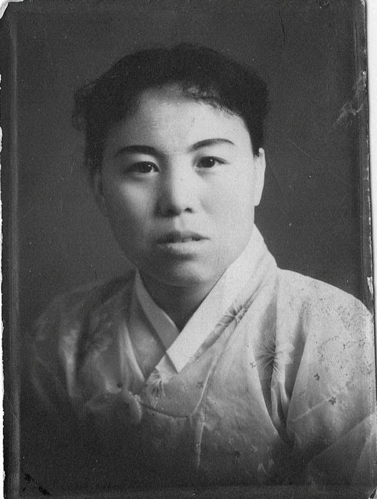
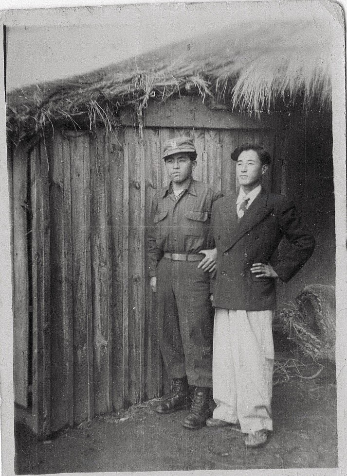
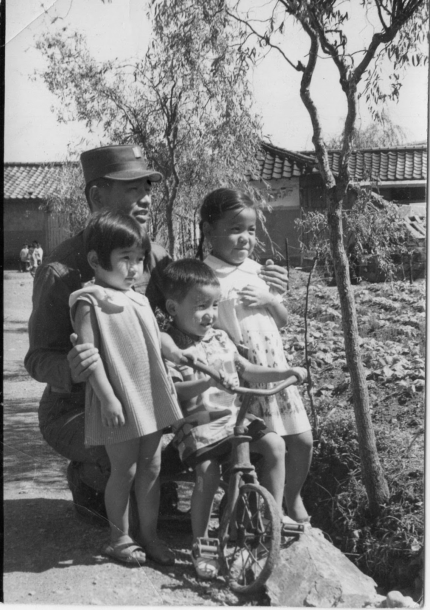

Mom often quoted,

> "집 떠나면 고생이다"

Which maybe interpreted as,

> "There's no place like home."

However, **"Life is a struggle once you leave home."** --more accurately reflects my parents' journey.

They attempted to establish a new home away from their ancestral homes, enduring struggles to reduce the suffering for the following generation.

------------------------------------------------------------------------

In a debate regarding the 100% Inheritance Tax, the economist Milton Friedman captured the essence of the parental heart:,

> "It is a curious observation of human nature that parents almost always value their children’s future consumption higher than their own current comfort.
>
> Even parents who expect their children to be wealthier than they are will still scrimp and save to leave a legacy behind."
>
> Paraphrased from a [Transcript](https://www.youtube.com/watch?v=MRpEV2tmYz4)

Professor Friedman sums up the life and legacy of my parents along with most from that generation.

A generation that knows about the occupation, liberty, war, separation and hunger.

------------------------------------------------------------------------

Koreans are a people who express what words cannot through music.

If we were to gather a group of 100 individuals, the spokesperson they would nominate would likely possess a voice that exceeds that of a popular singer—not just in technique, but in the ability to carry the Han (한,恨, heartache) of a nation that has survived war and occupation.

Some of my family members are blessed with musical talent.

My grandfather was a renowned singer in his hometown, a talent he passed to his fourth son, Uncle 春燮. While I never heard either of them sing, the tradition remains. My cousin, 인영, continues this legacy of storytelling and singing.

A recording of 인영 on analog cassette, recorded 25 years ago.

**타향이라 정이 들면 내 고향 되는 것을 가도 그만 와도 그만 언제나 타향**

> "They said affection turns a strange land into a hometown. Yet, coming or going, I find— A stranger’s land is always a stranger's land."
>
> Fourth Verse of **"타향살이" (Foreign Land Living)**

::: callout-note
These files contains audio, may need to adjust volume accordingly.
:::

## Audio Recording of 인영

<figure>

<figcaption>Click to Listen</figcaption>

<audio controls src="in_young.mp3">

Your browser does not support the <code>audio</code> element.

</audio>

</figure>

My parents spent their entire lives trying to re-establish the home they left behind. They met every challenge with an indomitable spirit, building a life in a country that, despite their best efforts and deepest affections, remained a foreign land to them.

Perhaps we are all pilgrims, in some sense.

Their struggle didn't end until they returned to their eternal home—reunited with loved ones and finding a rest, for a season.

