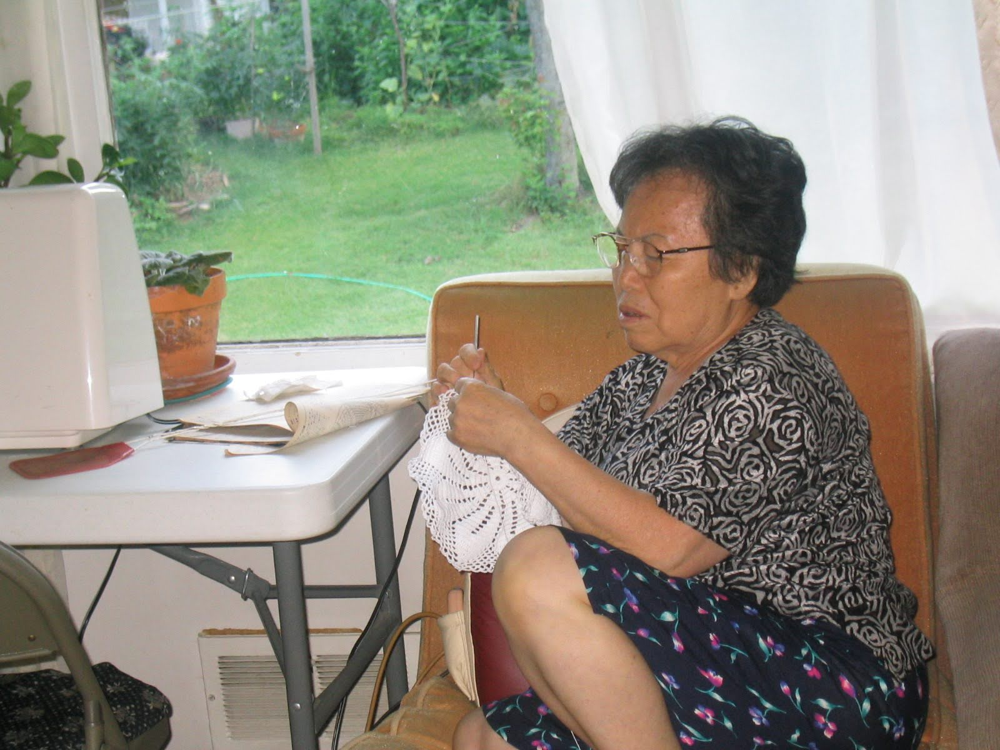
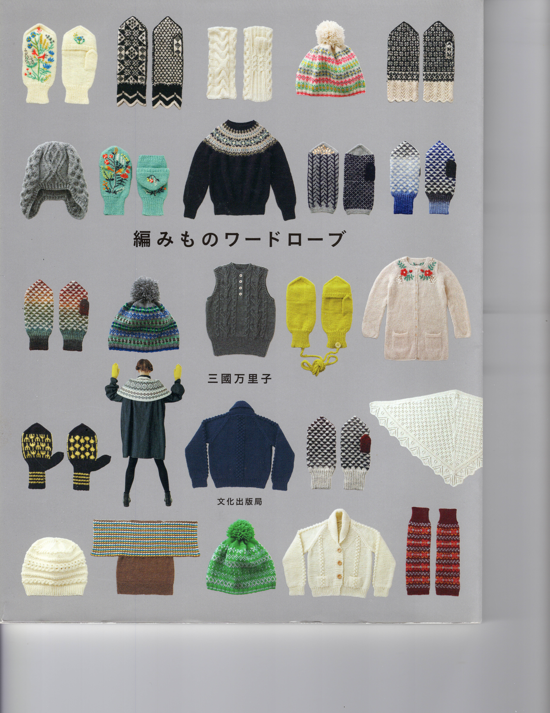
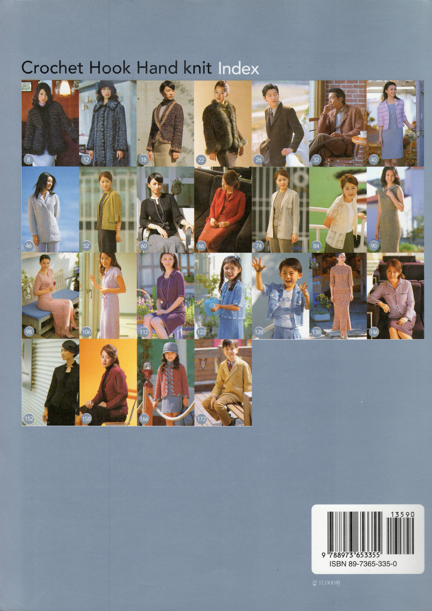

My mom could do many things well.

Tracking and synthesizing Korean dramas and celebrities, whether on video-tapes, DVDs or streaming.

Creating dishes reminiscent of Northern Korea from locally available ingredients

But there was one thing she towered over others.

Knitting or crocheting

It didn't matter the material or the final product, she just made it happen.

She enjoyed it, in part because she could still watch the screen as she knitted.

When I traveled to Asia and asked what I could get for her.

Inevitably her request was, buy the latest magazine or DIY catalog on knitting techniques or ideas.

