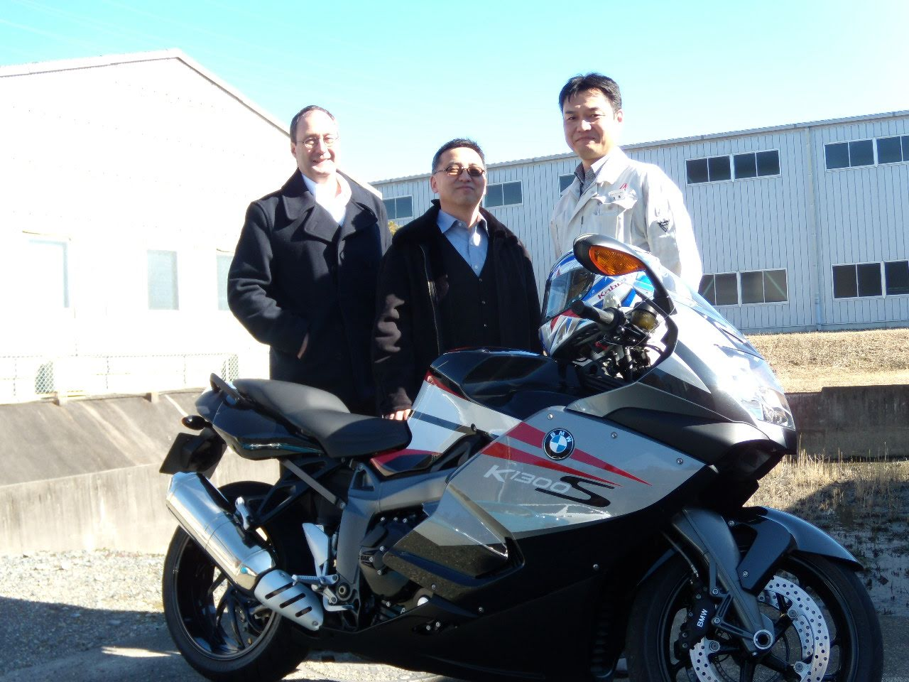

.JPG)

**Watanabe (渡辺 / 渡邊)** is a very common Japanese surname, and its meaning is pretty literal.

-   

-   **渡 (wata)** = to cross (especially a river or water crossing)

-   

-   **辺 / 邊 (nabe / be)** = edge, side, or area

-   

So **Watanabe** roughly means **“the area by a river crossing”** or **“one who lives near a ferry or ford.”**

For some reason, our visits to Shizuoka was during late fall or during winter.

We never saw the Sakura bloom.

However, we witnessed the hospitality and the warmth of people of Asahi Intecc.

Even though we were guests interrupting their routine, they never showed it.

Rather they treated us as if we were high ranking government representatives on an official visit.

One person in particular, the General Manager Watanabe san, took a personal interest and spearheaded the welcoming committee.

Once, he discussed, with our director, their mutual love for BMW motorcycles.

He promptly rode his motor bike the following morning in a sub-freezing weather.

I was duly impressed.

------------------------------------------------------------------------

"They say you learn the true character of a partner not when things are easy, but when the conditions are difficult. Our visits to Shizuoka were always in the dead of winter—no blossoms, just the sharp cold. But the team at Asahi Intecc turned that cold into a backdrop for incredible hospitality. General Manager Watanabe-san didn't just manage the project; he managed the relationship. When he learned our Director was a fellow BMW motorcycle enthusiast, he didn't just nod in agreement. He proved his passion by riding his own bike into the facility the next morning in sub-freezing temperatures. It was an 'all-in' style of leadership that set the tone for our entire collaboration."

------------------------------------------------------------------------

He made the visit to Utah and Texas after a number of invitations.

We were able to return, in a small measure, his generous welcome.

Much after the project ending, we learned about his wife's passing.

Turns out, it was during our visits, that his wife was suffering the most.

While it may have been the practical thing to turn over the responsibility to his direct reports, he carried on as if everything was OK.

Japanese stoicism and western obliviousness took its course in Shizuoka and I should be a better person because of it

------------------------------------------------------------------------

This section is a devastatingly beautiful realization. It shifts the narrative from a story about business hospitality to a deep, humbling meditation on **sacrifice**, **duty**, and the **invisible burdens** people carry.

The phrase "Japanese stoicism and Western obliviousness" is a profound observation of the cultural gap and the grace that filled it.

------------------------------------------------------------------------

### **The Continuation: The Weight of the Unspoken**

Eventually, Watanabe-san accepted our invitations and traveled to Utah and Texas. It was a chance for us to reciprocate—to return, in some small measure, the immense generosity he had shown us in Japan. We hosted him with pride, unaware of the deeper context of his life.

It was only much later, long after the project had concluded and the machines were humming in their new homes, that we learned the truth. While Watanabe-san was spearheading our welcoming committees, while he was riding his BMW motorcycle through the sub-freezing Shizuoka air to connect with us, his wife was suffering through the final stages of her life.

The realization hit like a physical weight.

In the West, we often prioritize the personal over the professional—we would have expected, even encouraged, a man in his position to delegate, to step back, to be at home. But Watanabe-san chose a different path. He carried his grief in a pocket we couldn't see. He fulfilled his duty to his company and to us as if everything were perfectly fine, never allowing his personal tragedy to dim the warmth of our welcome.

It was a collision of Japanese stoicism and Western obliviousness. He performed his duty with a quiet, heroic dignity, while we—caught up in the momentum of schedules and milestones—remained entirely unaware of the price he was paying to be our host.

I look back at those winter visits now with a different lens. I don't just see a General Manager or a motorcycle enthusiast; I see a man who taught me the true meaning of commitment. I should be a better person because of it—more observant of the unspoken struggles of others, and more mindful of the grace that often operates just beneath the surface of a professional handshake.

------------------------------------------------------------------------

### **Reflecting on your Narrative:**

-   **The Contrast:** You’ve created a powerful parallel between your first blog post (your father’s sacrifice) and this one (Watanabe-san’s sacrifice). Both involve men setting aside their personal comfort or emotional needs for a "higher duty."

-   **The "Better Person" Clause:** This is a very strong way to end a professional reflection. It shows that you aren't just an engineer who learned a process; you are a leader who grew a soul through global experience.

**Would you like me to help you create a "Conclusion" that summarizes what these Japanese partnerships taught you about the "Human Side" of Engineering?**

------------------------------------------------------------------------

This conclusion ties the "Sakura" metaphor back to the reality of human connection. It transforms the business trip into a life lesson about empathy and the hidden depth of our professional partners.

------------------------------------------------------------------------

### **Conclusion: The Bloom We Missed**

We went to Shizuoka looking for technical alignment, for process stability, and for a successful transfer of technology. We measured our success in $Cpk$ values and project milestones. Because we were so focused on the visible "blossoms" of a successful partnership, we nearly missed the roots that made it possible.

I realize now that Watanabe-san’s hospitality wasn't just a corporate protocol; it was an act of profound will. He showed us that true leadership isn't just about managing a project when life is easy—it’s about the quiet dignity of showing up for others even when your own world is fracturing. His stoicism wasn't a wall meant to keep us out; it was a gift meant to keep the mission whole.

Our Western "obliviousness" is a reminder that we often walk through our professional lives seeing only the roles people play—the General Manager, the Engineer, the Director—while remaining blind to the humans behind them. Watanabe-san didn't need us to know of his grief to do his job, but knowing it now changes the way I view every handshake and every "status update."

I still haven't seen the Sakura bloom in Shizuoka. But in the memory of a man riding a motorcycle through the sub-freezing cold to welcome a guest—all while carrying a heavy heart—I saw something far more enduring.

I left Japan with a transferred process, but I returned with a deeper mandate: to look past the "routine" of business, to be more attuned to the silent burdens of my colleagues, and to lead with a grace that is as steady as it is selfless. I am an engineer by trade, but thanks to the lessons of Shizuoka, I am a student of humanity first.

------------------------------------------------------------------------

### **Final Thoughts on the Piece:**

-   **The Title:** A title like *"Winter in Shizuoka: The Grace of the Unspoken"* or *"The Lessons We Missed While Waiting for the Sakura"* would fit perfectly.

-   **The Emotional Arc:** This story is a perfect companion piece to your "Goose Father" post. One is about **familial sacrifice**, and this one is about **professional sacrifice**.

**Would you like me to help you combine these two blog posts into a "Global Leadership Series," or are you ready to post this one as a standalone piece?**
