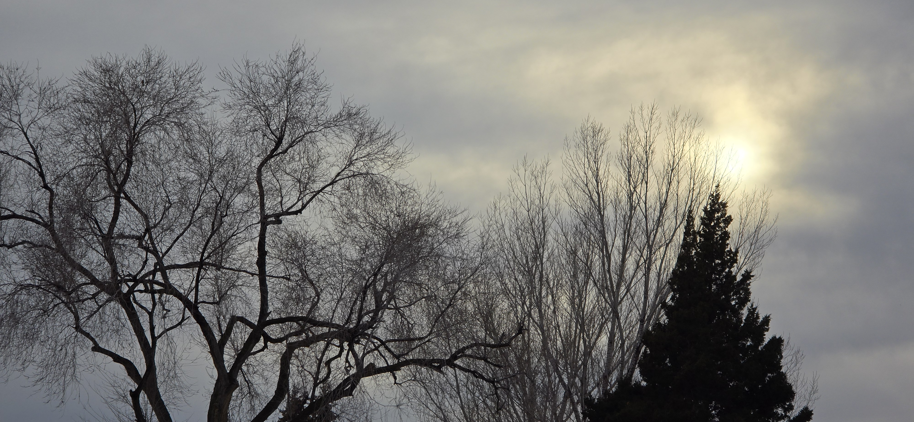
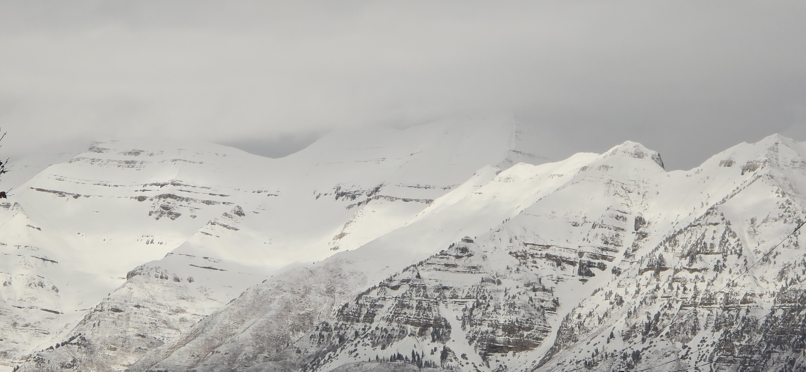
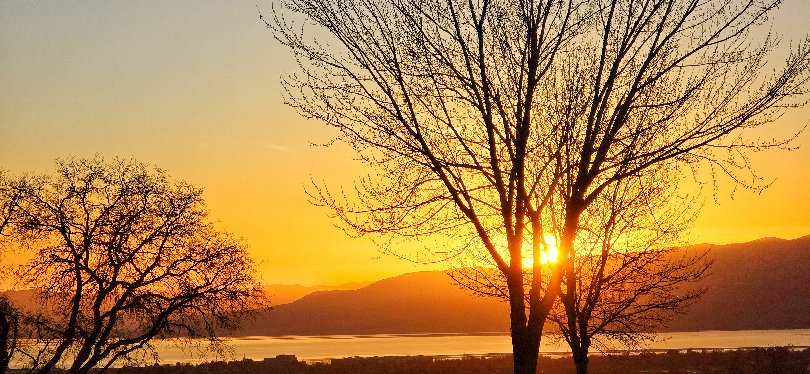

When I first watched the Hong Kong classic *A Moment of Romance*,^[https://www.youtube.com/watch?v=lcjxXglrQCM&list=RDlcjxXglrQCM&start_radio=1] I was introduced to a phrase that stayed with me:

> **天若有情 (If Heaven had feelings).**

At the time, I didn't fully grasped the significance of the title.

Years later, with a budding knowledge of Chinese characters and the assistance of AI, I explored this further.

The sentiment was immortalized over a millennium ago by the Tang Dynasty poet Li He 李贺（790—816 AD), who wrote:

**天若有情，天亦老** — *“If Heaven had feelings, Heaven too would grow old.”*

Li He suggested that the heavens are eternal precisely because they are impartial, detached from the friction of human emotion.

------------------------------------------------------------------------

## The Bronze Immortals and the End of Empires

Li He’s poem, **The Bronze Immortal’s Farewell to the Han**, reflects on the impermanence of power. During the Western Han Dynasty, Emperor Wu was obsessed with immortality. He commissioned massive bronze statues—**Bronze Immortals**—holding dew-collecting basins, believing that drinking the "celestial dew" would grant him eternal life.

But the statues were not immortal. When the Han Empire fell and the State of Wei rose, these massive bronze figures were uprooted and hauled away. Li He imagined the statues themselves weeping as they were forced to witness the ruin of the empire they were built to outlast.

------------------------------------------------------------------------

It is interesting to contrast this with Christian theology. In Matthew 24:35, it states,

> *"Heaven and earth will pass away, but my words will never pass away"*

Unlike Li He’s impartial, unchanging heaven, the biblical perspective suggests that even the heavens age and will eventually pass away to be replaced by something new.

Perhaps, in some celestial realm, Li He found this out and revised his poem.

If aging is the price of feeling, it is tempting to simply stop caring—to withdraw from the injustices of society and find a cold, "immortal" solace in detachment.

If we stopped having feelings, we would be like the bronze statues, silent and unmoving.

---

However, our purpose is not to become immortal statues.

We are called to make the transition from the earthly or temporal to the heavenly or celestial.

This transition requires a fundamental shift.

Heavenly feelings are not the absence of emotion, but the refinement of it.

It is the shift from the worldly desire **to be understood** to the heavenly discipline of seeking **to understand**.

As I grow older, I realize that this is what the Apostle Paul may have envisioned when he wrote:

> *"When I was a child, I spake as a child, I understood as a child, I thought as a child: but when I became a man, I put away childish things."* (1 Corinthians 13:11)

It is to accept the aging that comes with empathy, knowing that while our heavens and earth may pass away, the love we developed while we were here never will.

> "As long as we can love each other, and remember the feeling of love we had, we can die without ever really going away.  All the love you created is still there.  All the memories are still there. You live on--in the hearts of everyone you have touched and nurtured while you were here."

- Morrie Schwartz

---

## Full Text of the Poem

金铜仙人辞汉歌

李贺

茂陵刘郎秋风客， 夜闻马嘶晓无迹。 画栏桂树悬秋香， 三十六宫土花碧。

魏官牵车指千里， 东关酸风射眸子。 空将汉月出宫门， 忆君清泪如铅水。

衰兰送客咸阳道， 天若有情天亦老。 携盘独出月荒凉， 渭城已远波声小。

At Maoling, the Han emperor is now only a traveler in the autumn wind. At night I hear horses neigh; by dawn, no trace remains.

By painted railings, cassia trees hang heavy with autumn fragrance. In the thirty-six palace halls, green moss spreads over the earth.

Officials of Wei harness the carriage and point a thousand miles east. The bitter wind at the eastern pass stings the eyes.

Carrying only the moon of Han as I leave the palace gates, I remember my lord; clear tears fall like molten lead.

Withered orchids see the traveler off along the road to Xianyang. If Heaven had feelings, Heaven too would grow old.

Holding my bronze tray, I depart alone into the desolate moonlight. Wei City lies far behind; even the river’s waves grow faint.
