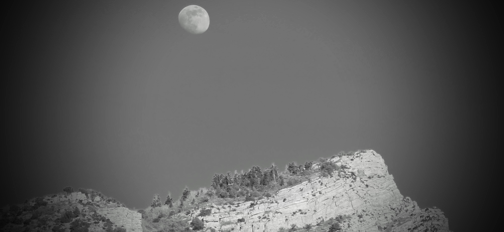
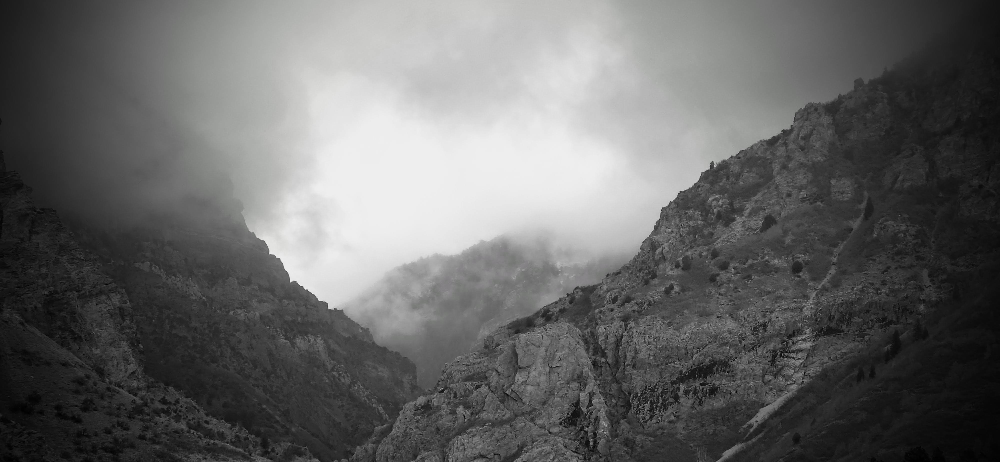

Sister K and I were on our regular date–to source items for our business.

Our route took us toward a city settled in 1847, two years before the city that we call home.

It is a journey that would have taken a traveler one or two days of walking or riding horses, during the pioneer days.

Today, we traveled at the practiced speed limit of 80 mph (130 kph)—still being passed by those in a greater hurry—and arrived in under an hour.

We spent the morning visiting the warehouses that line the I-15 and I-80 corridor.

It was a physical day of shopping: lifting, stretching, and closing in on our target of 10,000 steps.

We practice a rule: if an item weighs more than 20kg, we lift it together.

Like many things in life, sharing the load makes it manageable.



---

Normally, once the work is done, we simply merge with the southbound traffic, near 2100 South exchange, and head for the home.

Today, we took a detour.

We wound our way through the industrial portion of the valley, the area between the Trax line and the interstate from Murray Central (5000 South) down to 7200 South. To understand how the economic engine of the area is transforming.

Then we decided to visit H-Mart, to buy some treats for the grandchildren.

We were not in a hurry and that worked in our favor today.

We were discussing things of the moment as well as the future and the city street seemed to provide the right cadenence for our conversations.

---

One of the advantages of knowing people outside your own immediate family is the perspective of time they provide.

When you meet acquaintances from different generations, it is not just a conversation; you are viewing potential versions of your own future self.

As Sister K and I left the produce section and headed toward the ready-made food area, we ran into two such persons.

One was seven years my senior; the other was seven years older than him. As we exchanged news and caught up on the last 4 to 5 years, the contrast revealed itself.

One had selected the timing and the destination and had arrived; he was comfortable in his retirement.

The other was still in the fast lane.

I realized then that I am currently closer to the second than the first.

It forced a series of questions I wasn't quite ready to answer:

-   *What is the next phase of life for me?*

-   *Who decides what that phase should look like?*

-   *And, how ready am I?*



------------------------------------------------------------------------

After the encounter, we drove past my former employer’s property near Redwood and 9800 South—a physical reminder of my career's previous chapter.

We eventually stopped at a restaurant where the workers speak **廣東話 (Cantonese)**.

While sipping through a bowl of **酸辣湯 (Hot and Sour Soup)**, along with hot water that was settling into a room temperature, Sister K and I began to review the standing of our own lives.

We looked back at the big decisions we’ve made.

We didn’t always have all the data.

We certainly didn’t make every choice wisely.

But we made *enough* decisions that we are now able to look back and say, with a sense of peace:

We did all right.

On the freeway of life, we are grateful we had the resources to be on the road at all—to be part of the progression travel group.

It often felt like we were falling behind, or even being lapped by the fast travelers in the left lane.

But from the vantage point of this afternoon, those differences felt minor.

I am grateful for those two brief encounters at H-Mart—two views of the journey. One showing the grace of ending the race on one’s own terms, and the other showing the requisite energy of keeping the race going.

For now, I'll keep the car in the slow lane.

And look forward to seeing what other routes and adventures the pioneers have left behind for us to find.

```{r}
# Install packages if needed
# install.packages("leaflet")

library(leaflet)

# Create dataframe of coordinates
locations <- data.frame(
  lat = c(
    40.66014566524044,
    40.74424723342033,
    40.74380851602889,
    40.69687901413137,
    40.58936607194385,
    40.571747562281615,
    40.56199688335359
  ),
  lng = c(
    -111.89366287868371,
    -111.90980933579156,
    -111.90184794371217,
    -111.89006539097238,
    -111.93230374864861,
    -111.93564979652231,
    -111.93165271804175
  )
)

# Create leaflet map
leaflet(locations) %>%
  addTiles() %>%
  addMarkers(
    lng = ~lng,
    lat = ~lat,
    popup = ~paste("Lat:", lat, "<br>Lng:", lng)
  ) 

```
