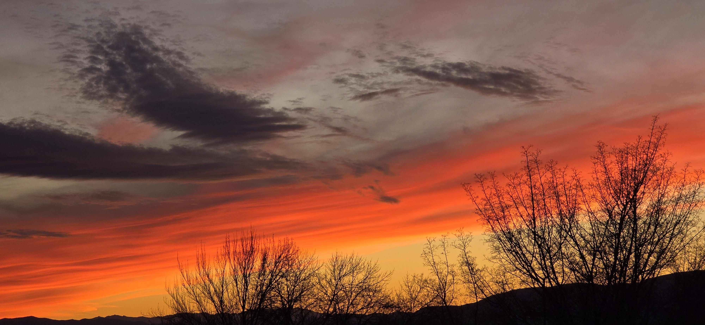

Watching the sunset made me think of this song.

울고 있나요 당신은 울고 있나요\

아 아 그러나 당신은 행복한 사람\

아직도 남은 별 찾을 수 있는\

그렇게 아름다운 두 눈이 있으니\

외로운가요 당신은 외로운가요\

아 아 그러나 당신은 행복한 사람\

아직도 바람결 느낄 수 있는\

그렇게 아름다운 그 마음 있으니\

아직도 남은 별 찾을 수 있는\

그렇게 아름다운 두눈이 있으니\

(‘행복한 사람’ 조동진 1979)

------------------------------------------------------------------------

Are you lonely? Yet, you are blessed\

You can still feel the breeze, and\

You still possess a beautiful soul\

You are searching for those stars, and\

You still possess those eyes, beautifully bright\

-   Blessed Soul by 조동진 1979

[LINK to the Song](https://www.youtube.com/watch?v=uyJMdYs6E7Y&list=RDuyJMdYs6E7Y)
