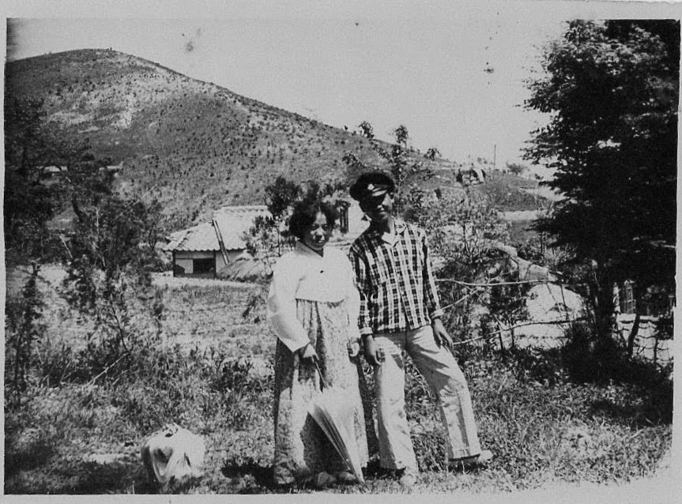
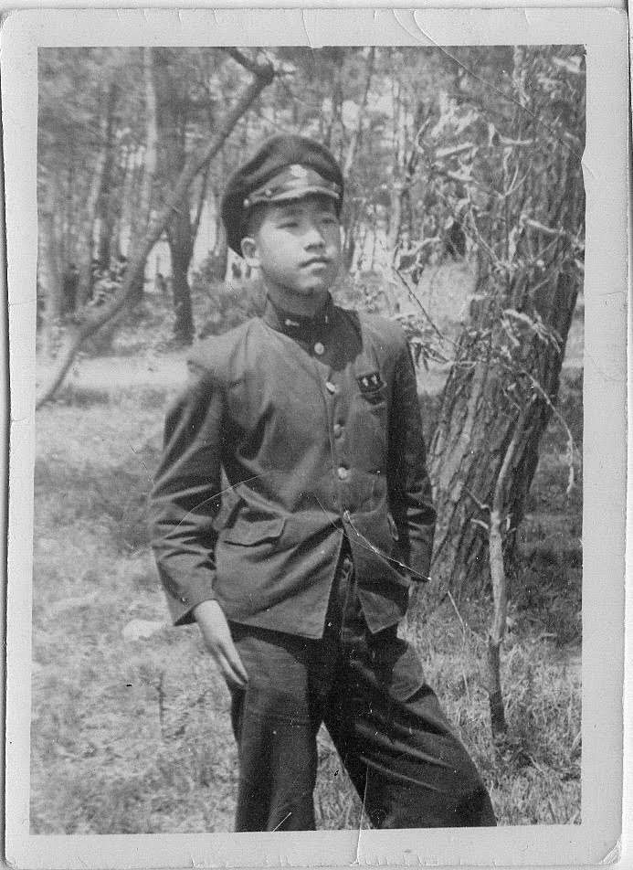
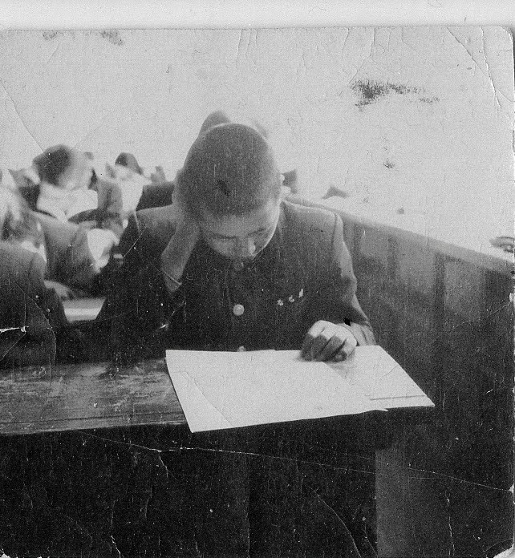
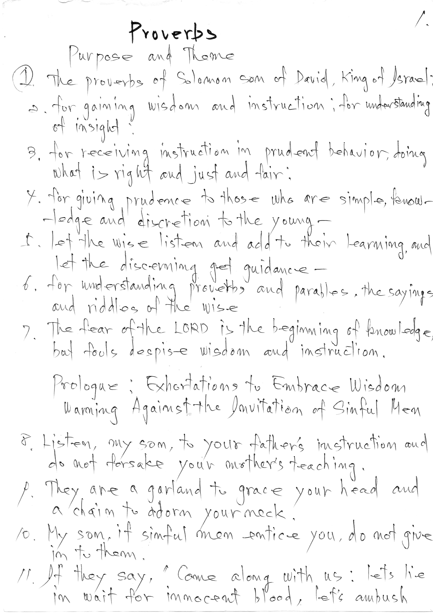

Three years ago, during the Lunar New Year period[^1], my mother made an unusual request:

[^1]: LNY was Sunday January 22nd, Mom passed away on the morning of Wednesday 18th. She called relatives on the evening of 14th

She wanted to call every one of her family members—back in Korea.

Her circle had grown smaller over the years—there were fewer than a dozen names left on the list.

As she spoke to them, she sounded as if she had never left Korea, displaying her sharp memory, sharing intimate knowledge of their lives and struggles.

It was her way of saying goodbye, in her own voice and on her own terms.

The relatives on the other end of the line were puzzled. "She seems fine," they told me later. "Why was she saying goodbye?"

Less than a week later, she passed away.

------------------------------------------------------------------------

When I called my uncle to share the news, he was silent for a moment.

He was only fifteen when my mother joined the family.

After expressing his gratitude, he said:

> **"너의 어머니가 나의 인생을 Leveled-Up 했다."**
>
> **(Your mother leveled up my life.)**

He explained that my mother had been the driving force behind his education—an opportunity that was virtually non-existent for most when Korea’s per capita GDP was a mere \$100.

She ensured the funds were available for him to go further than anyone else in the family.

Mom and my uncle made a pact.

The deal was simple: she would provide the means, and he had to pass every entrance exam.

My uncle wanted know what my mother wanted in return.

> Was this a loan or a grant?

My mother explained her vision.

She told him that in the future, if her own children had concerns or questions, they would need someone to go to.

He would be that person.

Also, with his education, he would be the one to represent the family.

He would be the anchor.

As in most cases, she was right.

When our family finally left Korea five years after his graduation, he became the de facto head of the family. He took care of the K-family. He provided care for my grandmother, for over 30 years, who used to stay with our family.

------------------------------------------------------------------------

When money became tight, she asked him to volunteer for the military.

At the time, Korea didn't have a draft.

He did so without complaint, recognizing the sacrifice she was making for him.

I have wondered why mom would do this?

Perhaps she did this because her own education had been stolen by the occupation and the war.

Perhaps she simply knew that a family needed a knowledgeable, educated person.

------------------------------------------------------------------------

Back in October 2024, I visited my uncle in his home in 안성.

We sat on the 17th floor, looking out over **평택 (Pyeongtaek)** and the first North-South freeway

We recalled a time when a truck slid on a snowy road and crashed into our home nearly pinning my uncle and me. [LINK](https://spencerirvinereed.github.io/Blog-2024/posts/20241010%20BuPyung%20Story/)

Then he shared a project he recently completed. He had hand transcribed the entire bible—in English.

It made me think of a story from long ago.

My dad had asked my uncle to accompany him to US Embassy, hoping his English would be an aid.

In turned out my father's street English was more useful than the classroom English of my uncle.

I’ve often wondered if my uncle never forgot that—if this handwritten Bible was his way of finally mastering the language that once felt so elusive.

My uncle lived nearly his entire life in South Korea.

However, I think his education of the soul has impacted me far beyond the formal school provided one.

He has clarified teachings both old and young, serving as my AI Assistant, before such things were known.

In addition, he taught me that there are wise and eternal things both on earth and in heaven.

