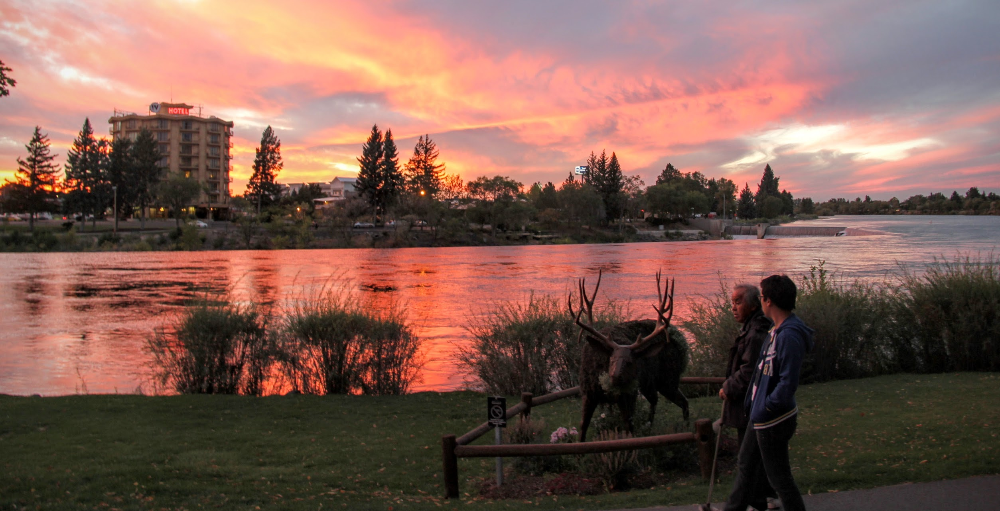

Koreans of my father’s generation love the 温泉 *oncheon*—the hot springs.

When my father moved from Maryland to Utah, he looked forward to 2 things: the fishing and the thermal pools.

Years ago, before my son was old enough to drive, he asked for a ride to visit friends in Idaho.

My father and I jumped at the chance to visit **Lava Hot Springs**.

As we moved in and out of the mineral pools, we ran into a visitor from Japan.

He watched us for a moment, then struck up a conversation. "It is a good thing," he said, "to see a father and son spending time together."

That was my introduction to **平田亮二伝道師, Evangelist Ryoji Hirata**.

He was a Japanese minister dedicated to serving the American Indians. What started as a chance encounter in the steam of Idaho turned into a decade-long friendship of faith.

### **Subway Meetings and Digital Sermons**

Over the years, we kept the connection alive through emails. He would send me links to his sermons recorded in Japan and uploaded to YouTube—digital breadcrumbs of his ministry. In 2016, we managed to bridge the distance in person. I was in Tokyo, and he made the long trip from his home in **Saitama** just to see me. As we met in the bustling Tokyo subway area, I felt a deep sense of gratitude that he would make such an effort for a friend he had met in a pool in Idaho.

I often wondered when he might return to preach in the U.S. again, but life—and its inevitable "trade-offs"—had other plans.

### **The "Afterthought" of Suffering**

In 2023, after my mother passed away, I wrote to him: *“All is well with me, except both of my parents passed away. My father in 2020 and my mother this January.”*

He wrote back with the characteristic gentleness of a shepherd:

> *"I am sure you must be sad to hear about the loss of your father and mother. God will be with you every time. I am still speaking about Jesus in my church in Japan. I will be speaking about Jesus at church tomorrow as well."*

Then, almost like an afterthought, he added:

> *"However, I had cancer a year and a half ago and I am still fighting with it."*

The way he phrased it was a testament to his "Level-Up" mindset. To Hirata-san, the cancer was secondary; the primary news was that he was *“speaking about Jesus tomorrow.”* His mission was the headline; his suffering was merely a footnote.

I wrote back, praying he would overcome the cancer and continue to serve. I thought of him again recently, only to discover that he had finished his race at the end of 2024. The announcement read:

**平田亮二 伝道師 2024年11月２日 天に凱旋しました！**

*(Evangelist Ryoji Hirata—Triumphantly returned to Heaven on November 2, 2024!)*

### **The Final Triumphant Return\^\[**<http://localhost:3665/posts/20260223%20Mr%20Hirata/index.html>\]

"凱旋" (Gaisen) is a powerful word—it describes a victorious, triumphant return, like a hero coming home from battle. Hirata-san didn't just pass away; he triumphed over the cancer, the diabetes, and the distance.

I find such joy in imagining him now—fully restored, free from the constraints of illness, enjoying a simple meal of *anpan* (bean-jam buns) and milk in the company of the Lord. He nurtured a family of faith that spanned from the Saitama suburbs to the Idaho mountains.

Thank you, Ryoji. You kept the faith until the final breath. You worked so hard, and you have nurtured so many. I will continue to live and evangelize on your behalf. We will see you at the next reunion.
