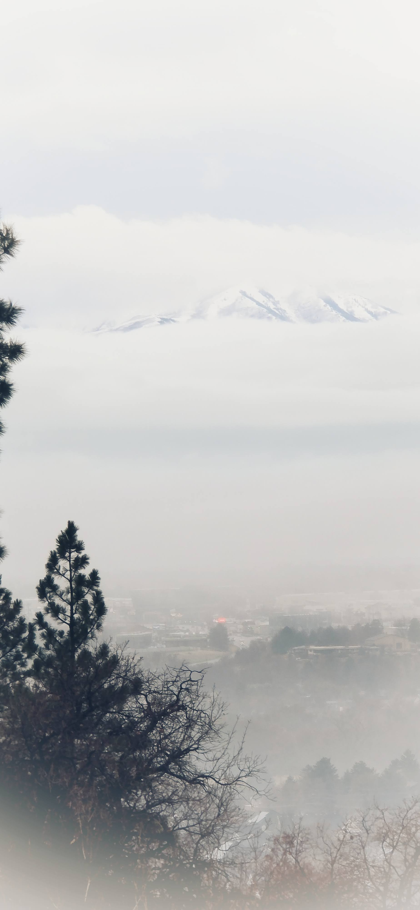
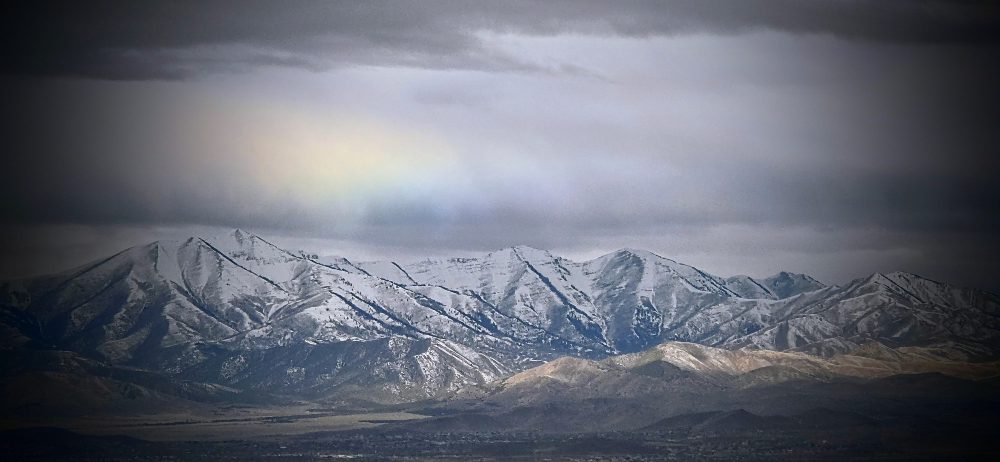
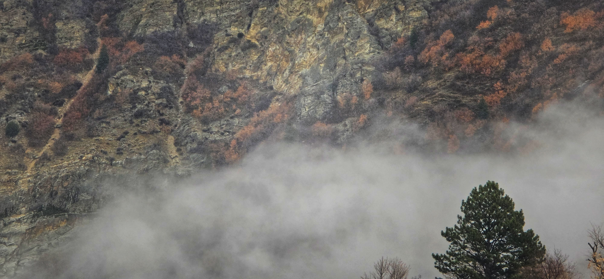

Sister K shared a video that moved me.

It told the story of Edna Olwyn Warner, an Australian woman whose final wish was to be buried next to her husband in South Korea ^[<https://www.koreaherald.com/article/3219532>]

It is a story that spanned eighty-four years and four continents, beginning in Ulmarra[^1], New South Wales (NSW), and ending 7,000 kilometers away in Pusan (부산).

[^1]: located 300 km south of Brisbane, Queensland

In life, they were often separated by vast distances and wars, yet they were never truly apart.

The story begins in December 1939.

> "Charlie Green was on his final leave before heading to the front. He walked into William Warner’s newsagency in Ulmarra and met Warner’s daughter, Olwyn—a sixteen-year-old girl."[^2]

[^2]: https://www.awm.gov.au/articles/blog/charlie-olwyn-green

There, Charlie bought a simple fountain pen.

Two years later, after Charlie had survived the desperate retreat from Greece after battling Germans, he wrote a letter to Olwyn from Egypt, using the same fountain pen he bought earlier.

> "Their correspondence would continue for the next two years, with Charlie writing from the Middle East and Ceylon (Sri Lanka) until returning to Australia in August 1942."[^3]

[^3]: https://www.awm.gov.au/articles/blog/charlie-olwyn-green

Olwyn and Charlie were married on 30 January 1943 in Ulmarra.

Charlie was 23, Olwyn was 19.

After the war, Charlie and Olwyn lived on Bacon Street in Grafton, a town some 16 km from Ulmarra along the Clarence River[^4].

[^4]: Note the location of Green's home along Alice and Bacon streets are estimates, and not based on a historical record



```{r}
# install.packages("leaflet")  # if needed
library(leaflet)

# Create dataframe
locations <- data.frame(
  lat = c(
    -29.631077926957687,
    -29.68591763768892,
    -29.689291678491436
  ),
  lng = c(
    153.03458472913653,
    152.92707124036338,
    152.93867984085864
  ),
  label = c(
    "Ulmarra, NSW",
    "Alice Street",
    "Bacon Street"
  )
)

# Build map
leaflet(locations) %>%
  addTiles() %>%
  addMarkers(
    lng = ~lng,
    lat = ~lat,
    popup = ~paste(label, "<br>Lat:", lat, "<br>Lng:", lng)
  ) %>%
  fitBounds(
    lng1 = min(locations$lng),
    lat1 = min(locations$lat),
    lng2 = max(locations$lng),
    lat2 = max(locations$lat)
  )
```

> "However their dream of owning a plot of land, building a vegetable garden, and raising a family finally came to fruition."

Their daughter Anthea was born on 1 August 1947.

Respite from the war was brief.

Greens thought about farming but Charlie rejoined the Army on January 1949.

When the Korean War broke out, Greens' peace also ended.

Charlie was to command the 3 Royal Australian Regiment.

> "When the Australian government committed 3 RAR, Army Headquarters determined that it would be led by an officer who had served in World War II and had a distinguished record."[^5]

[^5]: https://en.wikipedia.org/wiki/Charles_Green\_(Australian_soldier)



------------------------------------------------------------------------

## Korean Battles

```{r}
library(leaflet)

# Create data frame of locations
locations <- data.frame(
  lat = c(
    39.62128933706326,
    39.72086758901658,
    39.42275003992955,
    39.425912938785835,
    39.042709590891455
  ),
  lng = c(
    125.66432452927953,
    125.58603988978966,
    125.62411300118289,
    125.93001346153675,
    125.75961749510742
  ),
  label = c(
    "안주시",
    "박천읍",
    "숙천읍",
    "순천시",
    "평양시"
  )
)

# Build map
leaflet(locations) %>%
  addTiles() %>%
  addMarkers(
    lng = ~lng,
    lat = ~lat,
    popup = ~paste(label, "<br>Lat:", lat, "<br>Lng:", lng)
  ) %>%
  fitBounds(
    lng1 = min(locations$lng),
    lat1 = min(locations$lat),
    lng2 = max(locations$lng),
    lat2 = max(locations$lat)
  )
```

> "Charles Hercules Green was an Australian military officer who was the youngest Australian Army infantry battalion commander during World War II. He went on to command the 3rd Battalion, Royal Australian Regiment (3 RAR), during the Korean War, where he died of wounds." [^6]

[^6]: https://en.wikipedia.org/wiki/Charles_Green\_(Australian_soldier)

He led his battalion in 3 documented battles,

-   https://www.wikiwand.com/en/articles/Battle_of_the_Apple_Orchard
-   https://www.wikiwand.com/en/articles/Battle_of_the_Broken_Bridge
-   https://www.wikiwand.com/en/articles/Battle_of_Chongju\_(1950)

The expertise that made him the youngest battalion commander in WWII was exactly what Korea needed—but it was an expertise that came at the ultimate price.

> "Around dusk at 18:10, six high-velocity shells, likely from a KPA (Korean People's Army) SPG (Self Propelled Gun) or tank, hit the battalion position. Five of the shells landed on the forward slope, while the sixth cleared the crest and detonated to the rear of the C Company position after hitting a tree. In his tent on a stretcher after 36 hours without sleep, Green was severely wounded in the abdomen by a fragment from the wayward round. He was evacuated to a Mobile Army Surgical Hospital (MASH) at Anju (안주) but succumbed to his wounds and died two days later on 1 November, aged 30."[^7]

[^7]: https://en.wikipedia.org/wiki/Charles_Green\_(Australian_soldier)

> "Charlie was buried in Pakchon (박천) North Korea on 2 November 1950, two months before his 31st birthday. He was later reburied in the United Nations Military Cemetery in Pyongyang (평양) and then Pusan (부산) during Operation Glory"[^8]

[^8]: https://www.awm.gov.au/articles/blog/charlie-olwyn-green



## Aftermath

Olwyn lived another 69 years after Charlie died. She died on 27 November 2019, aged 96.

In life, her wishes were to be buried next to his Charlie in Korea. In life they were separated but they will be together.

That wish was fulfilled on the day marking her 100th birthday 21 September 2023.[^9]

[^9]: https://www.army.gov.au/news-and-events/speeches-and-transcripts/2023-09-21/interment-address-mrs-olwyn-green

From the Interment Address,

> "...today is also an occasion to commemorate an epic life and love story that transcended war, separation, and death itself. In a world so afflicted by crisis and conflict, our opportunities to celebrate life and love are too rare. But then again, people like Charlie and Olwyn Green were the rarest of people."

A YT video marking the interment. https://www.youtube.com/shorts/ZUY61uKCJFE

Sister K's remark on this story.

> 지금의 한국이 있기 까지 수많은 잊혀진 영웅들이 함께 했기 때문이다 아이들이 태어나 자라 성인이되어 자기만의 삶을 살아나가기 위해서는 또한 수많은 사람들이 관여했기 때문이다 늘 감사하는 마음으로 우리또한 베풀며 살아야한다

Sister K reminded us that we are here because of these forgotten heroes.

Just as a child needs others to grow, a nation needed these sacrifices from Green and many others

Grateful to have learned about story of Greens of Ulmarra and Grafton NSW.

Thank you for your sacrifice.

Provo, Utah February, 2026
