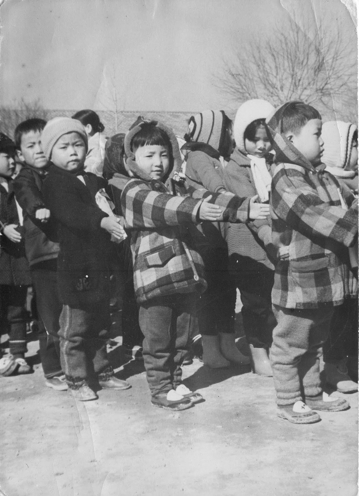
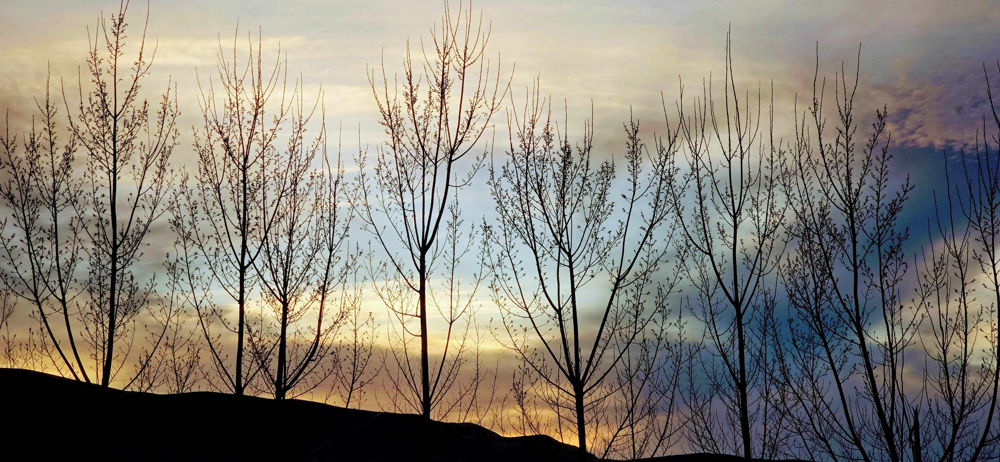

It was just a casual mention: *Maybe I should finally try tasting alcohol.*

The rebuke from Sister K was immediate, stern and firm:

> **"Your mom would be very disappointed."**

That was the end of the discussion. 

My mind began aggregating past events, comparing the world I see now to the one my mother built.

I’ve traveled overseas and watched people order wine the moment it became available, consuming it like a mandatory daily drug.

I saw it again in Japan, where colleagues spent their time scouring neighborhoods just to find that one coffee shop with the green logo.

In my family, those dependencies were stopped a generation ago.

My mother singlehandedly ended three cycles of failure in the family: **Poverty, lack of Education, and Dependence on Alcohol.**

In their place, she introduced the one missing element: **Religion.**

When Sister K spoke those words, she wasn't just giving an opinion. She was reminding me of the revolution my mother started—and a reminder of the high standard we need to keep.

------------------------------------------------------------------------

Dressed in the traditional 두루마기[^1], an outerwear worn over 한복, she accompanied me to my first grade orientation at 주안초등학교.

[^1]: https://namu.wiki/w/%EB%91%90%EB%A3%A8%EB%A7%88%EA%B8%B0

There were approximately one million births per year in Korea around the time I was born. This is based on the population of 25 million people, and the estimated fertility rate of 5\~6 children per woman.[^2]

[^2]: <https://fred.stlouisfed.org/data/SPDYNTFRTINKOR?utm_source=chatgpt.com>

The orientation scene was repeated in schools across the country.

Yet, in that crowd, I didn't feel like just another number. Having photographs of her there was my assurance that she valued education; it gave me a sense of hope for the future.

------------------------------------------------------------------------

At times, family members would visit and something unexpected would happen.

They would order some alcohol from a neighborhood shop.

This was before beer was widely available and most people drank 막걸리, a raw rice wine.

After a few drinks, these visitors inevitably brought up past misgivings and became confrontational.

My mother would not tolerate this behavior.

She made it clear that this was not allowed in our home and they were to stop practicing this.

They listened and obeyed.

I still don't know how she was able to summon that kind of courage.

------------------------------------------------------------------------

With alcohol controlled and the investment in education begun, the final piece fell into place. 

With my father working in Vietnam and sending money home, it was only a matter of time before poverty was wiped away.

------------------------------------------------------------------------

My mother’s family always sought truth. Through multiple generations, they visited churches, synagogues, and other religious institutions to learn and follow truths. 

This heritage allowed my mother to continue seeking truth, even while she was a member of a Christian congregation.

Fifty-five years ago, after studying with missionaries from the Church of Jesus Christ of Latter-day Saints, she was baptized in the 동부지부 (東部支部, Eastern Branch) in Seoul, Korea.

I am grateful for the foundation my parents set, both in South Korea and in the United States. They established the source of all blessings and the power to do all things.

> "I can do all things through Christ which strengtheneth me."

That same God of Israel helped them escape North Korea and establish a new home in a new land.

He is the one who calms the seas, stills the distractions, and eliminates dependencies.
