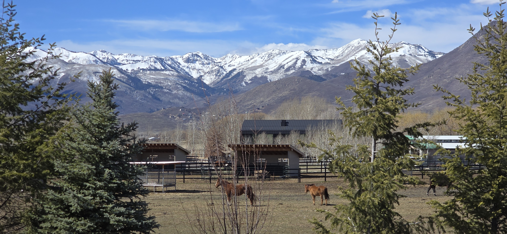
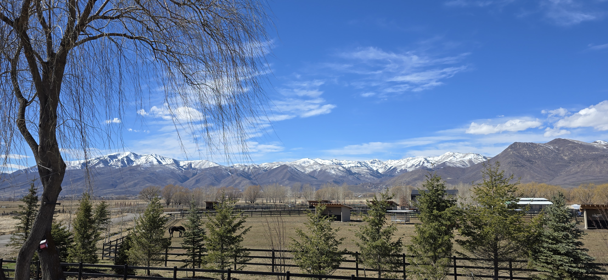

Attended an event over the weekend.

No tickets or reservations were required, attendance was by invitation. The first group invited consisted of family, friends, and neighbors.

Then there were those who might benefit from being there.

I was in the second group.

------------------------------------------------------------------------

I met the P family through a co-worker whose daughter had helped train the P family's daughter. Our paths crossed for the first time at Sister L's homecoming last February. [See](https://spencerirvinereed.github.io/Blog-2025/posts/20250323%20Homecoming/)

Standing by the chapel door, I struck up a conversation with a gentleman nearby.

> "Which ward is this?"

He didn’t know; he was also visiting, having traveled down from Wyoming.

As we talked, I learned he was the grandfather of the returned missionary we were there to hear.

He had served his own mission back in the 1960s. Now, some 60 years later, his granddaughter had just finished serving in that very same country: **한국 (韓國) Korea.**

Despite his age, he had an amazing recollection of places and people. He hadn't visited Korea since 1970, yet he could recall the full names of those he met on his mission—not just "Mr. Kim" or "Sister Park," but the specific individuals who had shared his journey in **한국**.^[He worked in 대구, opened 대전 area for the missionary work, 삼청 areas among others] 

His memory reminded me of a quote by Elder Neal A. Maxwell:

> "I testify to you that God has known you individually, brethren, for a long, long time. He has loved you for a long, long time. He knows the names of all the stars. He knows your names and all your heartaches and your joys! **By the way, you have never seen an immortal star; they finally expire. But seated by you tonight are immortal individuals** — imperfect, but who are, nevertheless, 'trying to be like Jesus!' "

— 5 *April 2004 Deseret News*^[<https://www.deseret.com/2004/4/5/19821447/elder-neal-a-maxwell/>]

The man from Green River understood what was truly important. He remembered that while buildings, cities, and even the planet we call home will eventually fade, the people we encounter are eternal.

I was able to express my appreciation to him for his service in Korea.

It brought to mind a story my mother once shared. When missionaries first visited her decades ago, she politely sent them away and asked them not to return. But they did return. When she asked why, they simply replied:

> **"Because we have something (important) to say."**

It is a miracle that a teenager can learn a foreign language, learn to love a foreign people, and in the process, convert both themselves and their friends to a way of life focused on Jesus Christ.

This same message is repeated throughout the world.

> I love this gospel and I love Jesus Christ. I know that He lives and that He invites us all to come unto Him.

> I invite you to draw closer to Him and experience the power of the Atonement in your own life.

> Through this path, we find the greatest joy—an eternal joy found only in Him.

The stars cannot feel, but you and the man from **綠河 (Green River)** will feel and live on for a long, long time.

The days of miracles have not passed, and they will not pass as long as the people like the man from Green River and his granddaughter continue the tradition of bearing a witness to the people of Korea and the world.

