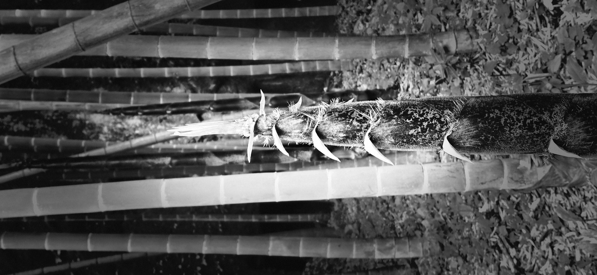
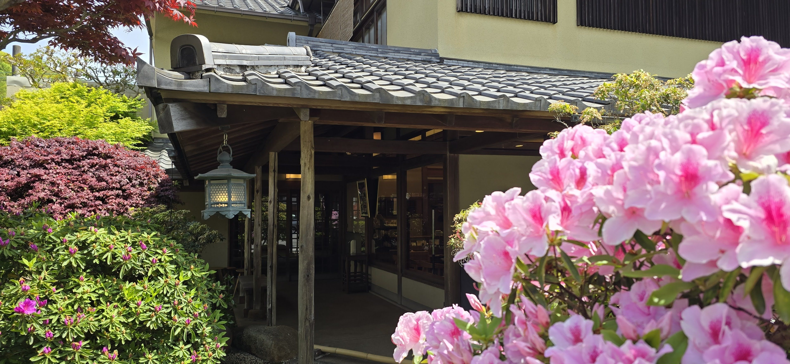

A quote from 225 years ago,

> "Ich bin mit meinen bisherigen Arbeiten nicht zufrieden; von heute an will ich einen neuen Weg einschlagen."
>
> "I am far from satisfied with my past works: from today on I shall take a new way"

[^1]

[^1]: Attributed to a conversation Beethoven had with his close friend and violinist **Wenzel Krumpholz** around **1801 or 1802 (AI Summary)**

The work that symbolizes and defines Beethoven’s New Path is the **Symphony No. 3 in E-flat major, Op. 55**, better known as the ***Eroica (Heroic)*** (composed 1803–1804).

------------------------------------------------------------------------

An enduring scene from the movie, **The Ten Commandments** is when Moses descends from mountain with tablets, having spent 40 days with God.

In addition, the movie depicts the mighty changes wrought in him visually.

The hair and beard is changed from dark or somewhat graying to stark, snowy white.

The face is weathered but also luminous with radiant glow.

------------------------------------------------------------------------

My parents didn't leave behind a tangible, catalog-ready body of work in the traditional sense.

Aside from a few writings chronicling their lives after retirement and their move to Utah, there are no hard evidences.

In their younger days, they were simply too busy squeezing out a life to capture it on paper, let alone find the stillness to reflect on the ever changing world around them.

However, they did leave behind both instruction and evidence on how to navigate adversity.

They lived through a world in chaos—-a time when nations and families were at odds and the economy was in such freefall that the currency was devalued by 90%.[^2]

[^2]: **Currency Reform of 1962:** In June 1962, the government introduced a new currency, replacing the Hwan with a new Won (10 Hwan = 1 Won) as part of a move to manage inflation and reorganize the monetary system.

In that crucible, they didn't consult experts or chase the latest trends.

Instead, they relied on something far more consistent and faithful: their own life’s experience and a deep, quiet faith in a being outside themselves.

They became masters of the calibrated response.

They didn't overreact in panic, nor did they under react in denial. They reacted just enough, with an exquisite timing that allowed them to overcome the immediate crisis while preserving the future for the family they were raising.

------------------------------------------------------------------------

Beethoven and Moses left behind monumental bodies of work that are still played, read, and experienced today.

Their influence spans centuries, continents, and people of many nations.

And while my parents’ output and the scope of their influence is not even comparable, they, also gave their all.

They created and chose their own new paths every time the world and society shifted and created new ways.

I recall from their lives:

-   leaving their North Korean homes as teenagers,
-   fighting and escaping the terror of war in their twenties, as a POW and as a boat people,
-   overcoming total economic despair in their thirties, and
-   finally finding a new religion and a refuge in a new country in their forties.

When something daunting confronts me today, I think of my mother and father.

I recall how they assessed the situation, relied on the hard-won wisdom of their past, and moved forward with full faith—not only that God was with them, but also that they had a mission.

They were determined to provide the foundation and the means for the next generation to succeed, ensuring we would face far fewer obstacles than they did.

Beethoven gave us the *Eroica*. Moses gave us the Law.

My parents gave us a life on this earth and how to prepare for that future in another sphere.

Fulfilling that commandment found in Genesis 1:28

> And God blessed them, and God said unto them, Be fruitful, and multiply, and replenish the earth, and subdue it:

Thank you, Mom and Dad.

