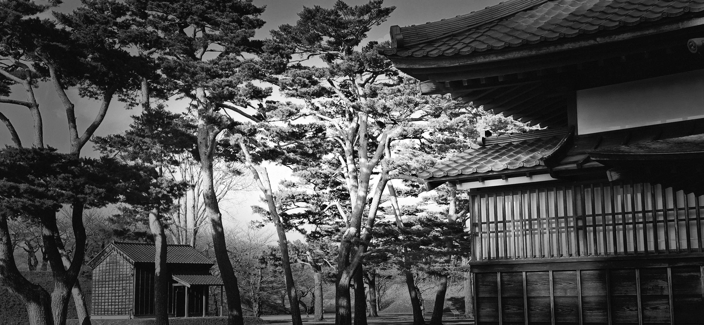
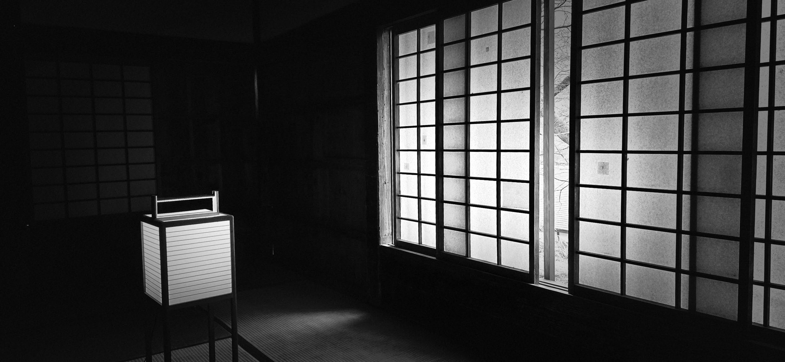
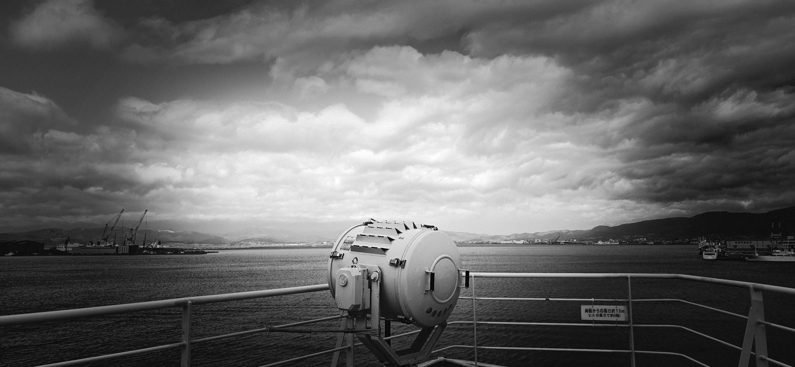

I recently traveled nearly 3,000 miles to an island in the Pacific.

As the flight stretched over six hours, I found myself wondering anew at the technology--which I barely understand--and the trust that allows hundreds of passengers to cross the vast Pacific in comfort.

I thought of the navigation and guidance tools that locate that small island, guide the plane in its travel, and land the 300K pound aircraft on the designated runway 8R/26L.[^1]

[^1]: Modern aircraft locating and guiding technology relies on a hybrid of satellite-based Global Navigation Satellite Systems (GNSS/GPS), ground-based radio beacons (VOR/DME), and Inertial Navigation Systems (INS) to provide precise, continuous positioning. These technologies enable advanced navigation, Automated Dependent Surveillance-Broadcast (ADS-B) tracking, and precision, low-visibility approaches via Instrument Landing Systems (ILS).

Our destination is a microscopic fraction of the Pacific.

In terms of landmass, the proportion of this island relative to the Pacific Ocean is almost infinitesimally small—like a single grain of sand in a large swimming pool, per AI.

Mathematically, the islands represent just 0.017%, or roughly 1/6,000th, of the ocean’s surface.[^2]

[^2]:
    -   **Total Land Area of Hawaii:** Approximately **10,931 square miles** ($28,311$ $km^2$).
    -   **Total Surface Area of the Pacific Ocean:** Approximately **63.8 million square miles** ($165.2$ $million$ $km^2$). If you divide the land area of the islands by the surface area of the ocean: $$\frac{10,931}{63,800,000} \approx 0.00017$$ This means the Hawaiian Islands make up roughly **0.017%** (or about **1/6,000th**) of the Pacific Ocean's surface area.

This comparison can be expanded upward, where the scale of our world shrinks even further.

Our Earth, when compared to the Sun, is even more lopsided; the ratio of their surface areas is roughly half that of Hawaii to the Pacific.

-EFFECTS.jpg)

------------------------------------------------------------------------

There was a time when I thought in terms of continents and mainlands, viewing those on the islands of the sea as being at the far ends of the earth.

From a man-made perspective, it is easy to classify and separate ourselves. But to a cosmic observer, there are no mainlands. We all live on a speck in the solar system called Earth.

Collectively, we all live on the edge.

We regularly board planes without knowing the intricate navigational details or the complex physics that keep us aloft.

We surrender to the truth of the instrumentation and the data supplied by the various navigation and guidance systems. And the skill of the crew that use that information to power through the airspace.

It is a sobering realization: we are utterly dependent on correct relationships—the relationship between the wing and the air, the pilot and the coordinates.

> *What kind of navigation and guidance systems do we rely on as we traverse this life on this earth?*

------------------------------------------------------------------------

This realization leads to a unique kind of security based on our place on this earth and in the universe.

If we are facing the right direction, and if our relationships or references are true, based on sound principles and god revealed truths, our size ceases to matter.

We are reminded of the words of Dag Hammarskjöld:

> *"To be humble is not to make comparisons. Secure in its reality, the self is neither better nor worse, bigger nor smaller, than anything else in the universe. It is—is nothing, yet at the same time one with everything."*

When we align ourselves with the truth, the grain of sand is no longer insignificant; it becomes the very point where the universe is realized.

Whether we are navigating the 3,000 miles of the Pacific or the vast stretches of a life's mission, we find that we are at once nothing and everything—provided we have the correct understanding of principles.

It is a sentiment captured in the Okinawan Shima Uta (島唄),

島唄よ 風に乗り 鳥とともに 海を渡れ\
島唄よ 風に乗り 届けておくれ 私の涙\
Island song, ride the wind, cross the sea with the birds.\
Island song, ride the wind, and deliver my tears.\

------------------------------------------------------------------------

島唄 by Boom

でいごの花が咲き 風を呼び 嵐が来た でいごが咲き乱れ 風を呼び 嵐が来た くり返す悲しみは 島渡る波のよう ウージの森で あなたと出会い ウージの下で 千代にさよなら 島唄よ 風に乗り 鳥とともに 海を渡れ 島唄よ 風に乗り 届けておくれ 私の涙 でいごの花も散り さざ波がゆれるだけ ささやかな幸せは うたかたの波の花 ウージの森で 歌った友よ ウージの下で 八千代の別れ 島唄よ 風に乗り 鳥とともに 海を渡れ 島唄よ 風に乗り 届けておくれ 私の愛を 海よ 宇宙よ 神よ いのちよ このまま永遠に夕凪を 島唄よ 風に乗り 鳥とともに 海を渡れ 島唄よ 風に乗り 届けておくれ 私の涙 島唄よ 風に乗り 鳥とともに 海を渡れ 島唄よ 風に乗り 届けておくれ 私の愛を

------------------------------------------------------------------------
