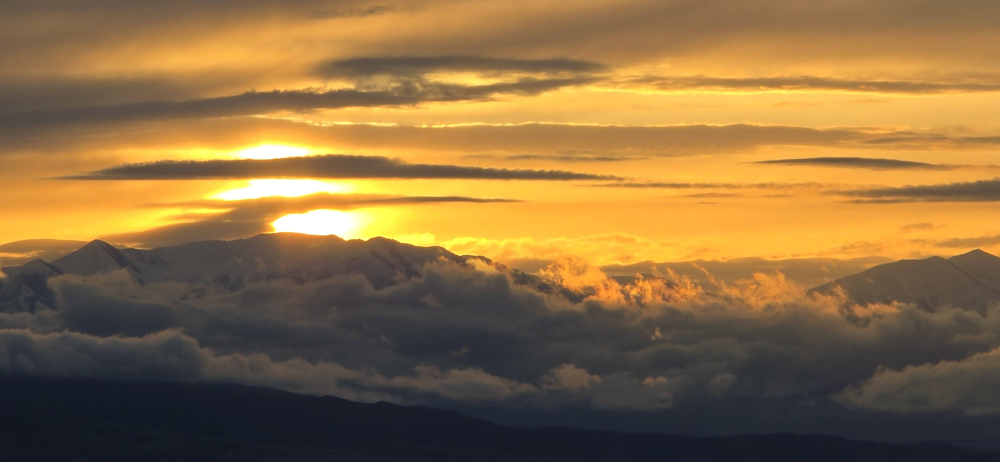

Living in Utah offers one significant advantage, it is hard to get lost.

Residences of Wasatch Front are guided by a hierarchy of reliable navigational markers.

For about 60% of our days, the sun remains our primary navigational tool. When the sun is obscured, we have a permanent monument to our orientation: the Mountain means East.


------------------------------------------------------------------------

This natural orientation is reinforced by human design.

These cities are laid out in a precise grid where the relationship between space and time is predictable.

-   One Block = Approximately 660 feet or 200 meters.
-   Ten Blocks = Approximately 1.25 miles (2 km).

However, if you are new to the area, it may take some time to adjust and a personal guide may help.

------------------------------------------------------------------------

This is not a new concept.

For millennia, the ancients built their surroundings to face the source of their direction in life.

Consider the Zenkoji Temple (善光寺) in Nagano, Japan. It sits on a hill at the eastern end of the Hida Mountains (飛騨山脈, the Northern Japanese Alps).

The temple faces due south, and the entire neighborhood layout is designed to sustain its importance.

As a tourist, the walk from the Nagano Station to the Zenkoji Temple is about 2.4 km or 12 Utah City Blocks with 2% grad or slope gain.

If one rushes through the experience, one might miss these well-thought-out markers. You might see those buildings but miss the alignment of earthly things to celestial things.

```{r}

library(leaflet)

nagano_station <- c(36.6431, 138.1881)
zenkoji <- c(36.6619, 138.1878)

locations <- data.frame( 
  name = c("Nagano Station (~360 m)", "Zenkoji Temple (~406 m)"), 
  lat = c(nagano_station[1], zenkoji[1]), 
  lon = c(nagano_station[2], zenkoji[2]) )

leaflet(locations) %>% 
  addTiles() %>% 
  addMarkers( lng = ~lon, lat = ~lat, popup = ~name) %>% 
  addPolylines( lng = locations$lon,  lat = locations$lat, color = "blue", weight = 3, popup = "Approx. 2–2.5 km route\nElevation gain ~45–50 m" ) %>% 
  addControl( html = "<b>Elevation Note:</b><br> Nagano Station: ~360 m<br> Zenkoji Temple: ~406 m<br> Gradual uphill walk", position = "bottomright" )
```

Today, these ancient terrestrial and celestial markers can seem outdated or unnecessary.

We have managed to simplify and automate nature’s signals through technology and GPS.

There are times when these man-made, enhanced tools seem superior to the original tools of the sun and the stars.

But nature still follows the rules and boundaries set forth from the beginning.

A sobering truth remains: when natural disasters occur or technology fails, a backup to the man-made system becomes necessary. It is in those moments of crisis that we must return to the fundamentals.

In our travels in this life, there will be times when the nature or celestial guides and its dictateion seem too restrictive or even seem incorrect.

Unless the sun, the moon, the stars, and the Wasatch Mountains disappear, we will still be able to find our way.

If we are given the right direction, verified with the celestial markers and remain aligned with the truth of our surroundings, we can navigate any storm—provided we haven't forgotten how to look up at the sky or listen to what the nature is whispering.



------------------------------------------------------------------------

### Nagano Naviagation

To relate the elevation gain to **grade (slope)**, we convert the rise over the horizontal distance:

### 📏 Given

-   Elevation gain: **\~45–50 m**
-   Distance: **\~2,000–2,500 m**

### 📐 Grade formula

$$
\text{Grade (\%)} = \frac{\text{Rise}}{\text{Run}} \times 100
$$

### 📊 Result

-   **Lower estimate:** ( \frac{45}{2500} \times 100 \approx 1.8% )
-   **Upper estimate:** ( \frac{50}{2000} \times 100 \approx 2.5% )

👉 **Typical grade: \~2% (roughly 2–2.5%)**
