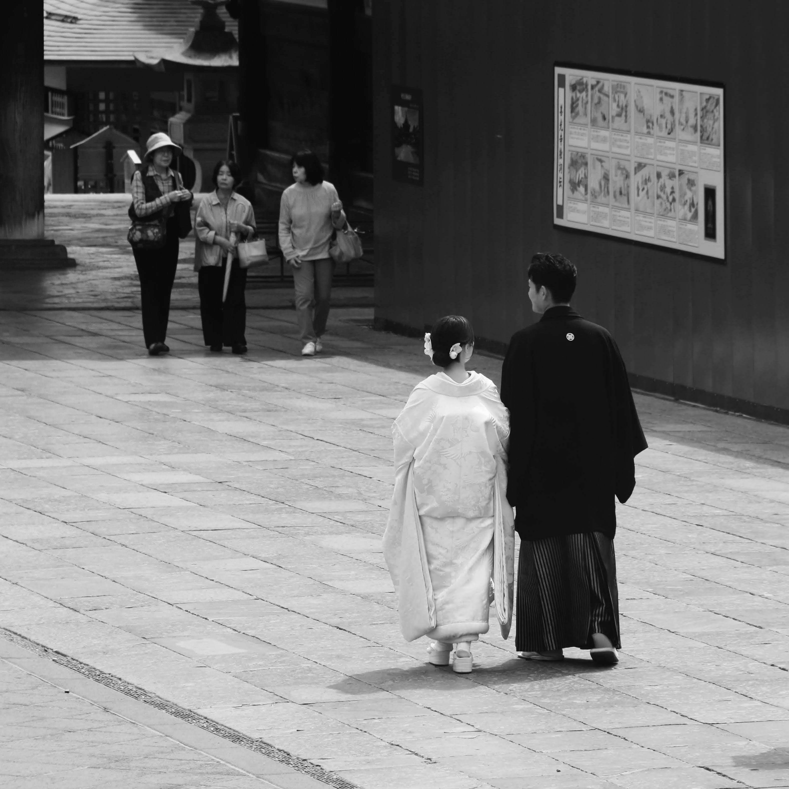

One of the advantages of knowing a widely spoken language is the opportunity to read classics in its original form, moving a step closer to the writer's initial thoughts and unique style, free from subsequent translations and interpretations.

However, advancements in Artificial Intelligence, particularly Large Language Models (LLM) have enabled unprecedented access to and interpretation of works by both common and exceptional writers. This shift has almost eliminated the perceived need to expend the effort required to engage with the original text.

------------------------------------------------------------------------

On a recent overseas trip, I carried a book with me to read on the plane—a 350-page paperback containing approximately 95,000 words.

Given the range of typical reading rates, this book could be read in as little as 3.5 hours for a fast reader, or up to 8 hours for a more deliberate pace.

Initially, the book struggled to compete with the modern conveniences of the flight.

On the first legs of the trip, the lure of in-flight movies won out after I had finished only a few chapters.

On subsequent legs, a chance meeting and conversation with a neighbor about his recent publication took precedence over the printed word.

It wasn't until the last leg—an overnight flight—that the setting was finally right.

With a classical music channel in my ears and the vast majority of the passengers asleep, I finally leaned into the effort of this original text.

------------------------------------------------------------------------

The story, written by an American author, Pearl Sydenstricker Buck^[[Bio](https://en.wikipedia.org/wiki/Pearl_S._Buck), [Org](https://www.pearlsbuck.org)] (1892–1973), who spent much of her early life in China, chronicles the epic rise and fall of Wang Lung.

He begins as a humble Chinese farmer in the early 20th century, but his life changes when he marries O-Lan, a former slave from the town's most prominent family, the House of Hwang.

With O-Lan as his silent, driving force, Wang Lung prospers.

Block by block, he saves his earnings and buys land from the decaying Hwang clan.

Even when a catastrophic famine forces the family south to survive as refugees, sees the more advanced society, Wang Lung’s soul remains tethered to his soil.

He eventually returns, establishing the Wang family as the new dominant power in the region.

However, as material prosperity peaks, moral decay sets in.

Wang Lung begins to mirror the very family he replaced.

He succumbs to the same decadence that destroyed the House of Hwang, taking a concubine named Lotus and ultimately dismissing the woman who made his success possible: O-Lan.

The story ends on a sobering note. Following the death of O-Lan, Wang Lung’s sons—who never felt close to the soil—already begin plotting to sell the land and divide the silver among themselves.

------------------------------------------------------------------------

The tragedy of Wang Lung is a failure of recognizing the source of his success.

He mistook the result of his success—the land and the silver—for the cause of it.

In reality, the engine of his prosperity was O-Lan.

As the Proverbs suggest, wealth can be inherited or acquired, but a prudent partner is a gift of a different order.

> 집과 재물은 조상에게서 상속하거니와 슬기로운 아내는 여호와께로서 말미암느니라
>
> Houses and wealth are inherited from parents, but a prudent wife is from the Lord.

Proverbs 19:14 (NIV)

When we abandon the divine relationships that built our lives in favor of worthless pursuits, we ensure our own obsolescence.

The cycle of the Wang family reminds us that true wealth management isn't about guarding the property.

It is about honoring the person who helped you overcome both the earthly burdens and helped you establish the heavenly foundation.

